# Repeating Earthquake Activity at STAR

## Waveforms
[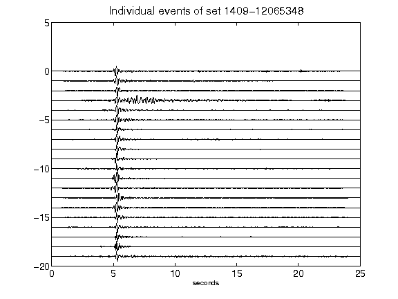](figures/1409-12065348_AllEv.png)[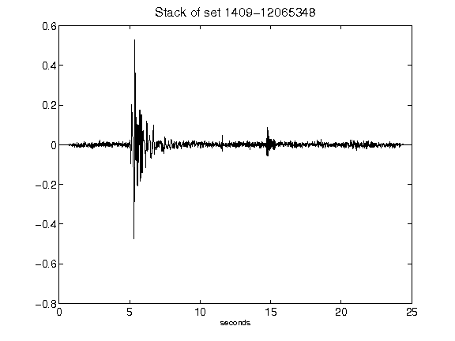](figures/1409-12065348_Stack.png)[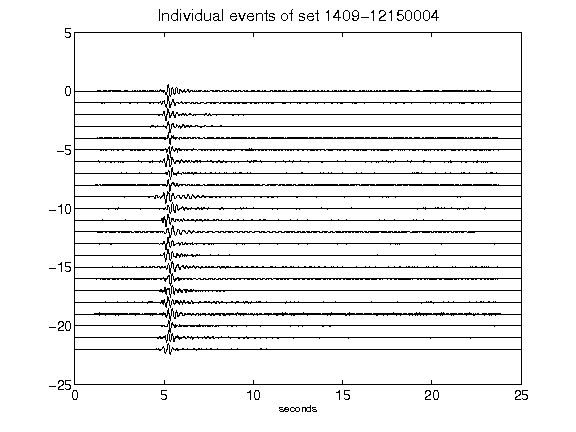](figures/1409-12150004_AllEv.png)[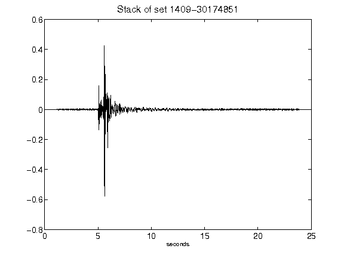](figures/1409-30174851_Stack.png)[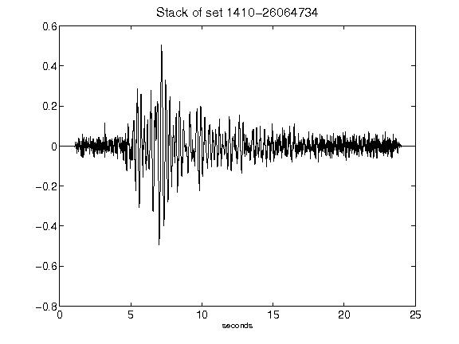](figures/1410-26064734_Stack.png)[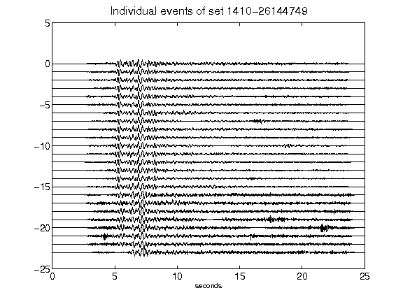](figures/1410-26144749_AllEv.png)[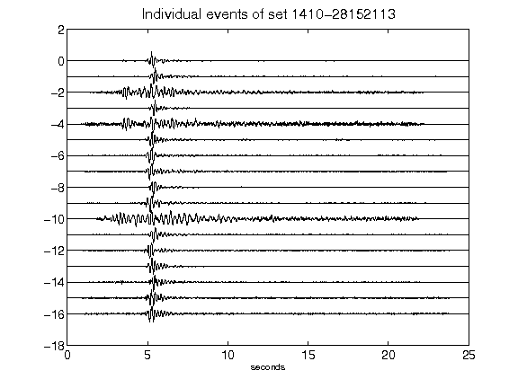](figures/1410-28152113_AllEv.png)[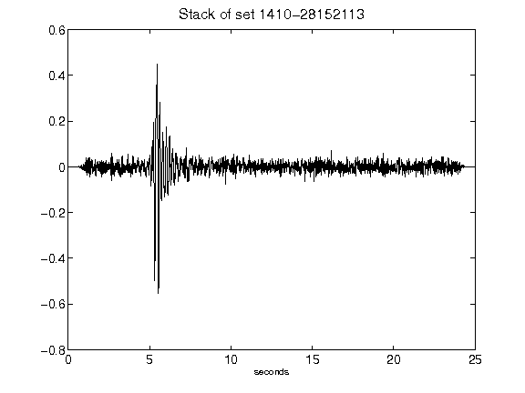](figures/1410-28152113_Stack.png)[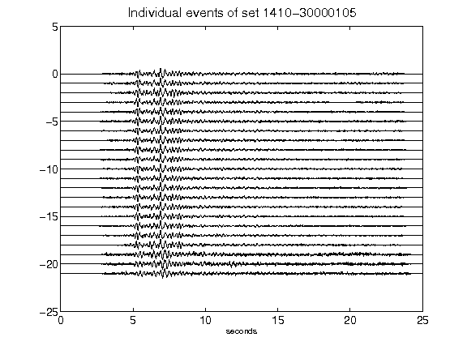](figures/1410-30000105_AllEv.png)[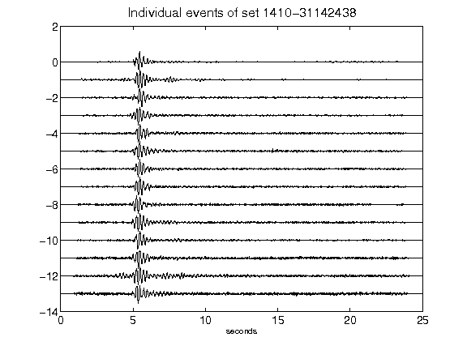](figures/1410-31142438_AllEv.png)[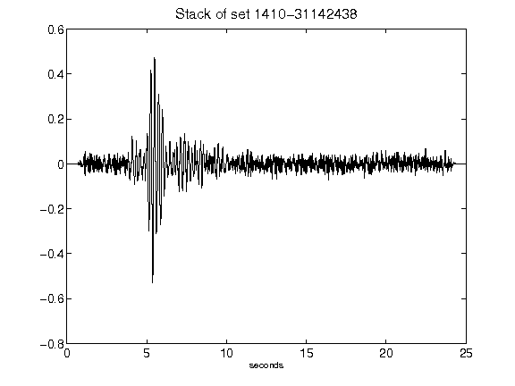](figures/1410-31142438_Stack.png)[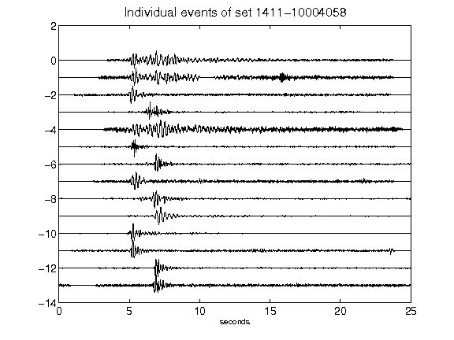](figures/1411-10004058_AllEv.png)[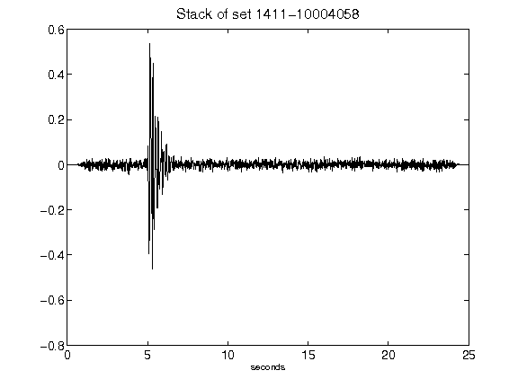](figures/1411-10004058_Stack.png)[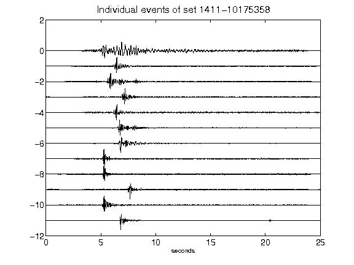](figures/1411-10175358_AllEv.png)[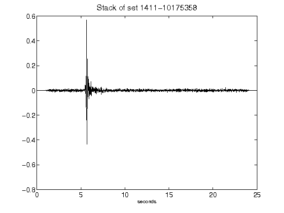](figures/1411-10175358_Stack.png)[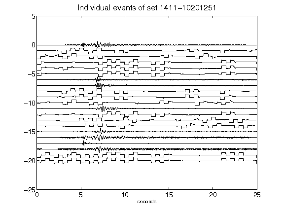](figures/1411-10201251_AllEv.png)[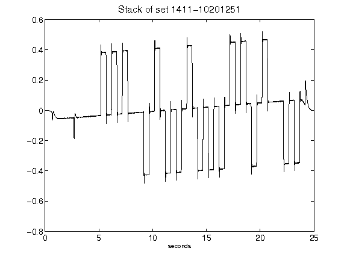](figures/1411-10201251_Stack.png)[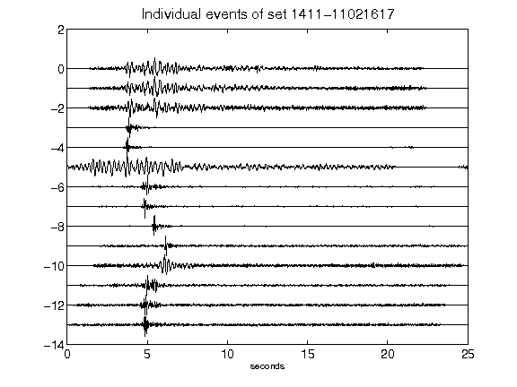](figures/1411-11021617_AllEv.png)[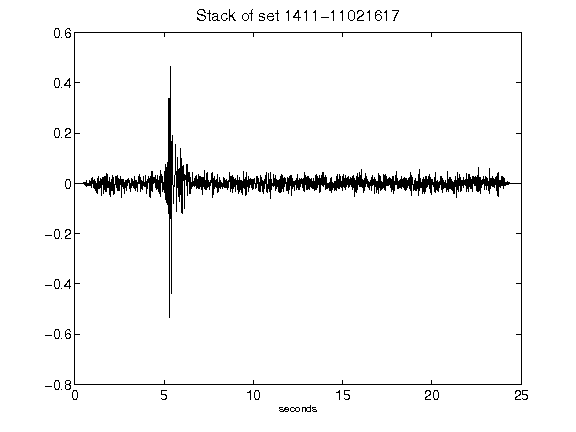](figures/1411-11021617_Stack.png)[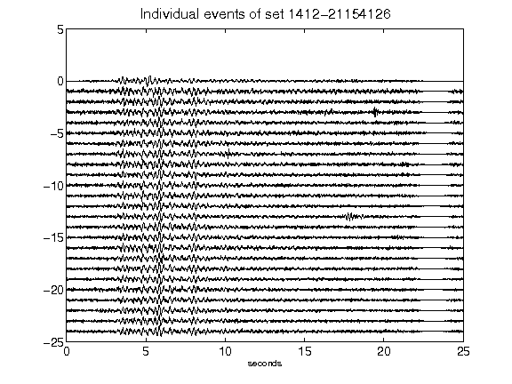](figures/1412-21154126_AllEv.png)[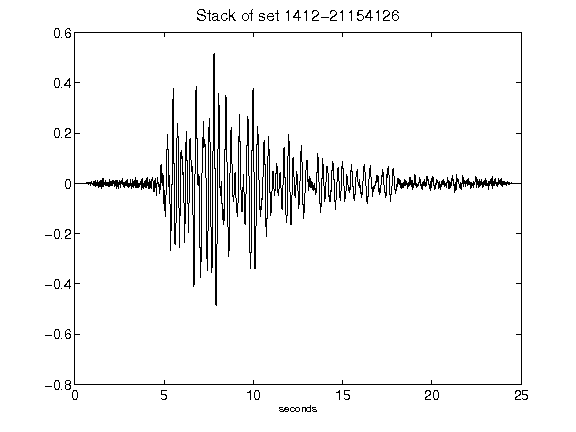](figures/1412-21154126_Stack.png)