# Repeating Earthquake Activity at STAR

## Waveforms
[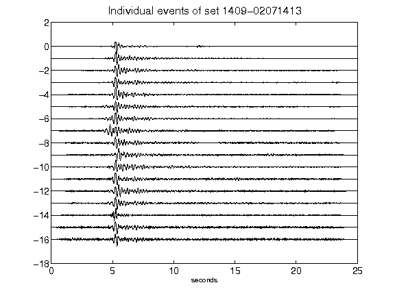](figures/1409-02071413_AllEv.png)[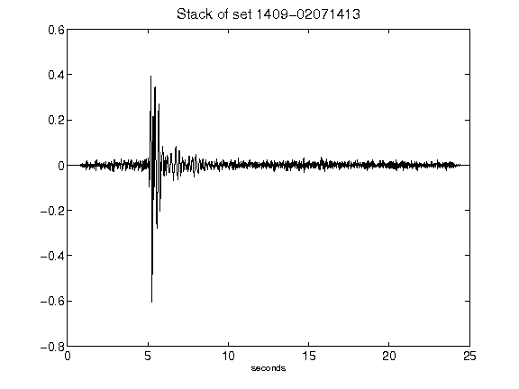](figures/1409-02071413_Stack.png)[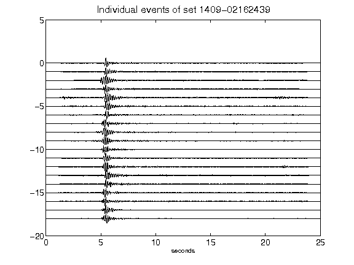](figures/1409-02162439_AllEv.png)[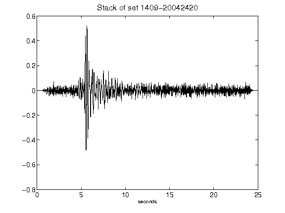](figures/1409-20042420_Stack.png)[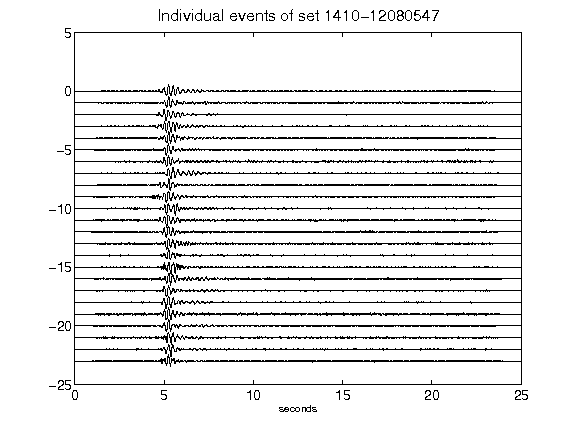](figures/1410-12080547_AllEv.png)[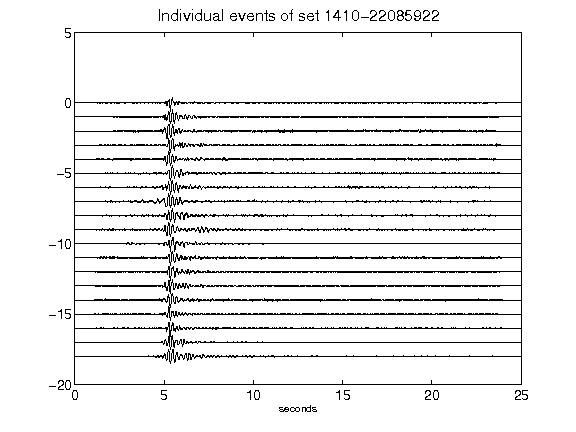](figures/1410-22085922_AllEv.png)[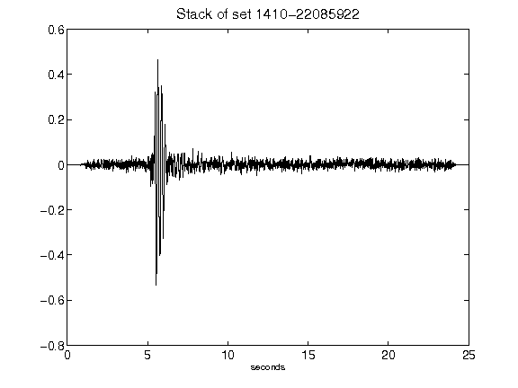](figures/1410-22085922_Stack.png)[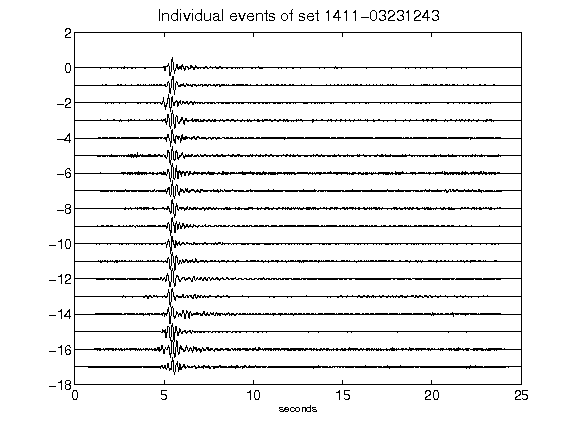](figures/1411-03231243_AllEv.png)[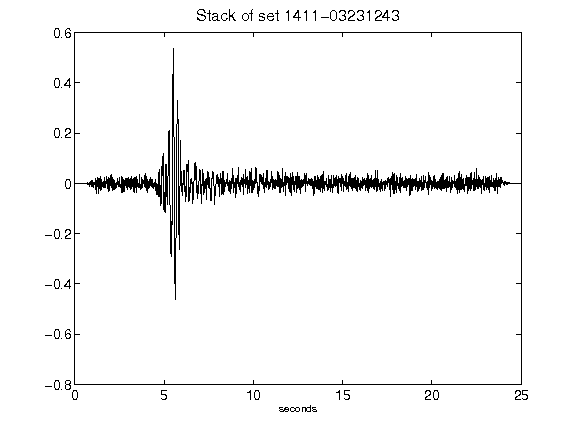](figures/1411-03231243_Stack.png)[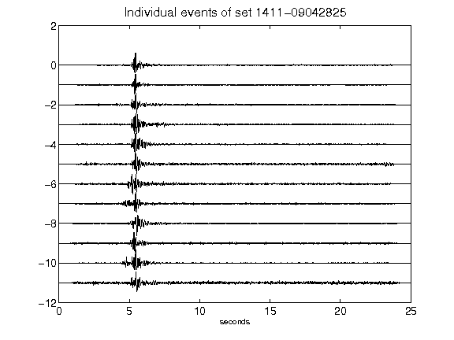](figures/1411-09042825_AllEv.png)[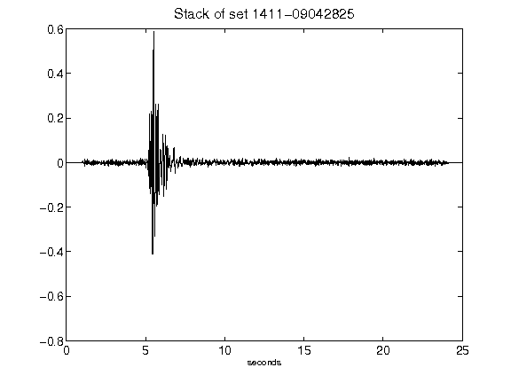](figures/1411-09042825_Stack.png)[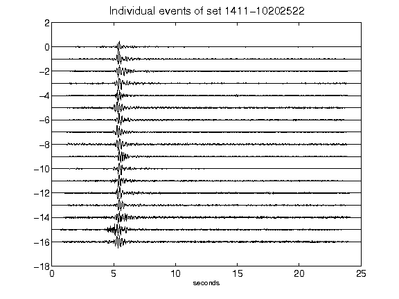](figures/1411-10202522_AllEv.png)[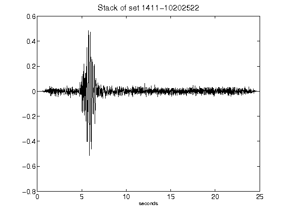](figures/1411-10202522_Stack.png)[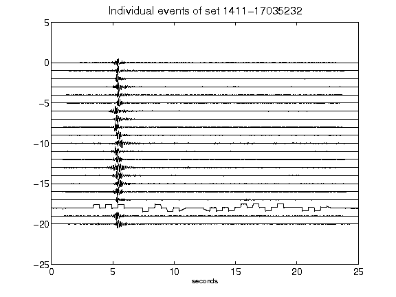](figures/1411-17035232_AllEv.png)[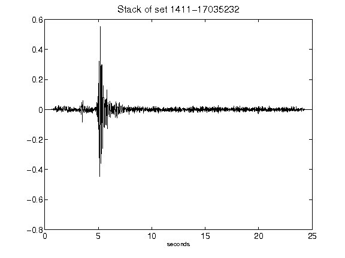](figures/1411-17035232_Stack.png)[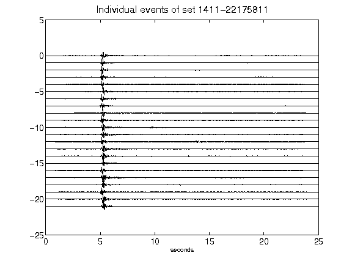](figures/1411-22175811_AllEv.png)[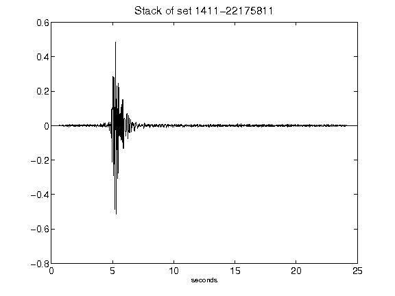](figures/1411-22175811_Stack.png)[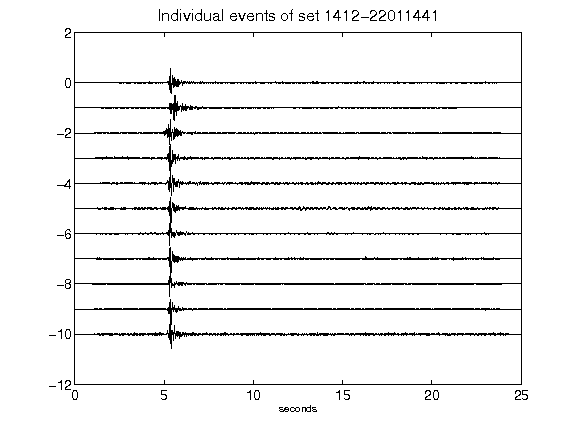](figures/1412-22011441_AllEv.png)[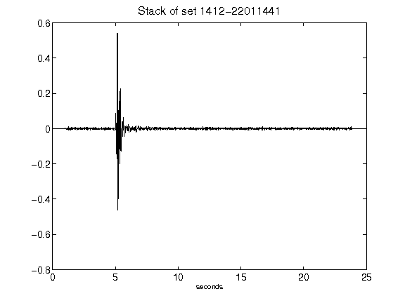](figures/1412-22011441_Stack.png)[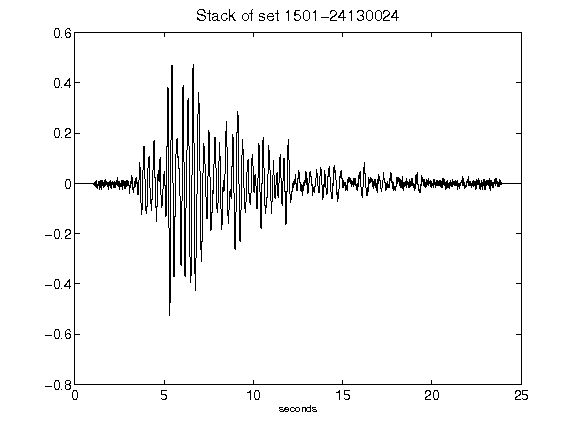](figures/1501-24130024_Stack.png)