# Repeating Earthquake Activity at STAR

## Waveforms
[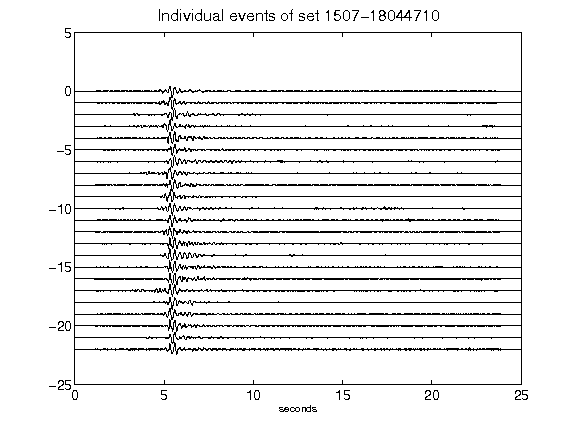](figures/1507-18044710_AllEv.png)[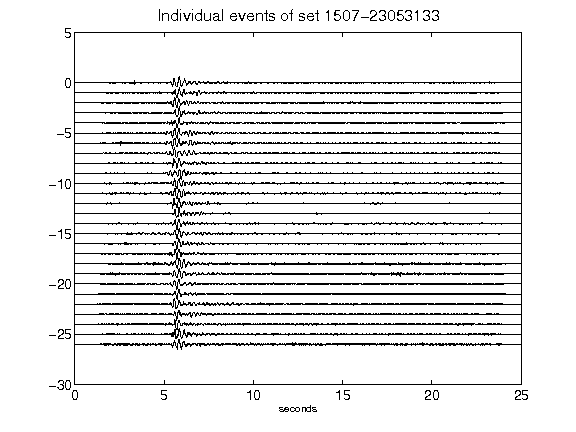](figures/1507-23053133_AllEv.png)[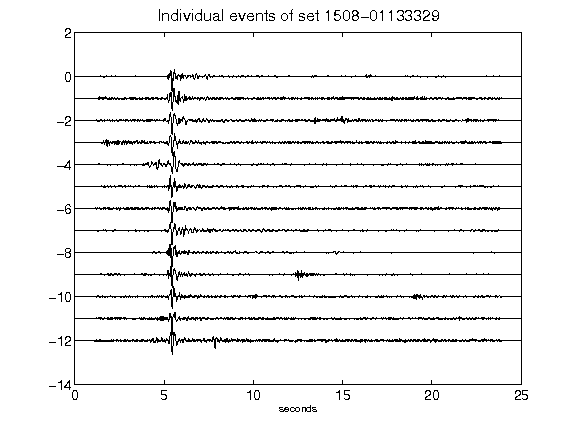](figures/1508-01133329_AllEv.png)[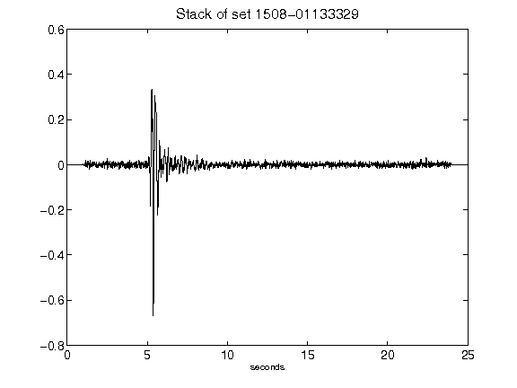](figures/1508-01133329_Stack.png)[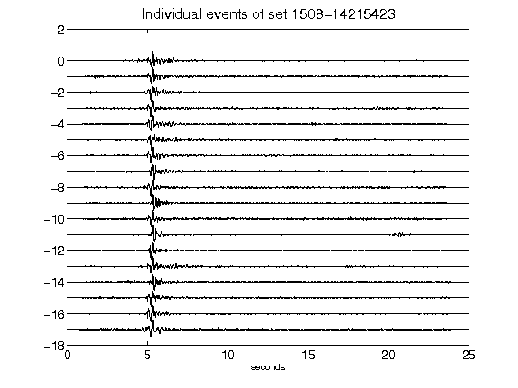](figures/1508-14215423_AllEv.png)[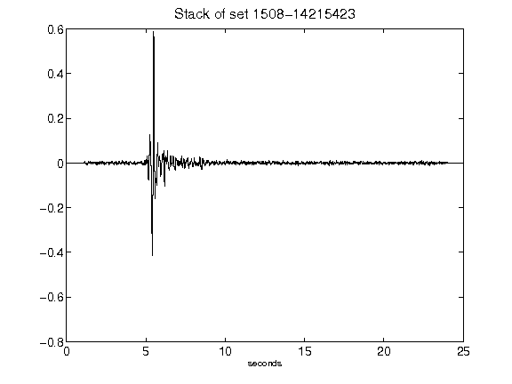](figures/1508-14215423_Stack.png)[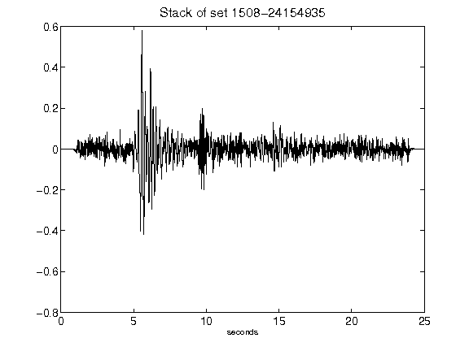](figures/1508-24154935_Stack.png)[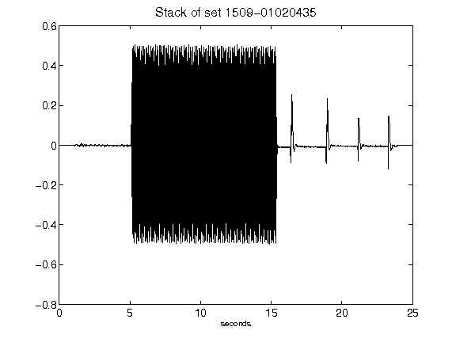](figures/1509-01020435_Stack.png)[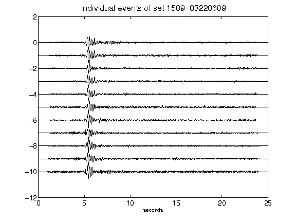](figures/1509-03220609_AllEv.png)[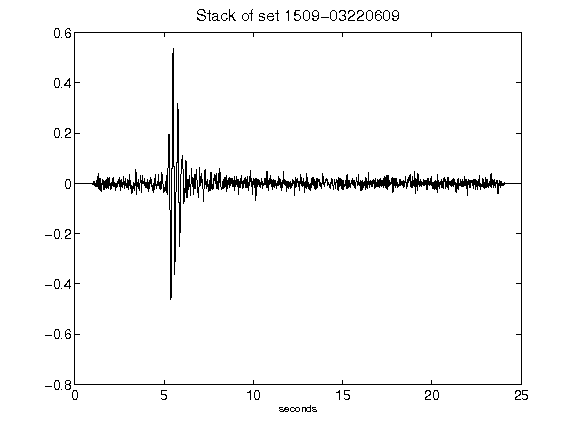](figures/1509-03220609_Stack.png)[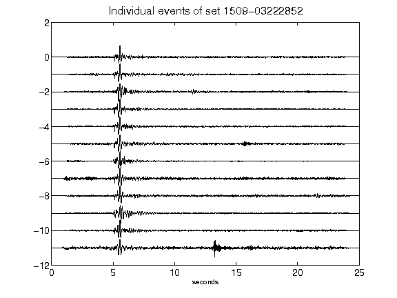](figures/1509-03222852_AllEv.png)[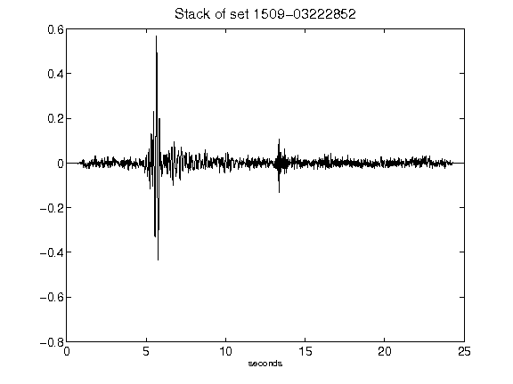](figures/1509-03222852_Stack.png)[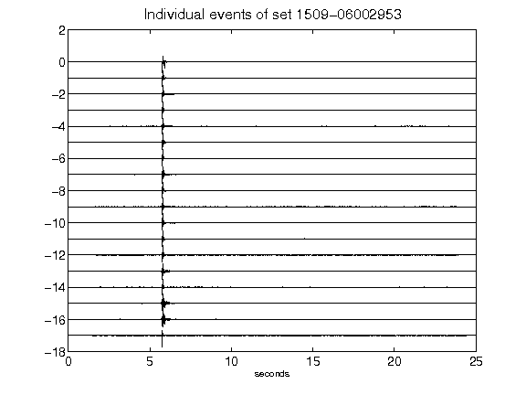](figures/1509-06002953_AllEv.png)[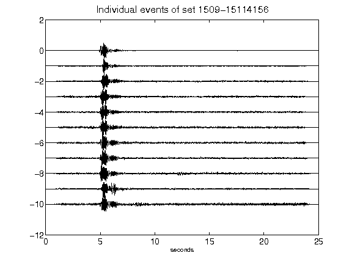](figures/1509-15114156_AllEv.png)[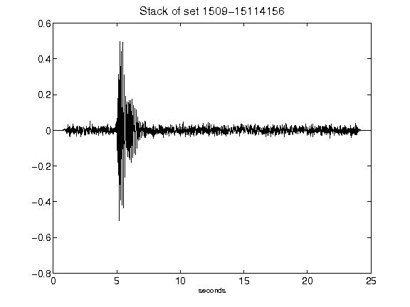](figures/1509-15114156_Stack.png)