# Repeating Earthquake Activity at STAR

## Waveforms
[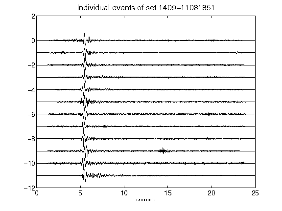](figures/1409-11081851_AllEv.png)[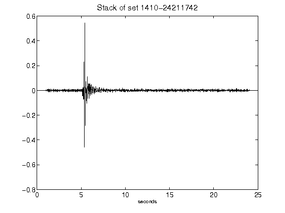](figures/1410-24211742_Stack.png)[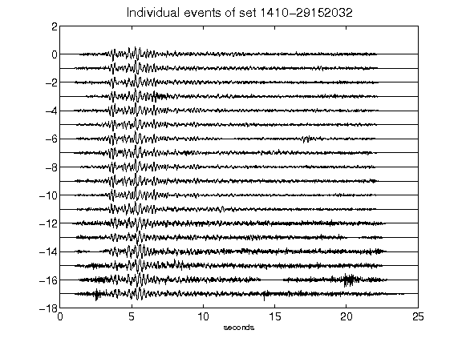](figures/1410-29152032_AllEv.png)[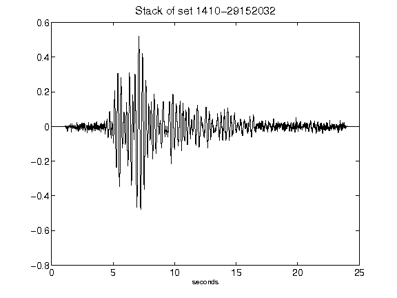](figures/1410-29152032_Stack.png)[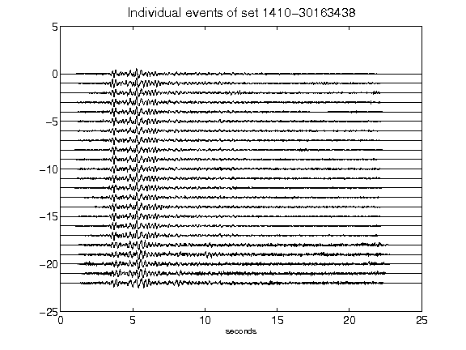](figures/1410-30163438_AllEv.png)[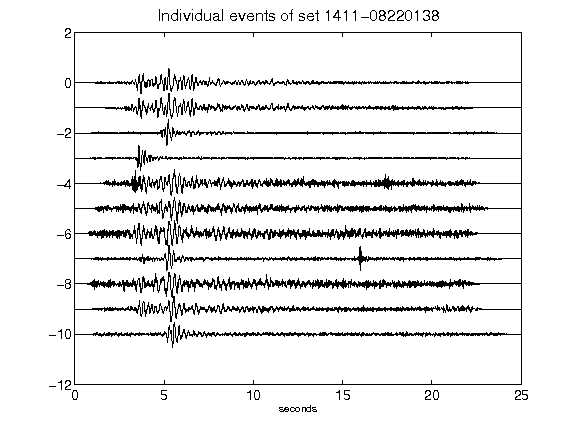](figures/1411-08220138_AllEv.png)[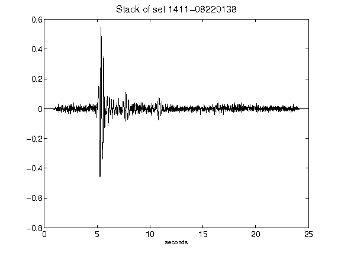](figures/1411-08220138_Stack.png)[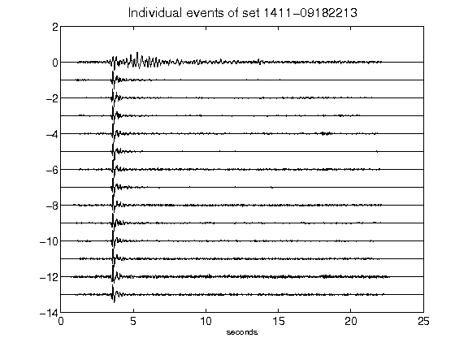](figures/1411-09182213_AllEv.png)[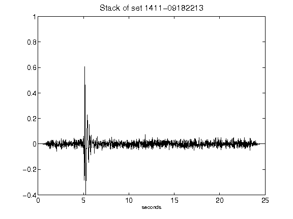](figures/1411-09182213_Stack.png)[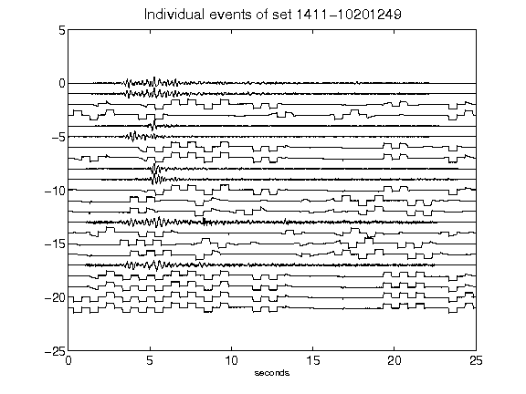](figures/1411-10201249_AllEv.png)[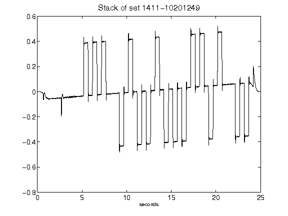](figures/1411-10201249_Stack.png)