# Repeating Earthquake Activity at STAR

## Waveforms
[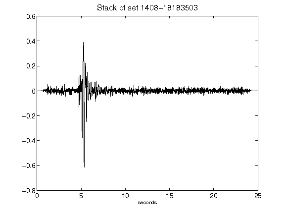](figures/1408-18183503_Stack.png)[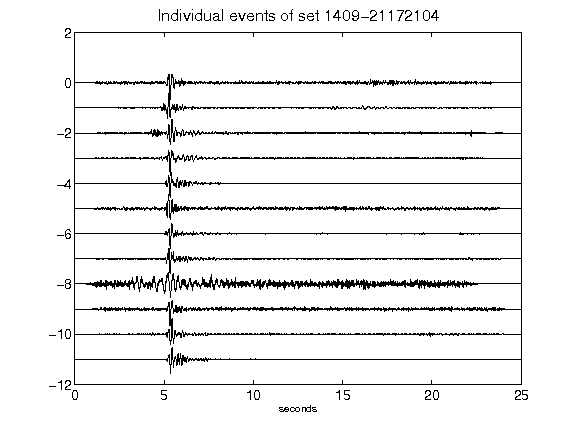](figures/1409-21172104_AllEv.png)[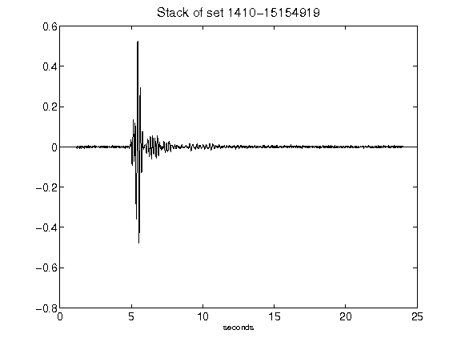](figures/1410-15154919_Stack.png)[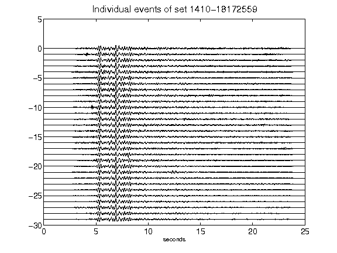](figures/1410-18172559_AllEv.png)[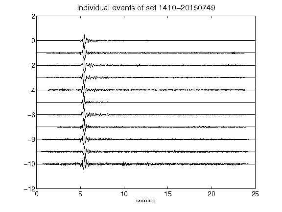](figures/1410-20150749_AllEv.png)[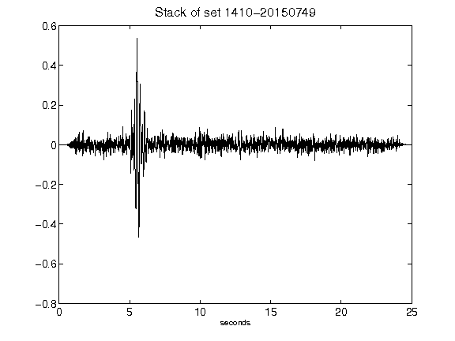](figures/1410-20150749_Stack.png)[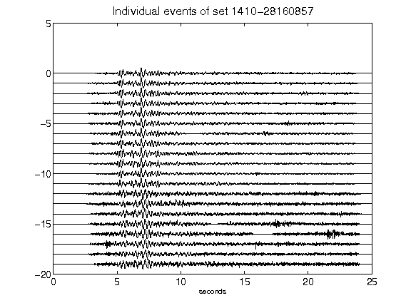](figures/1410-28160857_AllEv.png)[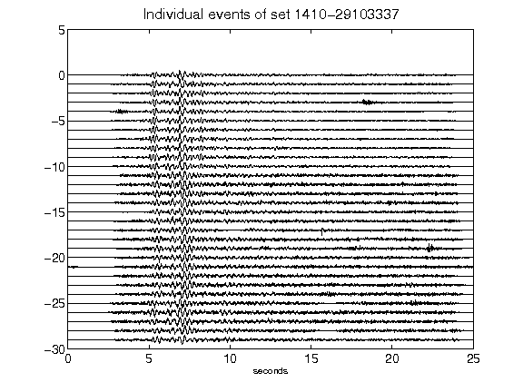](figures/1410-29103337_AllEv.png)[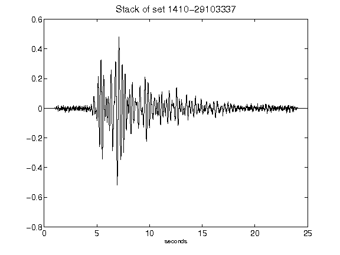](figures/1410-29103337_Stack.png)[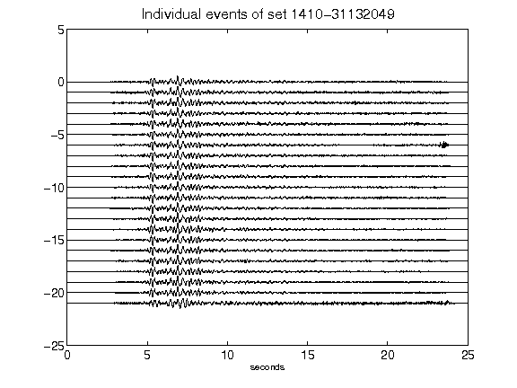](figures/1410-31132049_AllEv.png)[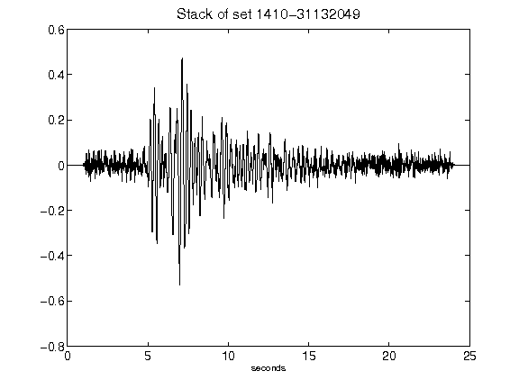](figures/1410-31132049_Stack.png)[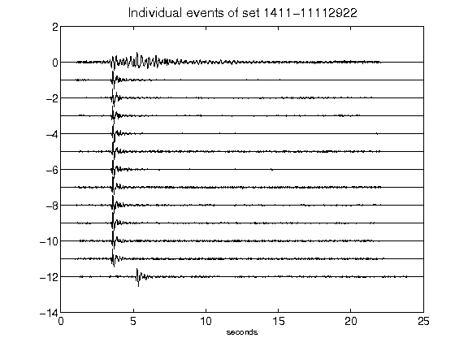](figures/1411-11112922_AllEv.png)[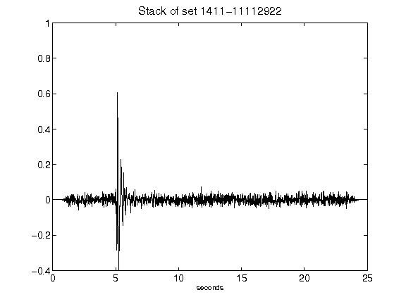](figures/1411-11112922_Stack.png)[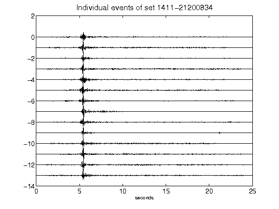](figures/1411-21200834_AllEv.png)[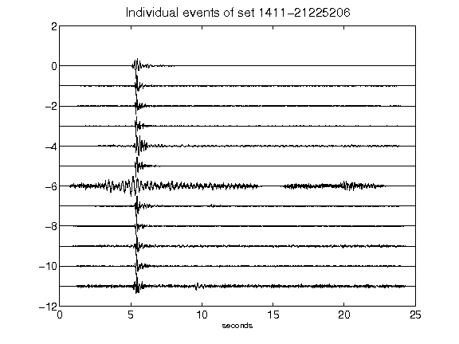](figures/1411-21225206_AllEv.png)[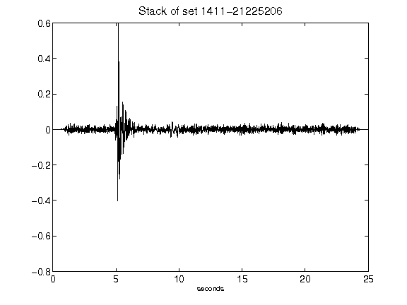](figures/1411-21225206_Stack.png)[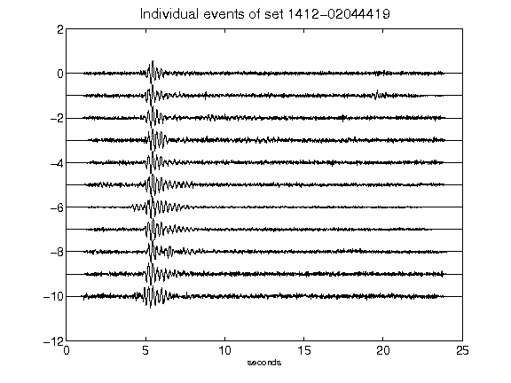](figures/1412-02044419_AllEv.png)[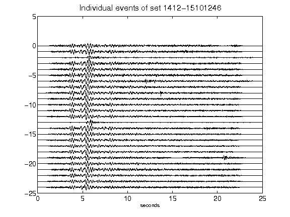](figures/1412-15101246_AllEv.png)[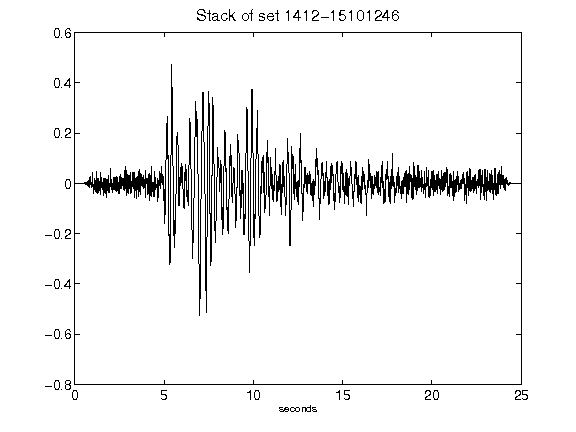](figures/1412-15101246_Stack.png)[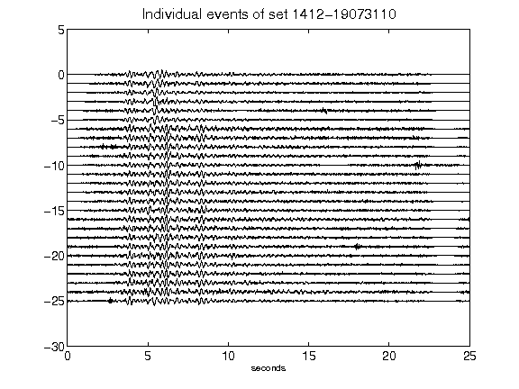](figures/1412-19073110_AllEv.png)[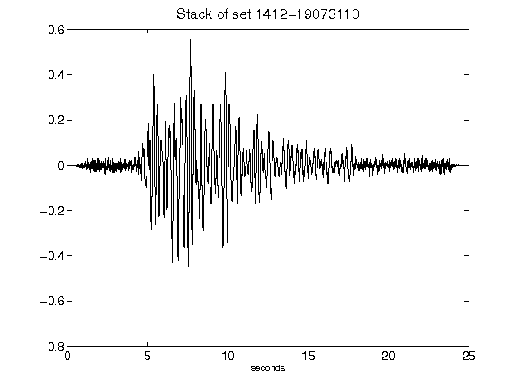](figures/1412-19073110_Stack.png)