# Repeating Earthquake Activity at STAR

## Waveforms
[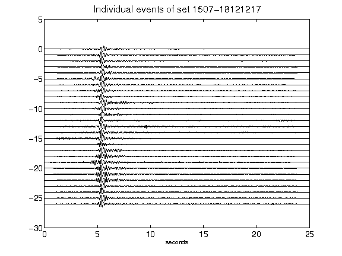](figures/1507-18121217_AllEv.png)[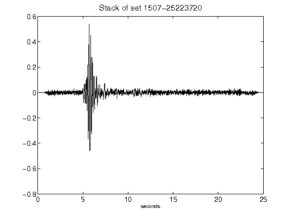](figures/1507-25223720_Stack.png)[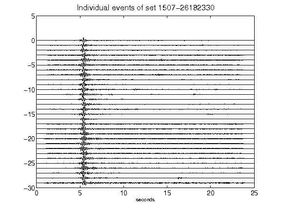](figures/1507-26182330_AllEv.png)[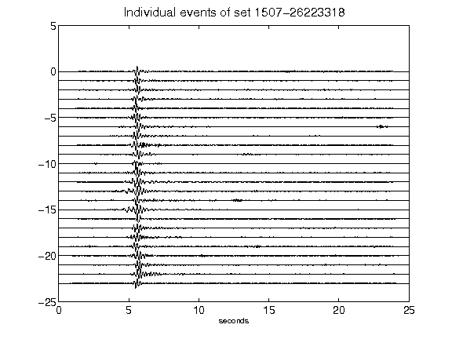](figures/1507-26223318_AllEv.png)[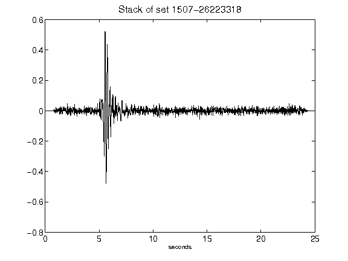](figures/1507-26223318_Stack.png)[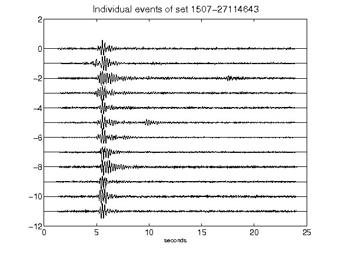](figures/1507-27114643_AllEv.png)[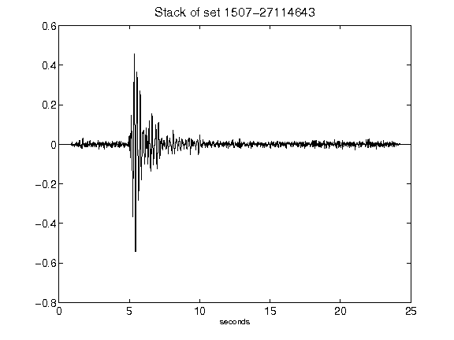](figures/1507-27114643_Stack.png)[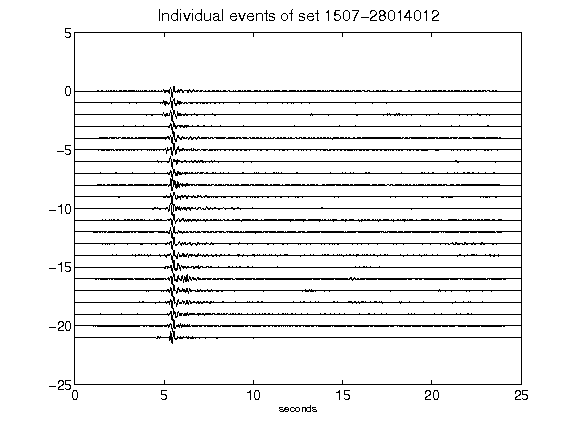](figures/1507-28014012_AllEv.png)[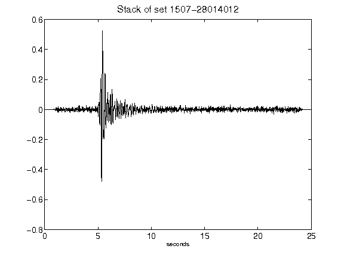](figures/1507-28014012_Stack.png)[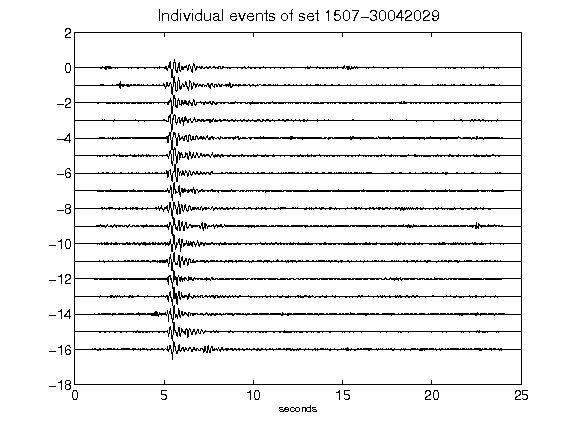](figures/1507-30042029_AllEv.png)[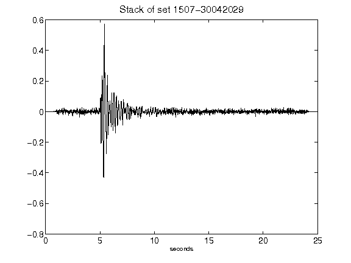](figures/1507-30042029_Stack.png)[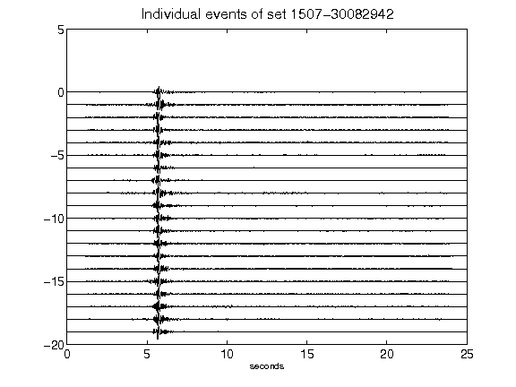](figures/1507-30082942_AllEv.png)[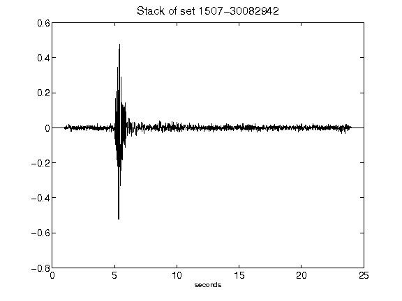](figures/1507-30082942_Stack.png)[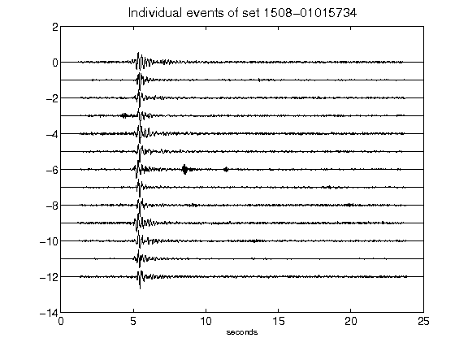](figures/1508-01015734_AllEv.png)[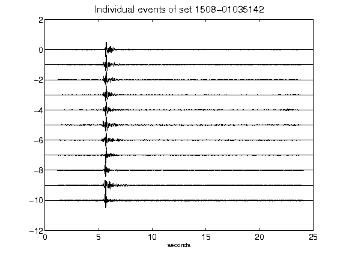](figures/1508-01035142_AllEv.png)[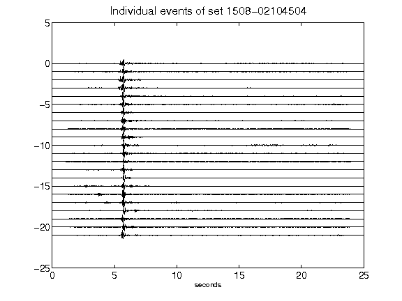](figures/1508-02104504_AllEv.png)[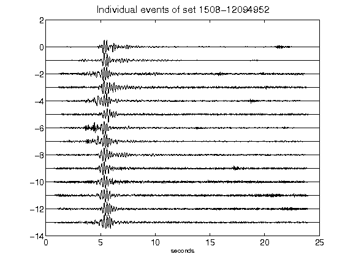](figures/1508-12094952_AllEv.png)[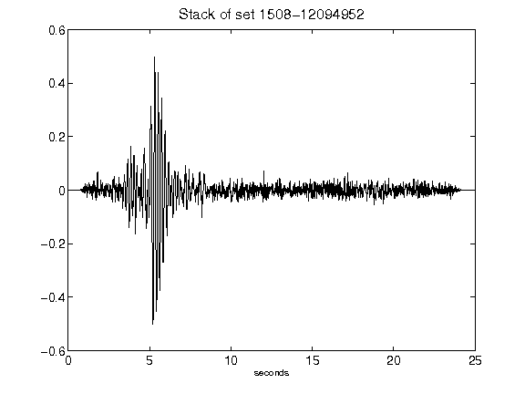](figures/1508-12094952_Stack.png)[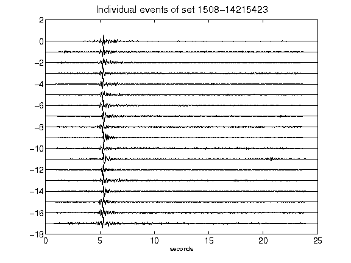](figures/1508-14215423_AllEv.png)[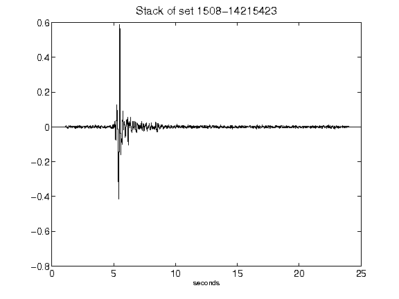](figures/1508-14215423_Stack.png)[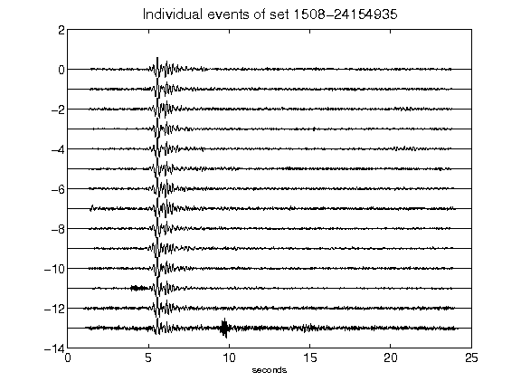](figures/1508-24154935_AllEv.png)[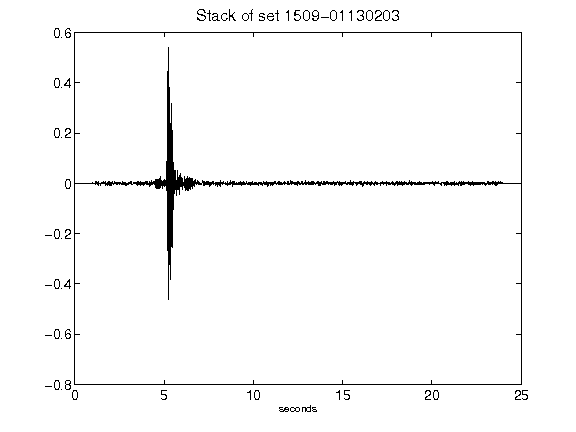](figures/1509-01130203_Stack.png)[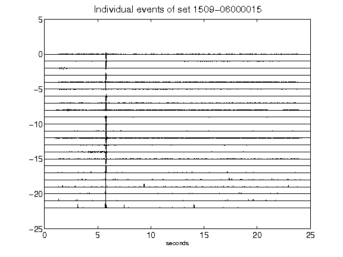](figures/1509-06000015_AllEv.png)