# Repeating Earthquake Activity at STAR

## Waveforms
[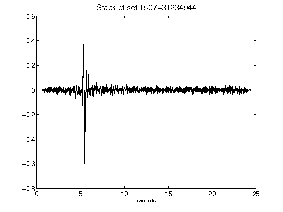](figures/1507-31234944_Stack.png)[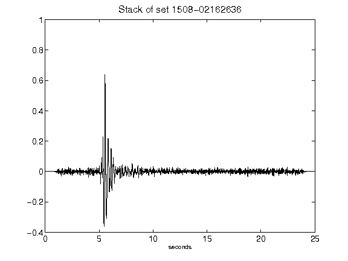](figures/1508-02162636_Stack.png)[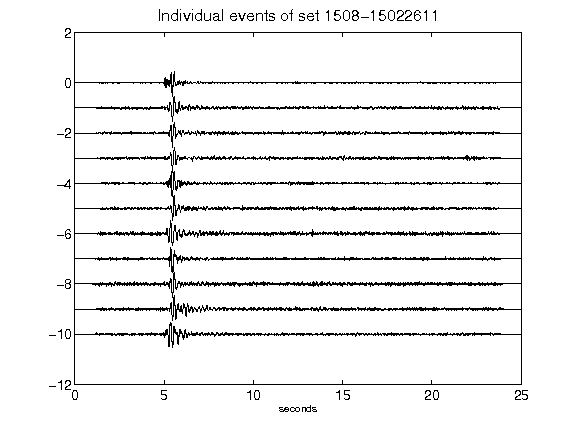](figures/1508-15022611_AllEv.png)[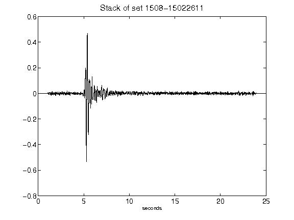](figures/1508-15022611_Stack.png)[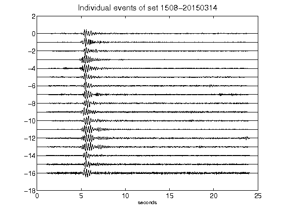](figures/1508-20150314_AllEv.png)[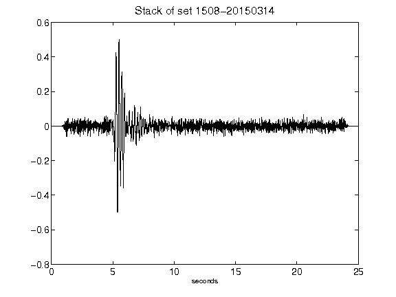](figures/1508-20150314_Stack.png)[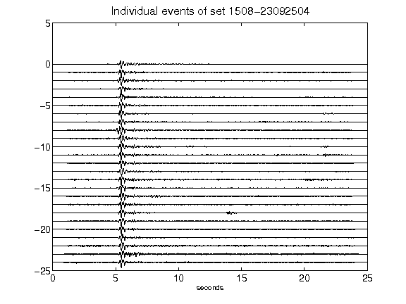](figures/1508-23092504_AllEv.png)[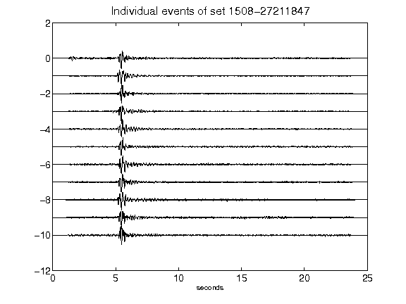](figures/1508-27211847_AllEv.png)[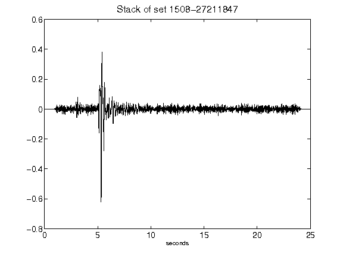](figures/1508-27211847_Stack.png)[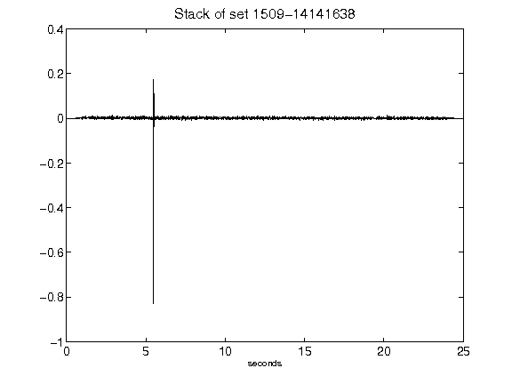](figures/1509-14141638_Stack.png)[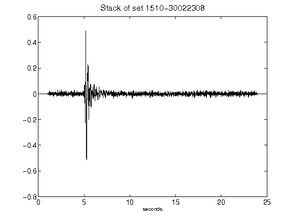](figures/1510-30022308_Stack.png)[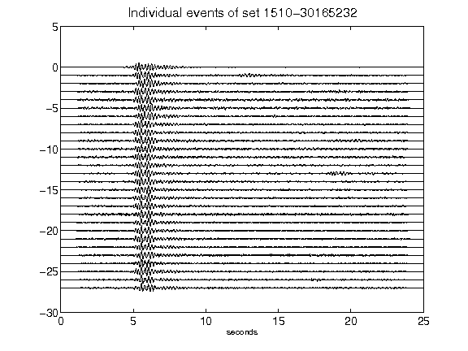](figures/1510-30165232_AllEv.png)[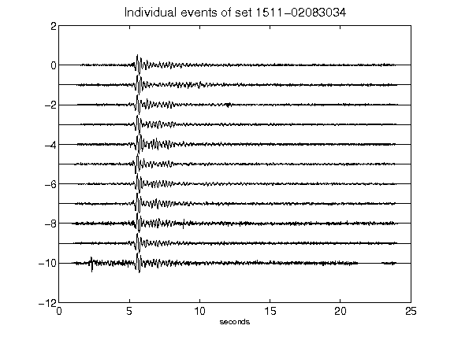](figures/1511-02083034_AllEv.png)[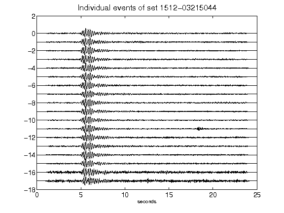](figures/1512-03215044_AllEv.png)[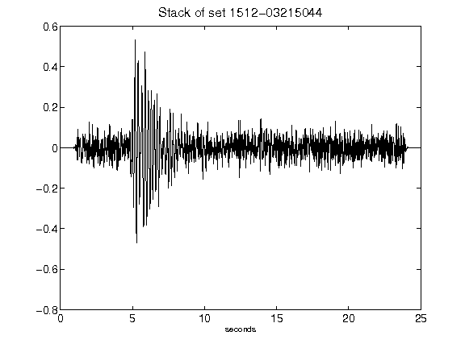](figures/1512-03215044_Stack.png)