# Repeating Earthquake Activity at STAR

## Waveforms
[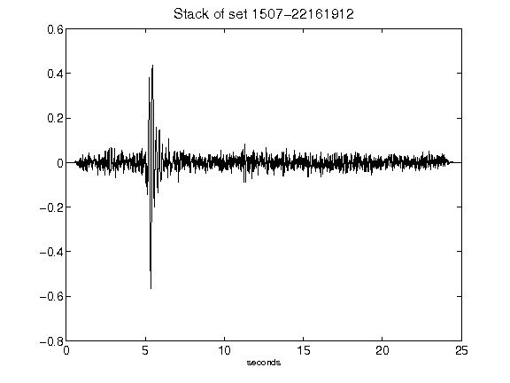](figures/1507-22161912_Stack.png)[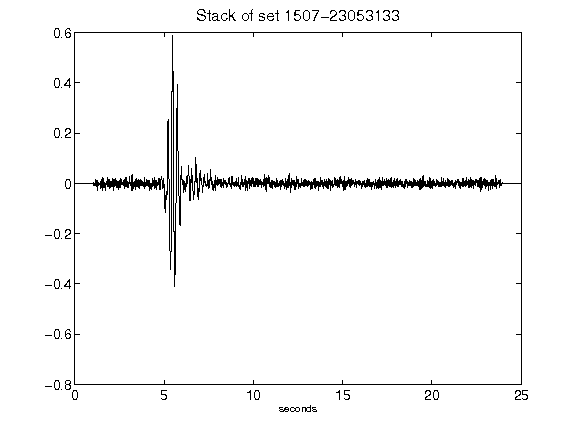](figures/1507-23053133_Stack.png)[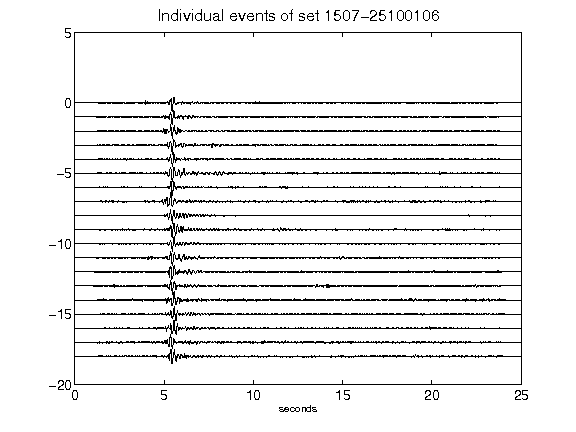](figures/1507-25100106_AllEv.png)[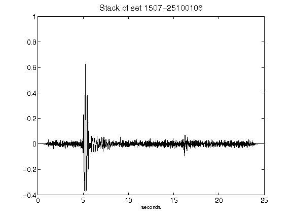](figures/1507-25100106_Stack.png)[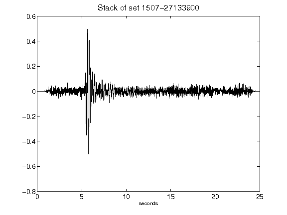](figures/1507-27133900_Stack.png)[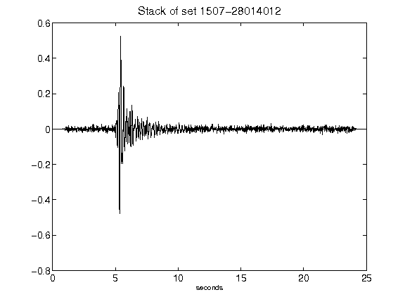](figures/1507-28014012_Stack.png)[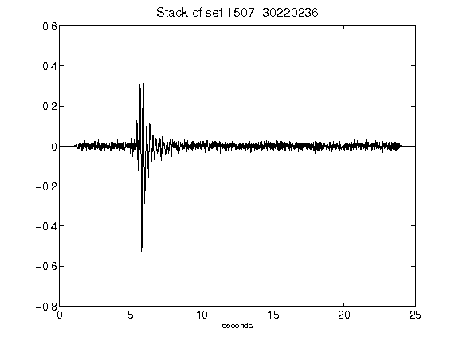](figures/1507-30220236_Stack.png)[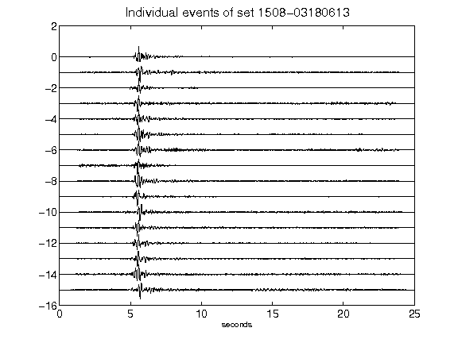](figures/1508-03180613_AllEv.png)[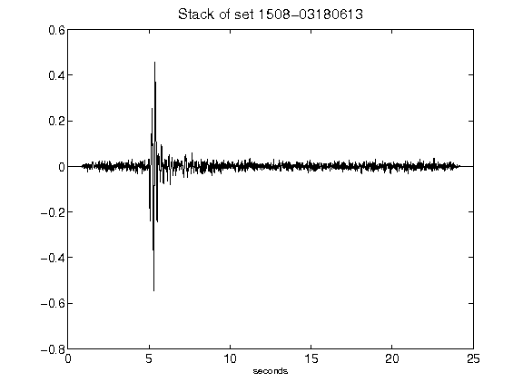](figures/1508-03180613_Stack.png)[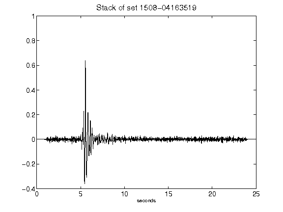](figures/1508-04163519_Stack.png)[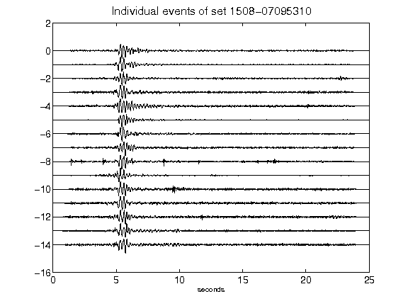](figures/1508-07095310_AllEv.png)[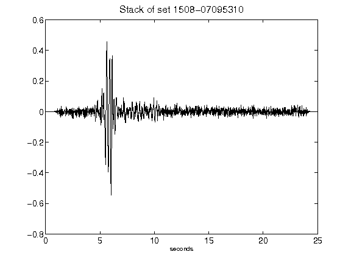](figures/1508-07095310_Stack.png)[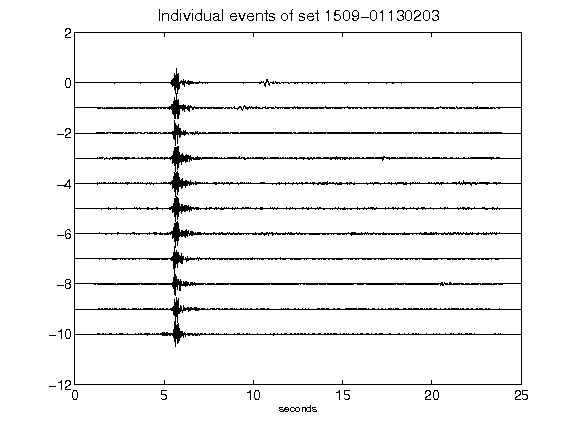](figures/1509-01130203_AllEv.png)[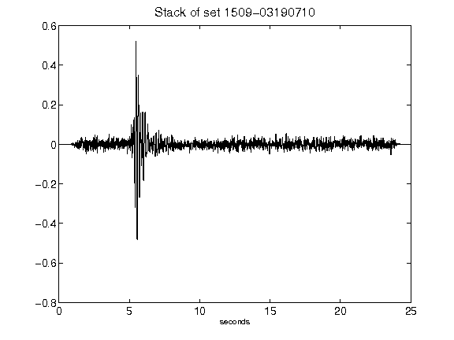](figures/1509-03190710_Stack.png)[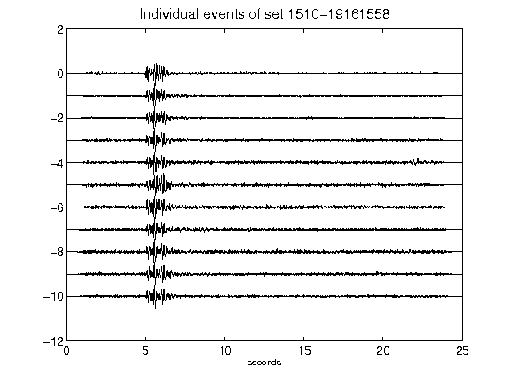](figures/1510-19161558_AllEv.png)[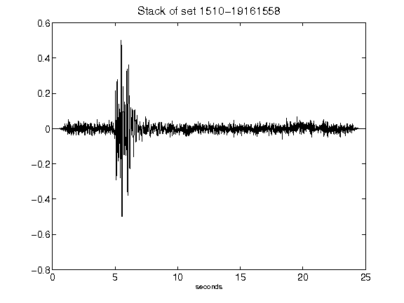](figures/1510-19161558_Stack.png)[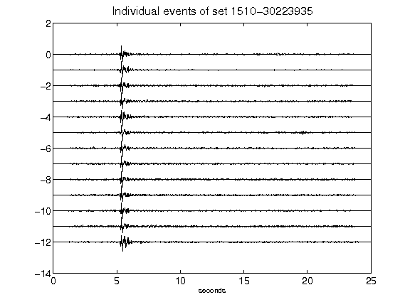](figures/1510-30223935_AllEv.png)[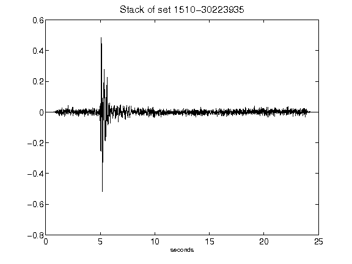](figures/1510-30223935_Stack.png)[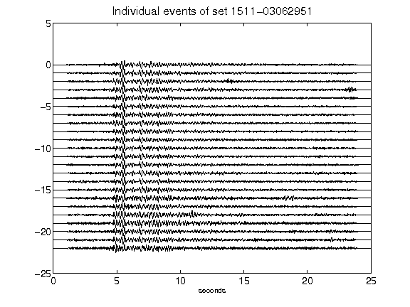](figures/1511-03062951_AllEv.png)[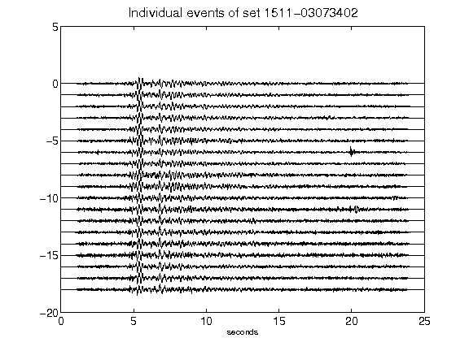](figures/1511-03073402_AllEv.png)