# Repeating Earthquake Activity at STAR

## Waveforms
[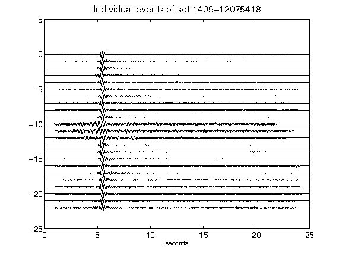](figures/1409-12075418_AllEv.png)[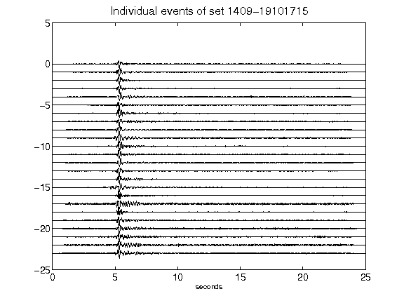](figures/1409-19101715_AllEv.png)[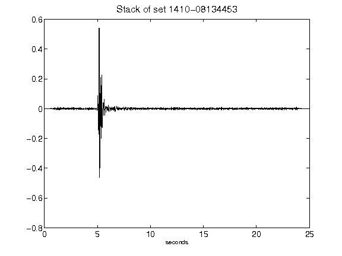](figures/1410-08134453_Stack.png)[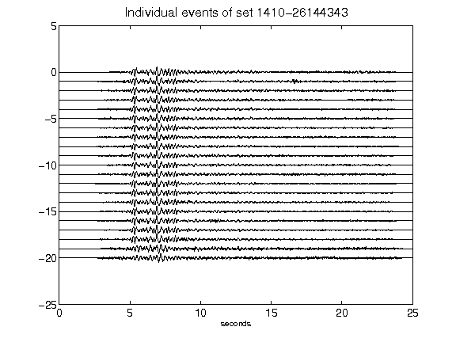](figures/1410-26144343_AllEv.png)[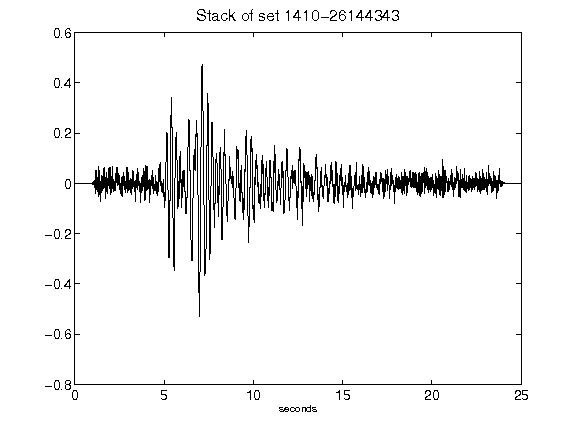](figures/1410-26144343_Stack.png)[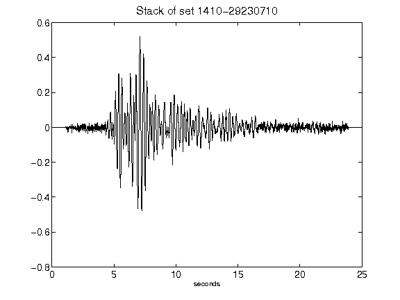](figures/1410-29230710_Stack.png)[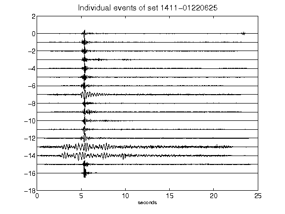](figures/1411-01220625_AllEv.png)[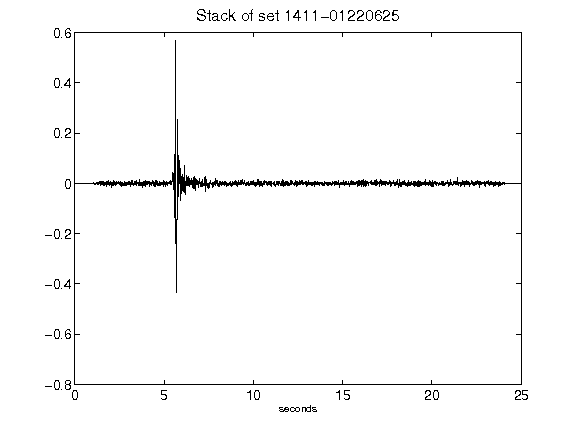](figures/1411-01220625_Stack.png)[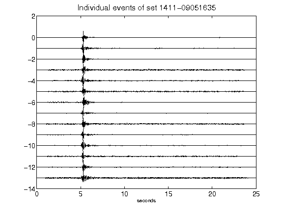](figures/1411-09051635_AllEv.png)[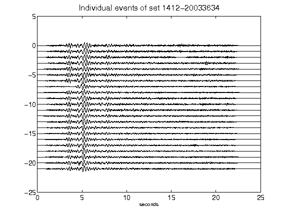](figures/1412-20033634_AllEv.png)[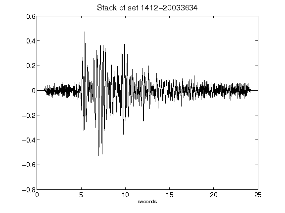](figures/1412-20033634_Stack.png)[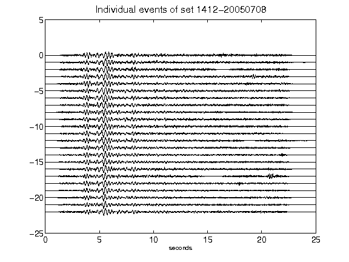](figures/1412-20050708_AllEv.png)