# Repeating Earthquake Activity at STAR

## Waveforms
[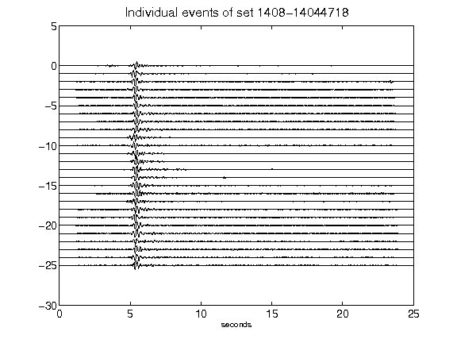](figures/1408-14044718_AllEv.png)[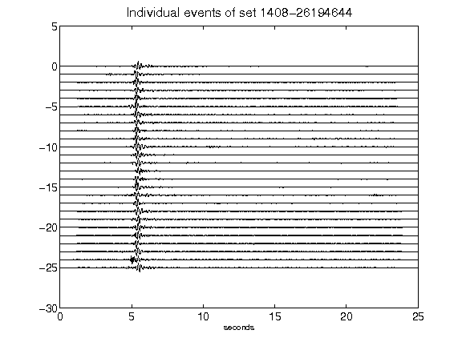](figures/1408-26194644_AllEv.png)[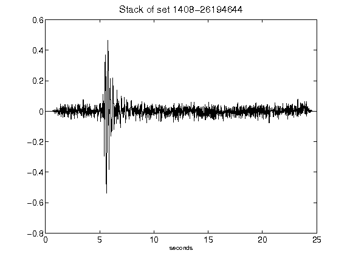](figures/1408-26194644_Stack.png)[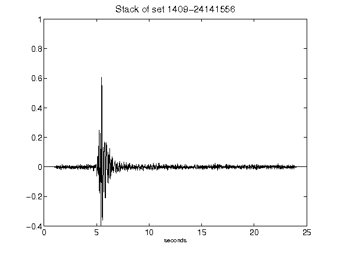](figures/1409-24141556_Stack.png)[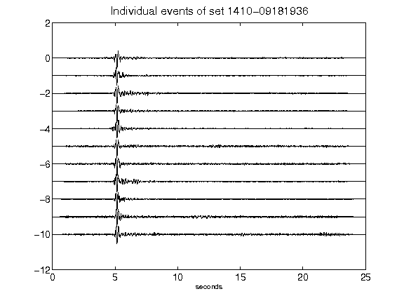](figures/1410-09181936_AllEv.png)[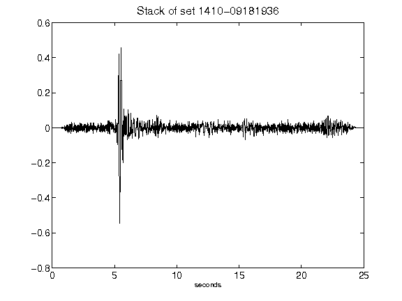](figures/1410-09181936_Stack.png)[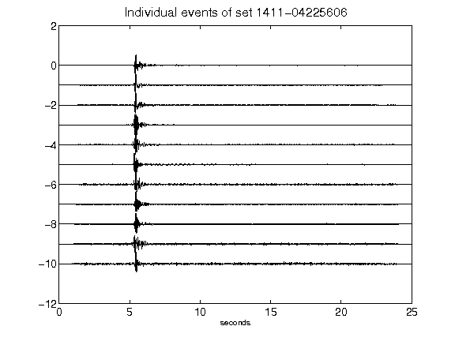](figures/1411-04225606_AllEv.png)[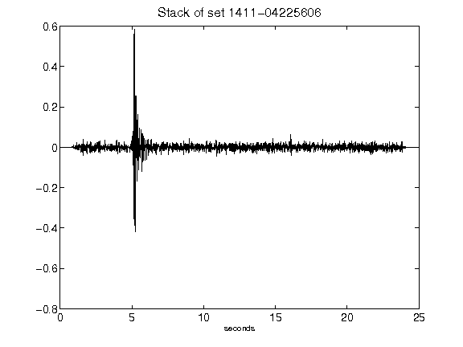](figures/1411-04225606_Stack.png)[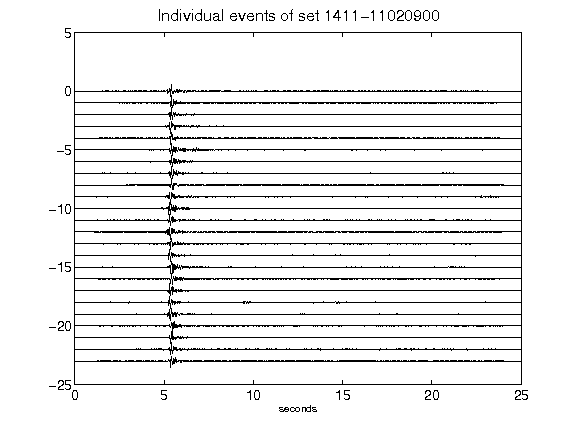](figures/1411-11020900_AllEv.png)[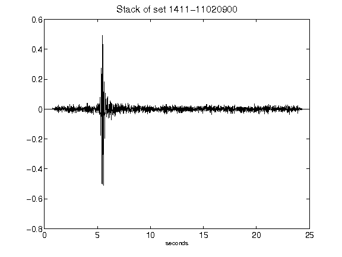](figures/1411-11020900_Stack.png)[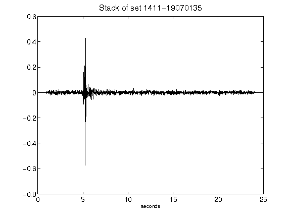](figures/1411-19070135_Stack.png)[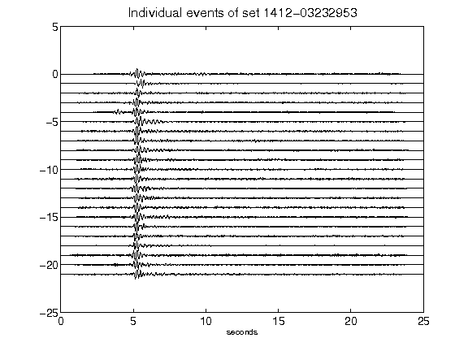](figures/1412-03232953_AllEv.png)[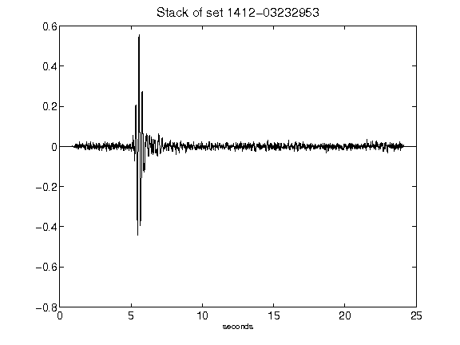](figures/1412-03232953_Stack.png)[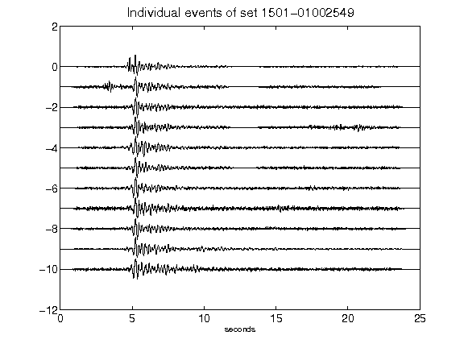](figures/1501-01002549_AllEv.png)[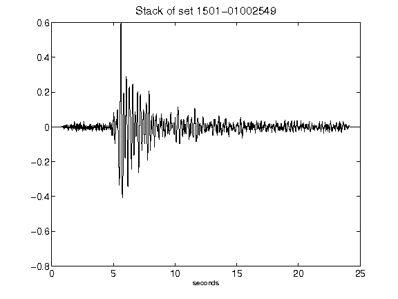](figures/1501-01002549_Stack.png)[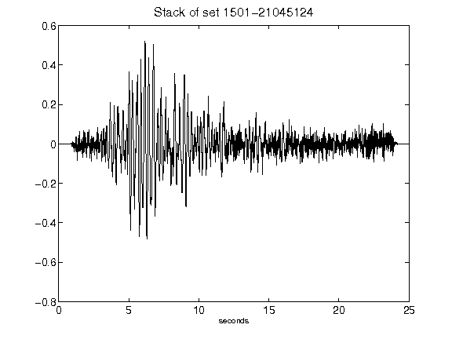](figures/1501-21045124_Stack.png)