# Repeating Earthquake Activity at STAR

## Waveforms
[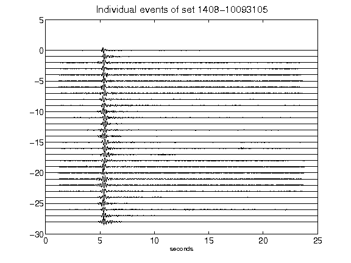](figures/1408-10093105_AllEv.png)[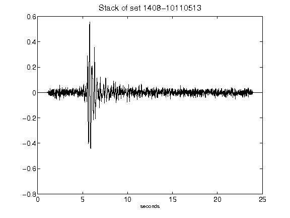](figures/1408-10110513_Stack.png)[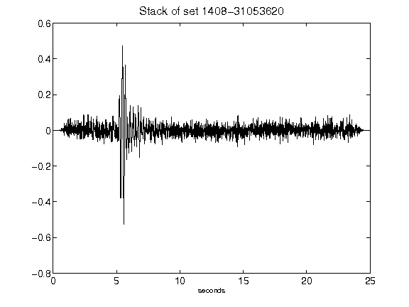](figures/1408-31053620_Stack.png)[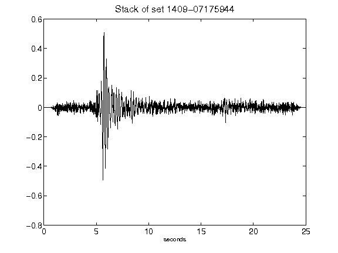](figures/1409-07175944_Stack.png)[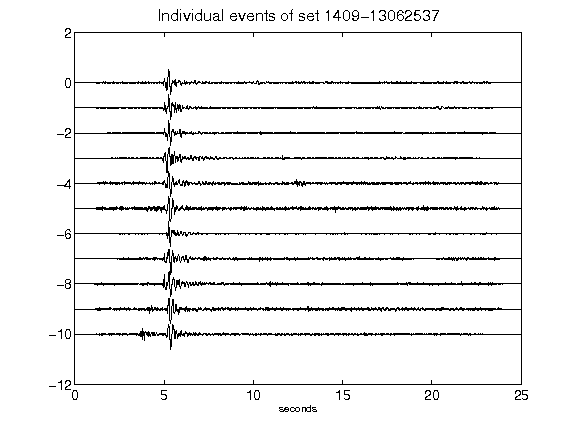](figures/1409-13062537_AllEv.png)[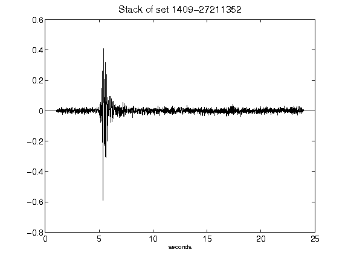](figures/1409-27211352_Stack.png)[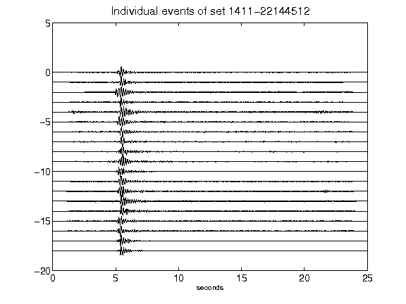](figures/1411-22144512_AllEv.png)[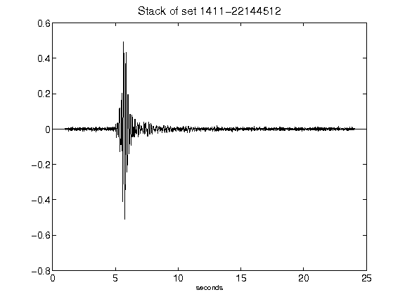](figures/1411-22144512_Stack.png)[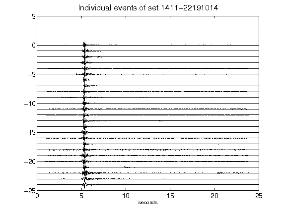](figures/1411-22191014_AllEv.png)[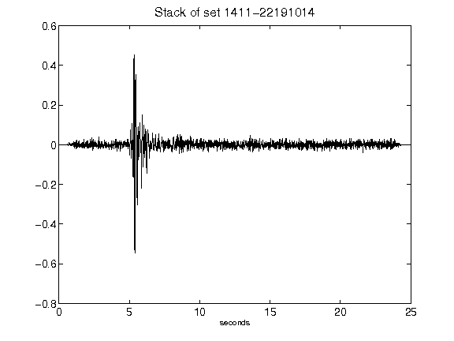](figures/1411-22191014_Stack.png)[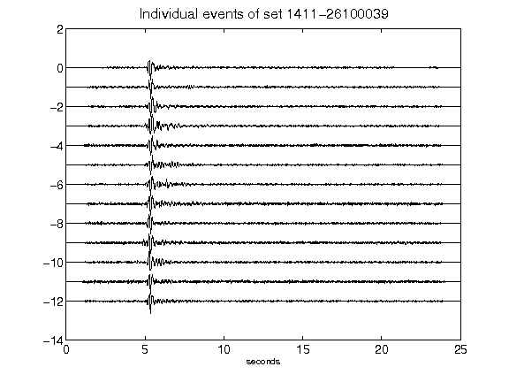](figures/1411-26100039_AllEv.png)[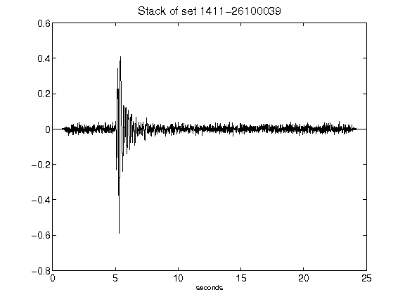](figures/1411-26100039_Stack.png)[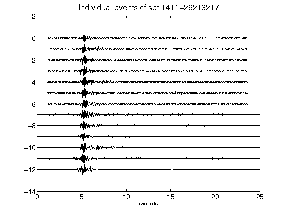](figures/1411-26213217_AllEv.png)[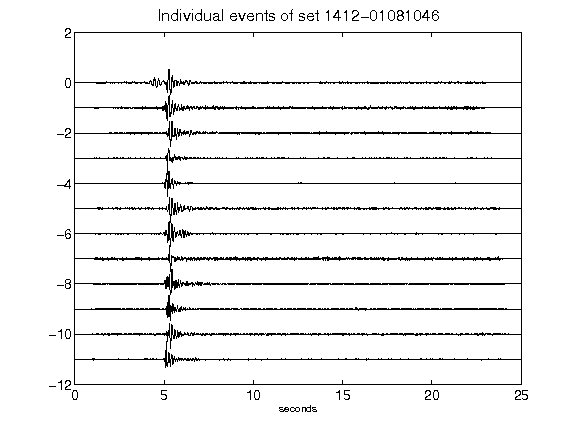](figures/1412-01081046_AllEv.png)[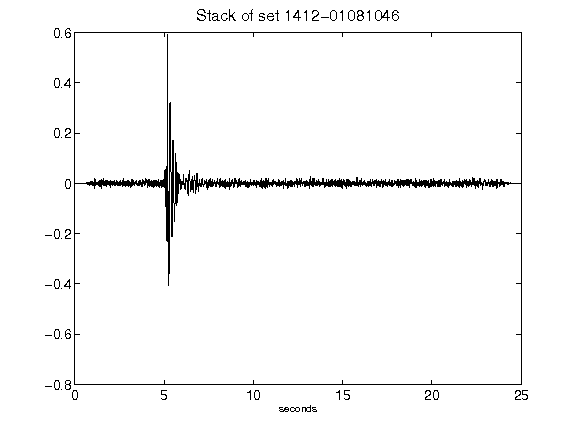](figures/1412-01081046_Stack.png)[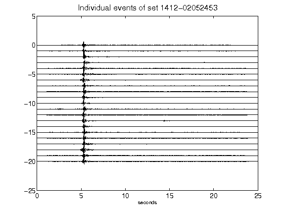](figures/1412-02052453_AllEv.png)[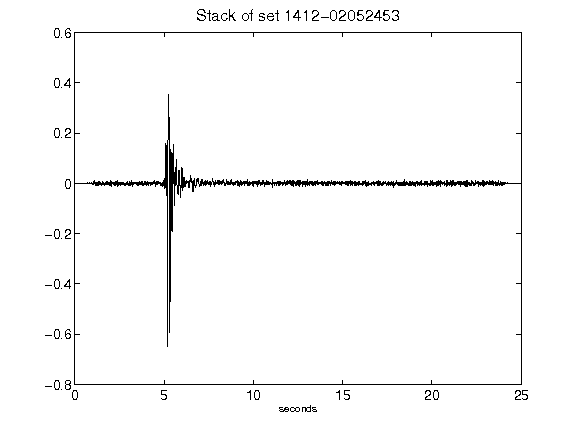](figures/1412-02052453_Stack.png)[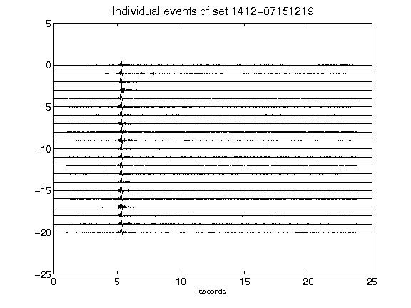](figures/1412-07151219_AllEv.png)[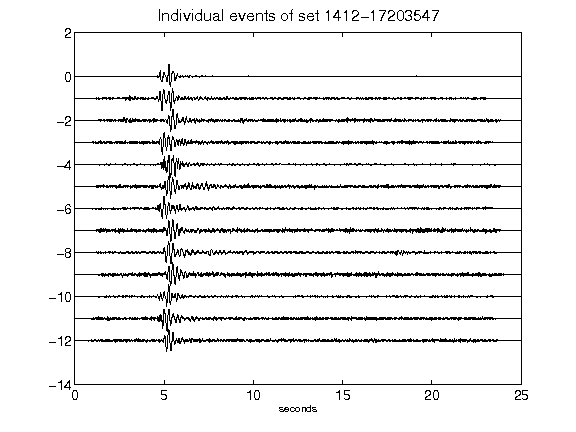](figures/1412-17203547_AllEv.png)[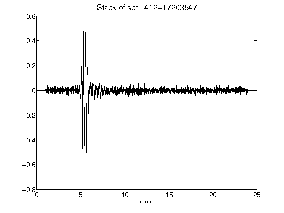](figures/1412-17203547_Stack.png)[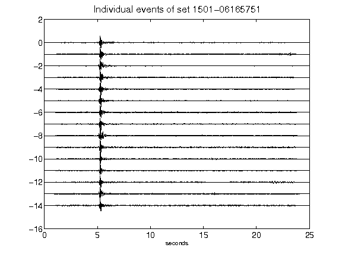](figures/1501-06165751_AllEv.png)[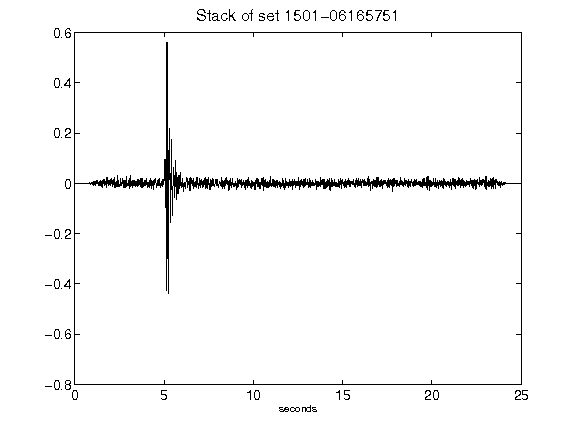](figures/1501-06165751_Stack.png)[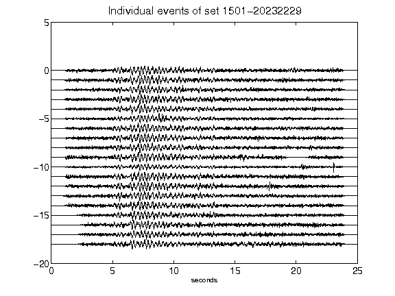](figures/1501-20232229_AllEv.png)[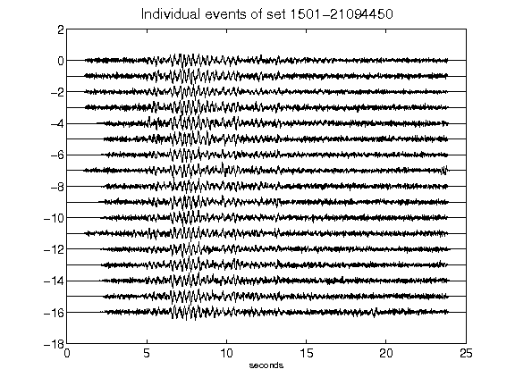](figures/1501-21094450_AllEv.png)[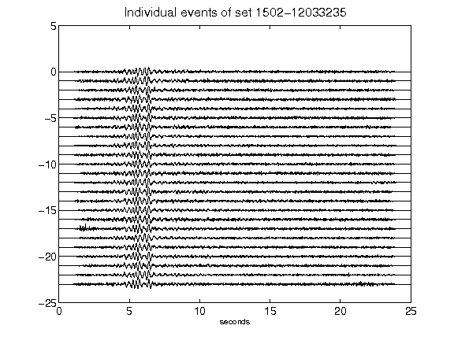](figures/1502-12033235_AllEv.png)