# Repeating Earthquake Activity at STAR

## Waveforms
[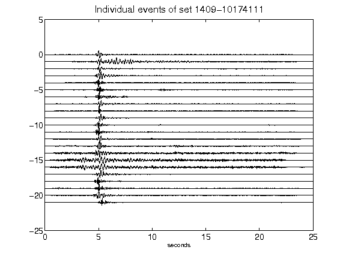](figures/1409-10174111_AllEv.png)[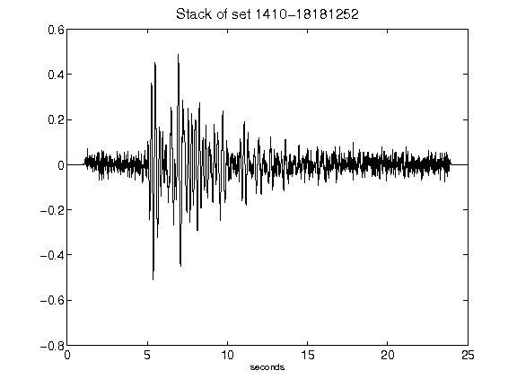](figures/1410-18181252_Stack.png)[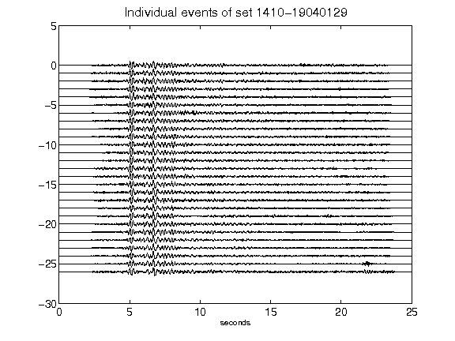](figures/1410-19040129_AllEv.png)[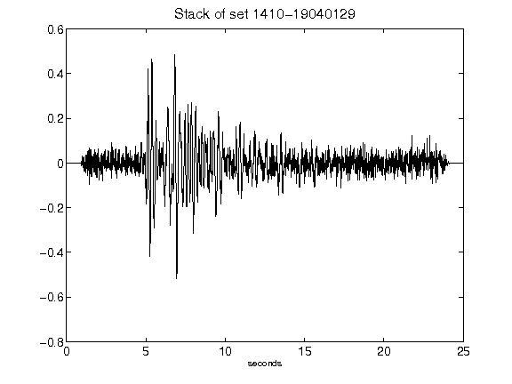](figures/1410-19040129_Stack.png)[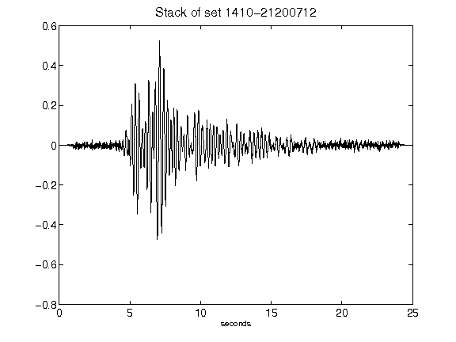](figures/1410-21200712_Stack.png)[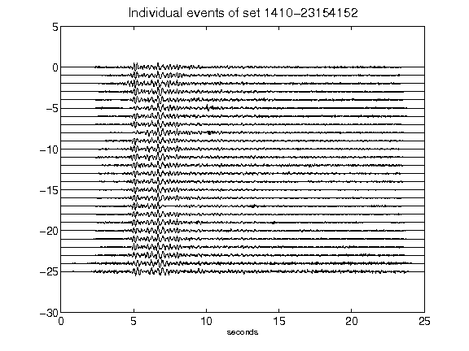](figures/1410-23154152_AllEv.png)[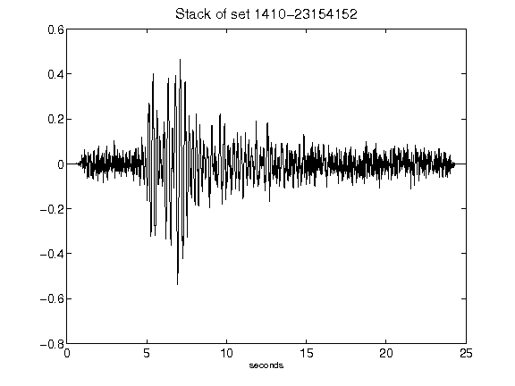](figures/1410-23154152_Stack.png)[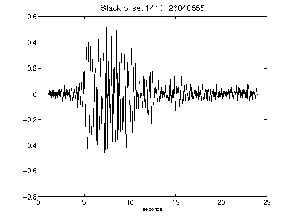](figures/1410-26040555_Stack.png)[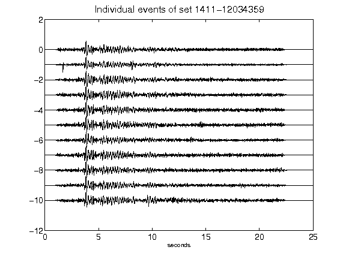](figures/1411-12034359_AllEv.png)[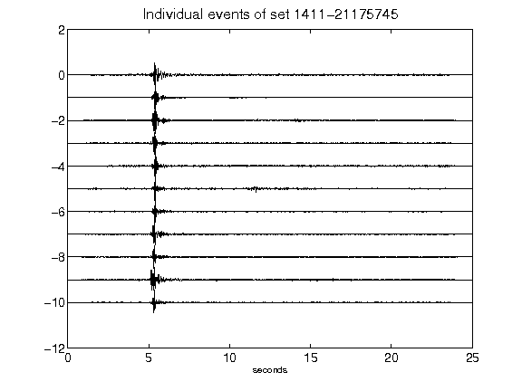](figures/1411-21175745_AllEv.png)[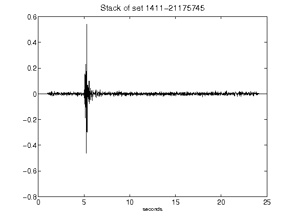](figures/1411-21175745_Stack.png)