# Repeating Earthquake Activity at STAR

## Waveforms
[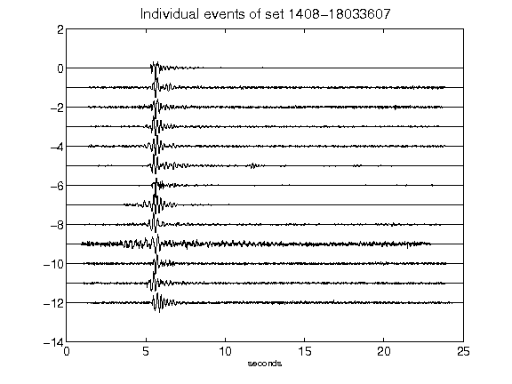](figures/1408-18033607_AllEv.png)[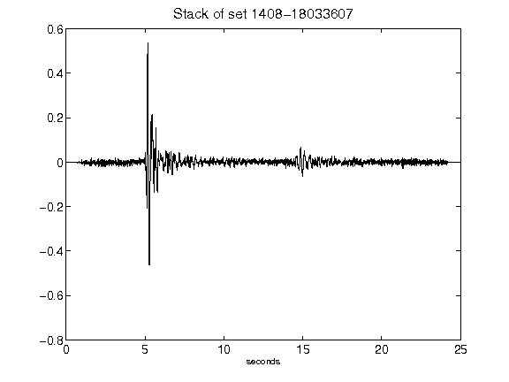](figures/1408-18033607_Stack.png)[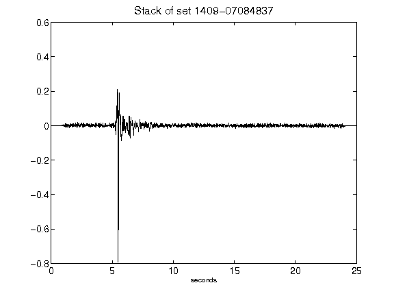](figures/1409-07084837_Stack.png)[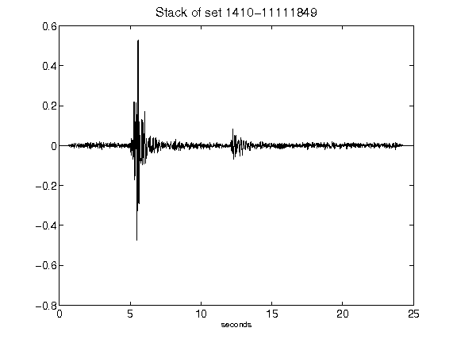](figures/1410-11111849_Stack.png)[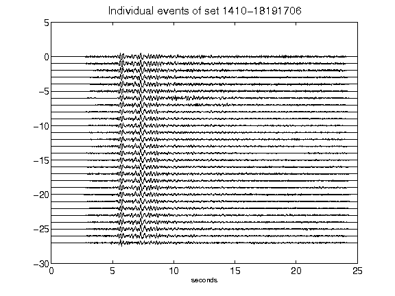](figures/1410-18191706_AllEv.png)[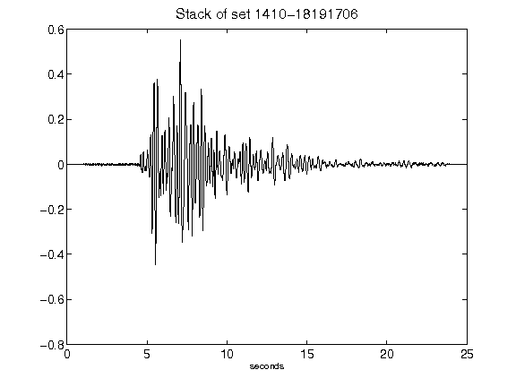](figures/1410-18191706_Stack.png)[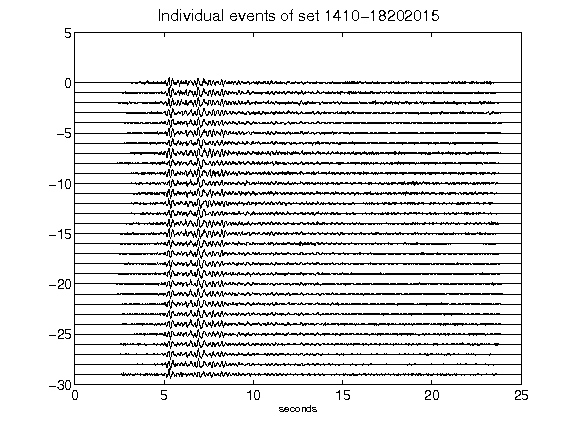](figures/1410-18202015_AllEv.png)[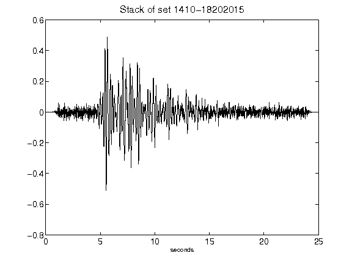](figures/1410-18202015_Stack.png)[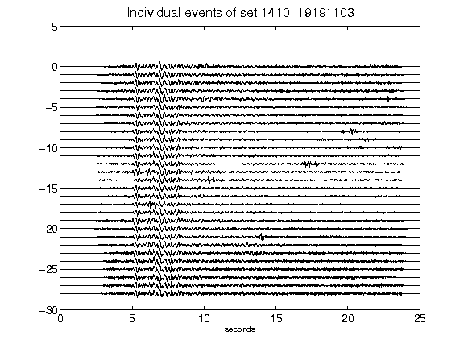](figures/1410-19191103_AllEv.png)[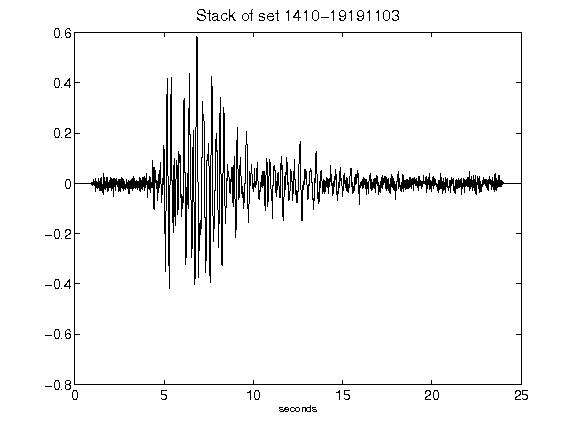](figures/1410-19191103_Stack.png)[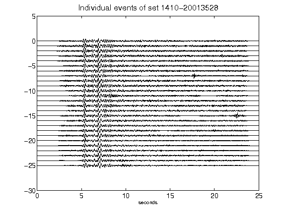](figures/1410-20013528_AllEv.png)[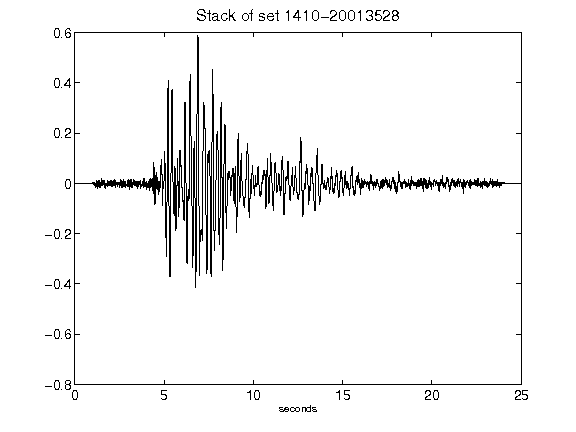](figures/1410-20013528_Stack.png)[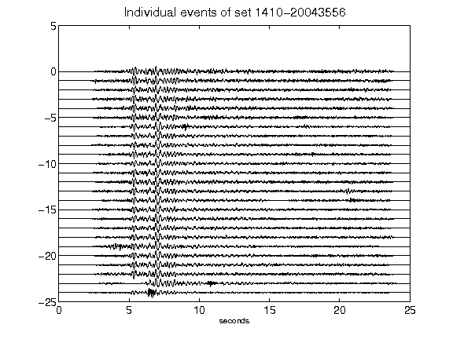](figures/1410-20043556_AllEv.png)[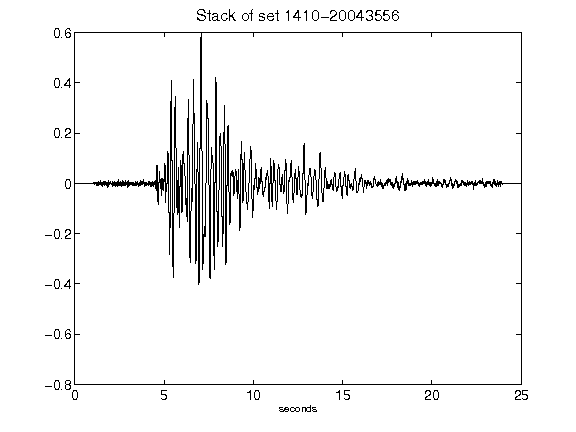](figures/1410-20043556_Stack.png)[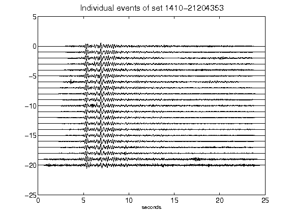](figures/1410-21204353_AllEv.png)[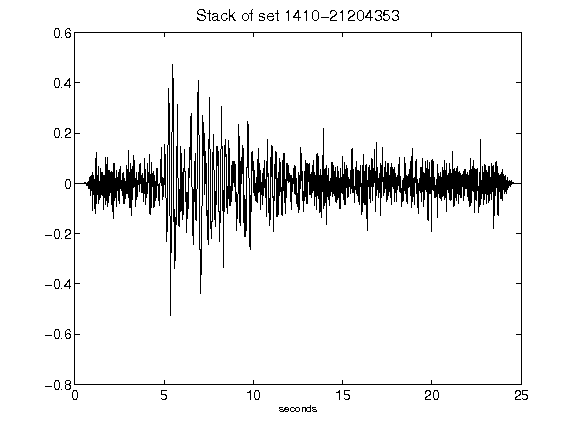](figures/1410-21204353_Stack.png)[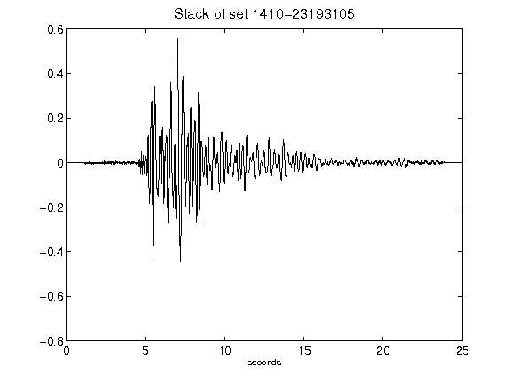](figures/1410-23193105_Stack.png)[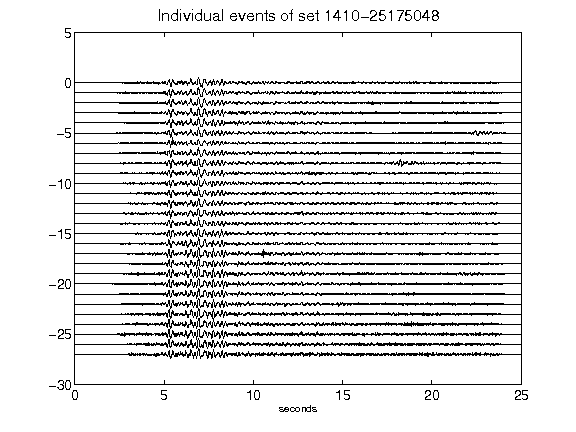](figures/1410-25175048_AllEv.png)[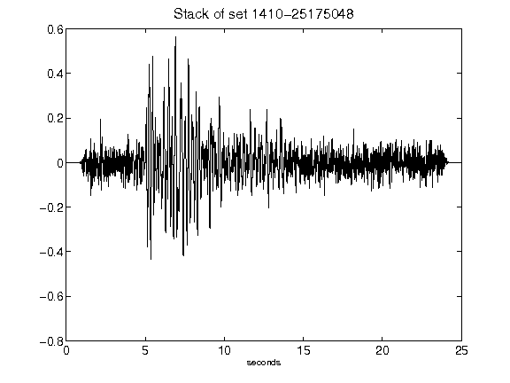](figures/1410-25175048_Stack.png)[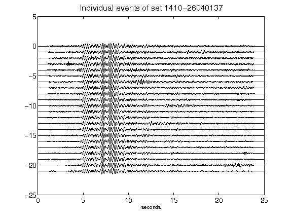](figures/1410-26040137_AllEv.png)[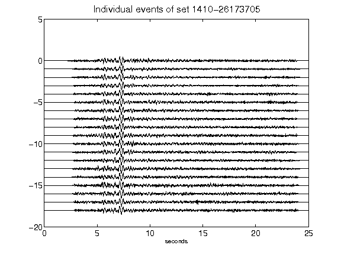](figures/1410-26173705_AllEv.png)[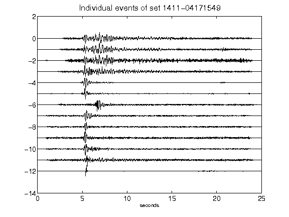](figures/1411-04171549_AllEv.png)[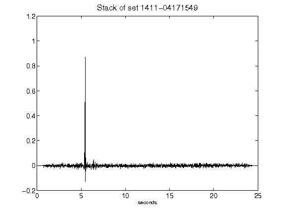](figures/1411-04171549_Stack.png)[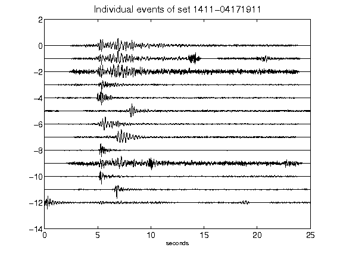](figures/1411-04171911_AllEv.png)[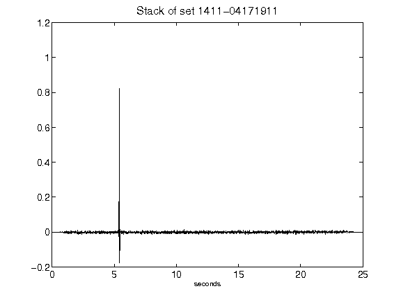](figures/1411-04171911_Stack.png)[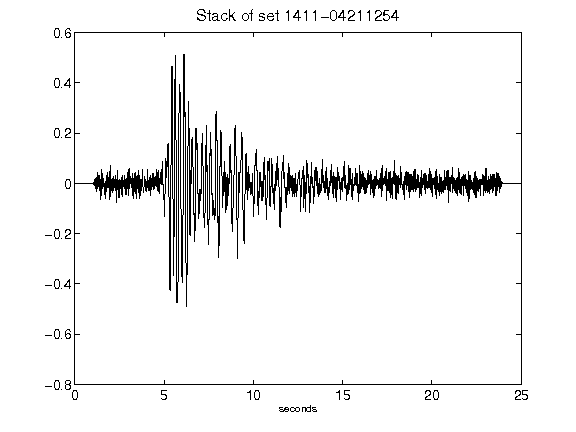](figures/1411-04211254_Stack.png)[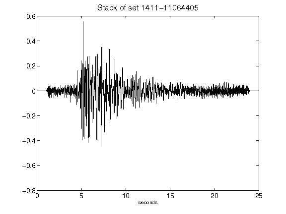](figures/1411-11064405_Stack.png)[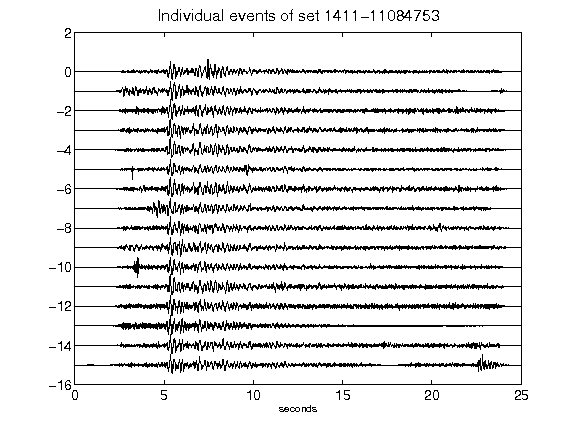](figures/1411-11084753_AllEv.png)[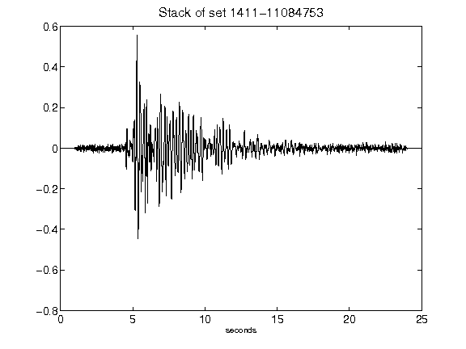](figures/1411-11084753_Stack.png)[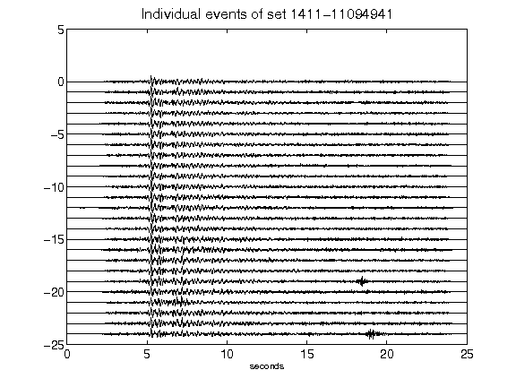](figures/1411-11094941_AllEv.png)[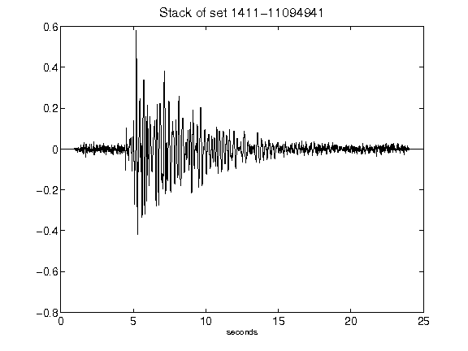](figures/1411-11094941_Stack.png)[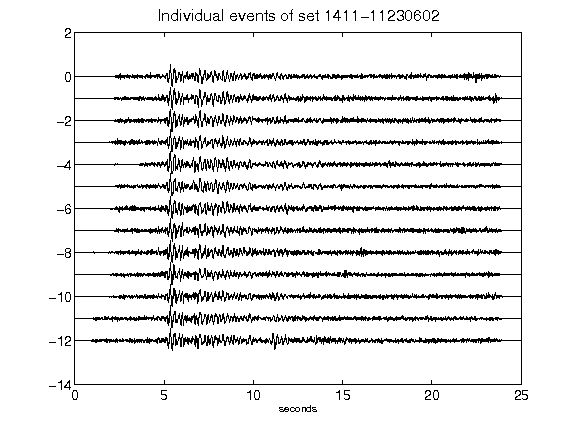](figures/1411-11230602_AllEv.png)[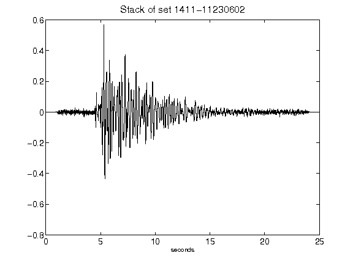](figures/1411-11230602_Stack.png)[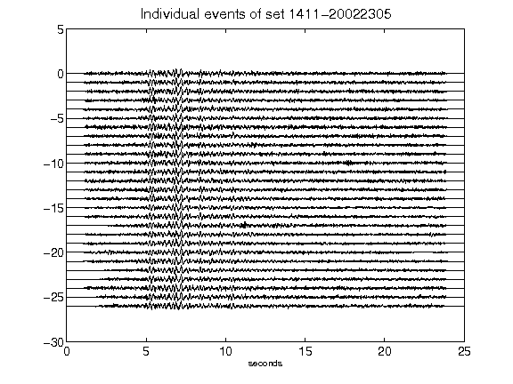](figures/1411-20022305_AllEv.png)[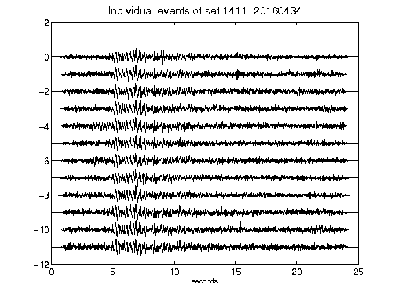](figures/1411-20160434_AllEv.png)[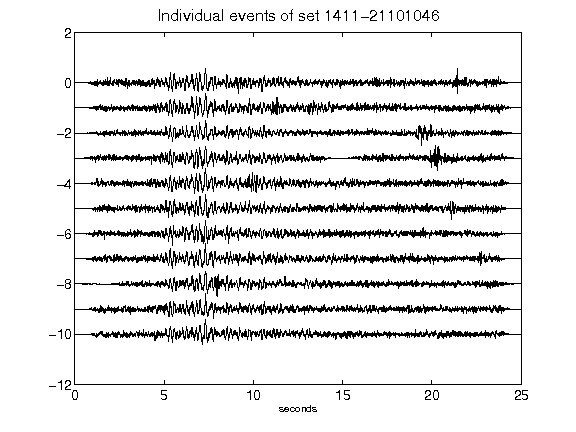](figures/1411-21101046_AllEv.png)[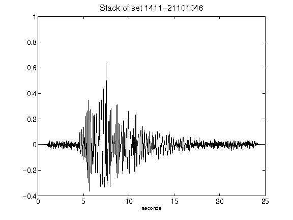](figures/1411-21101046_Stack.png)