# Repeating Earthquake Activity at STAR

## Waveforms
[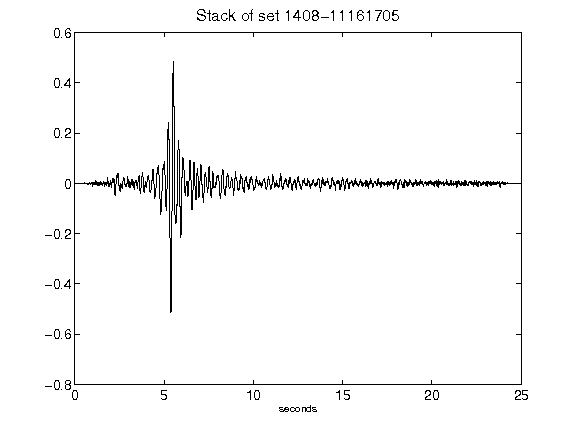](figures/1408-11161705_Stack.png)[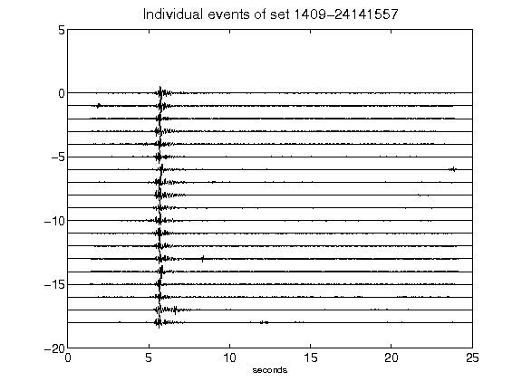](figures/1409-24141557_AllEv.png)[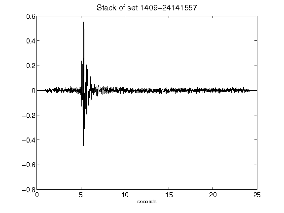](figures/1409-24141557_Stack.png)[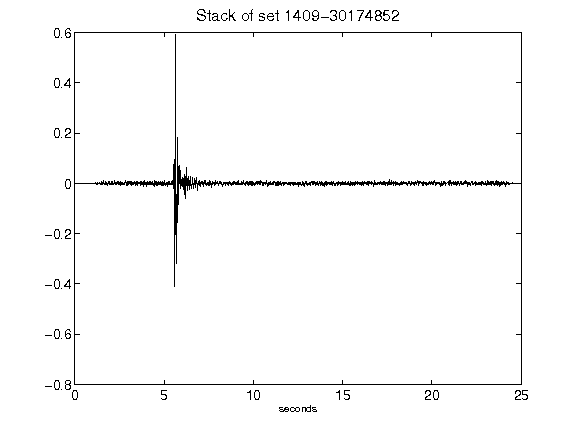](figures/1409-30174852_Stack.png)[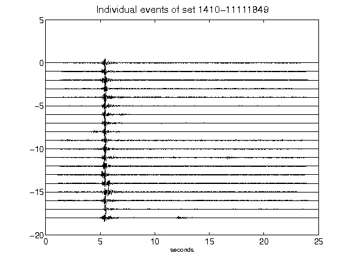](figures/1410-11111849_AllEv.png)[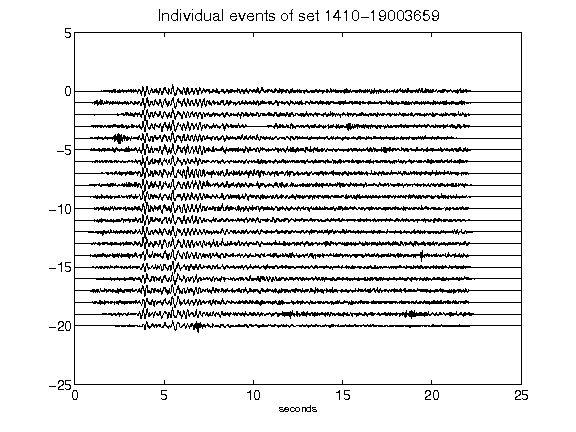](figures/1410-19003659_AllEv.png)[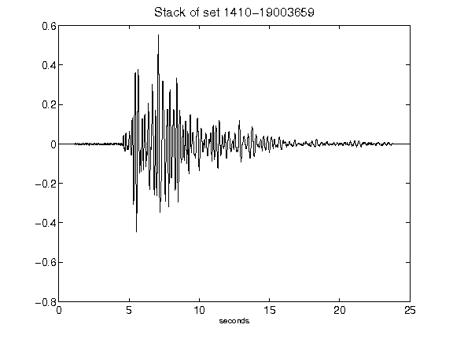](figures/1410-19003659_Stack.png)[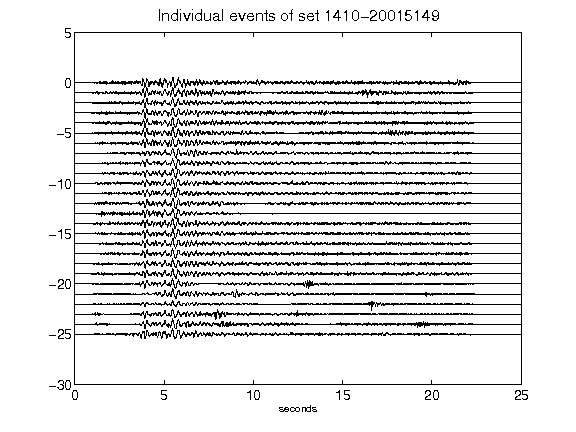](figures/1410-20015149_AllEv.png)[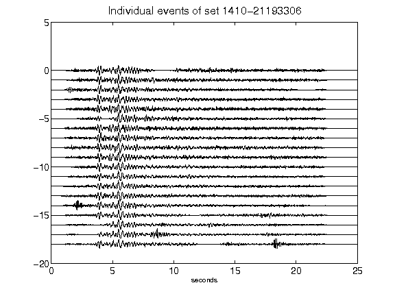](figures/1410-21193306_AllEv.png)[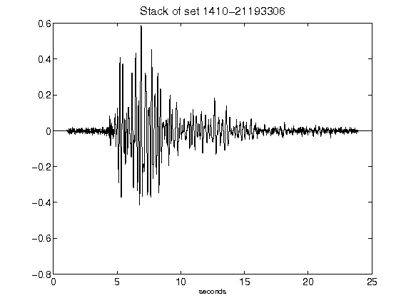](figures/1410-21193306_Stack.png)[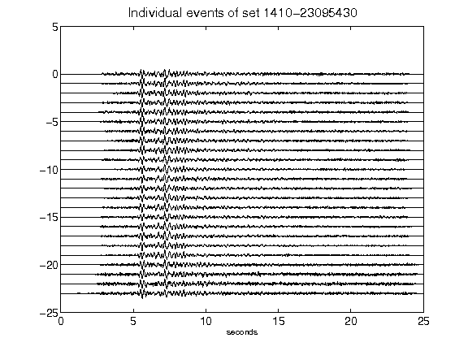](figures/1410-23095430_AllEv.png)[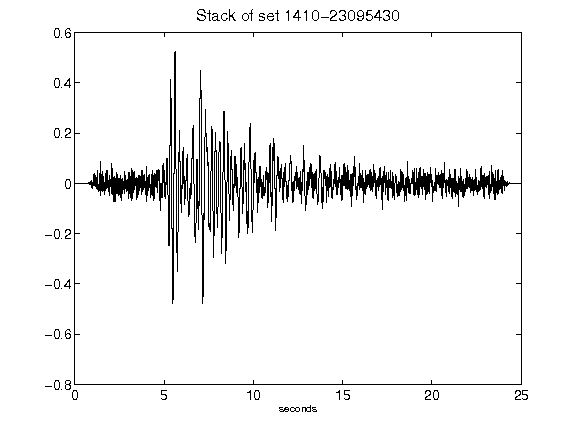](figures/1410-23095430_Stack.png)[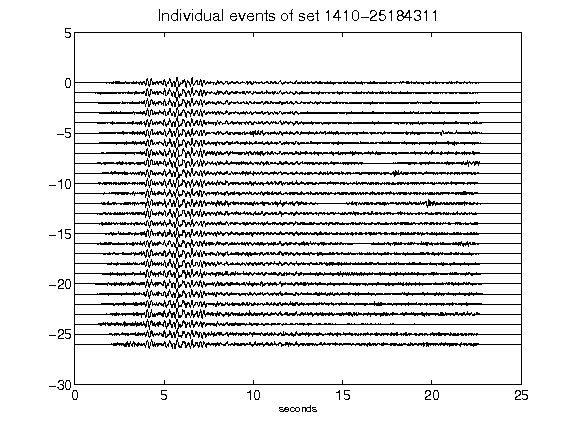](figures/1410-25184311_AllEv.png)[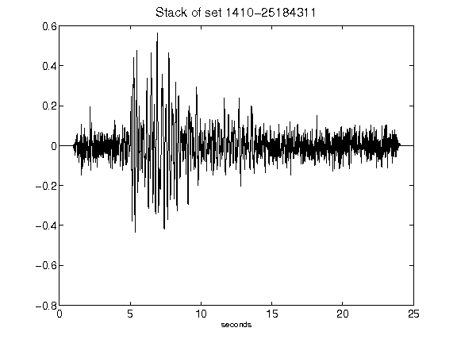](figures/1410-25184311_Stack.png)[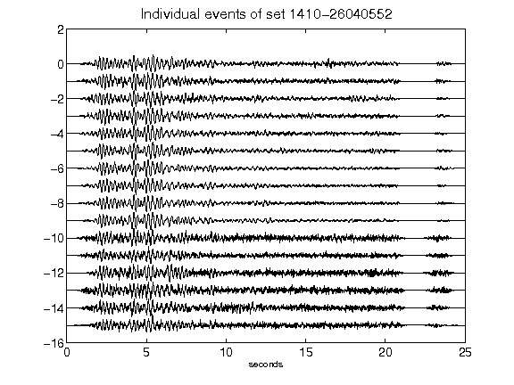](figures/1410-26040552_AllEv.png)[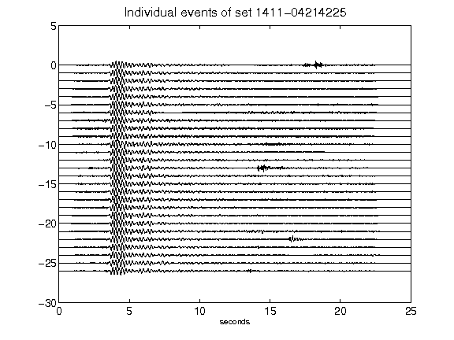](figures/1411-04214225_AllEv.png)[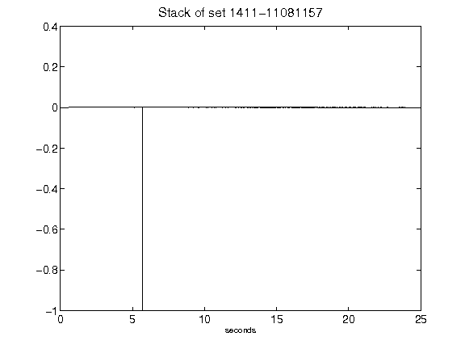](figures/1411-11081157_Stack.png)[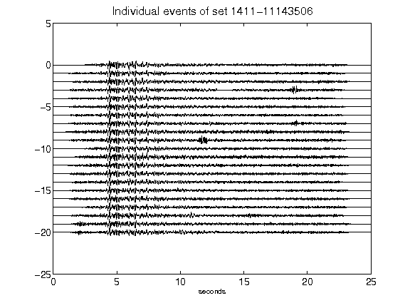](figures/1411-11143506_AllEv.png)[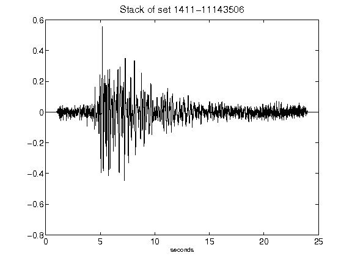](figures/1411-11143506_Stack.png)