# Repeating Earthquake Activity at STAR

## Waveforms
[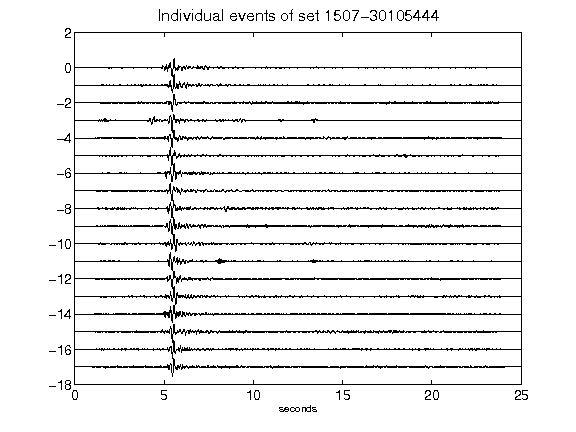](figures/1507-30105444_AllEv.png)[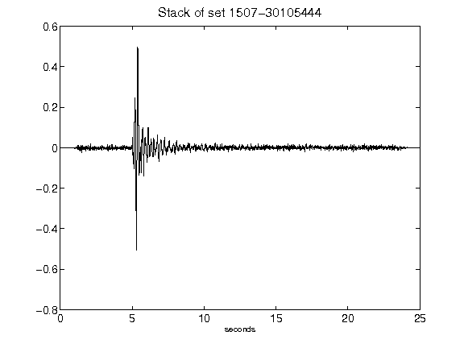](figures/1507-30105444_Stack.png)[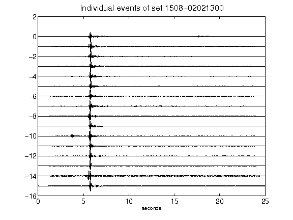](figures/1508-02021300_AllEv.png)[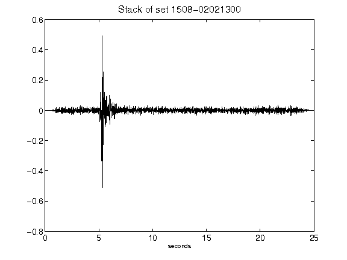](figures/1508-02021300_Stack.png)[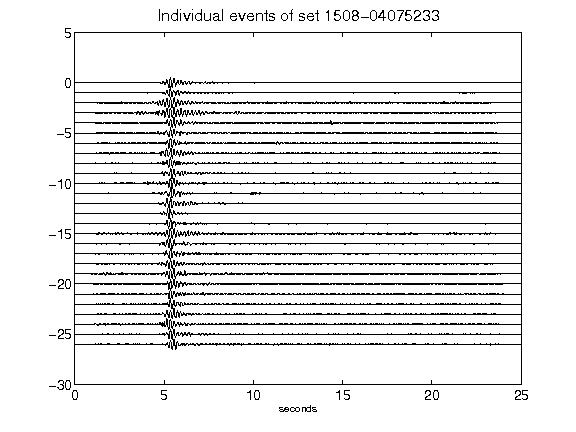](figures/1508-04075233_AllEv.png)[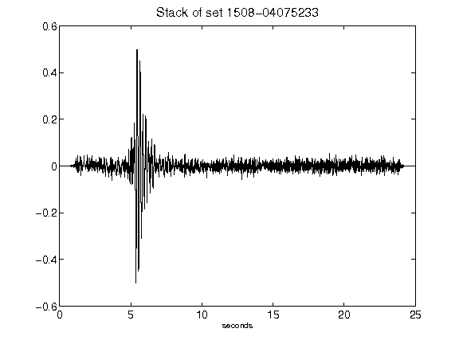](figures/1508-04075233_Stack.png)[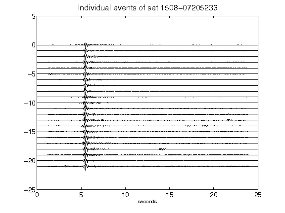](figures/1508-07205233_AllEv.png)[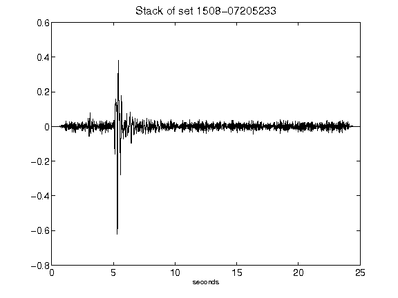](figures/1508-07205233_Stack.png)[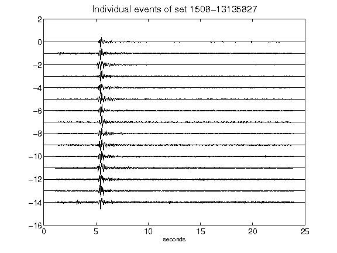](figures/1508-13135827_AllEv.png)[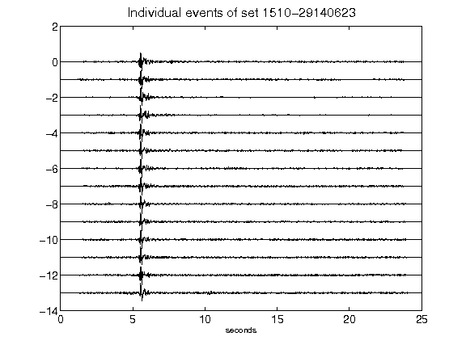](figures/1510-29140623_AllEv.png)[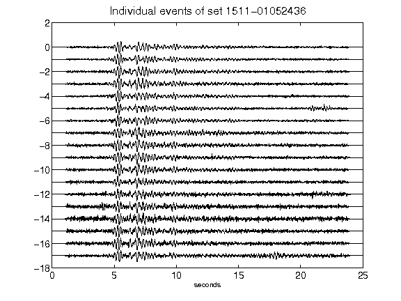](figures/1511-01052436_AllEv.png)[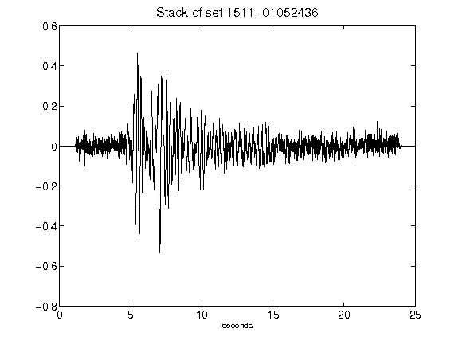](figures/1511-01052436_Stack.png)