# Repeating Earthquake Activity at STAR

## Waveforms
[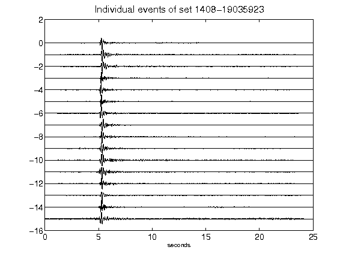](figures/1408-19035923_AllEv.png)[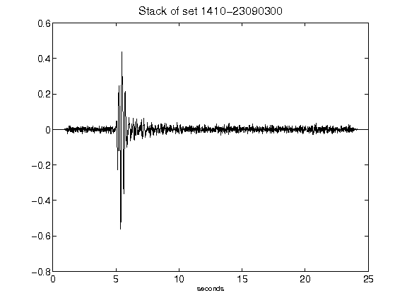](figures/1410-23090300_Stack.png)[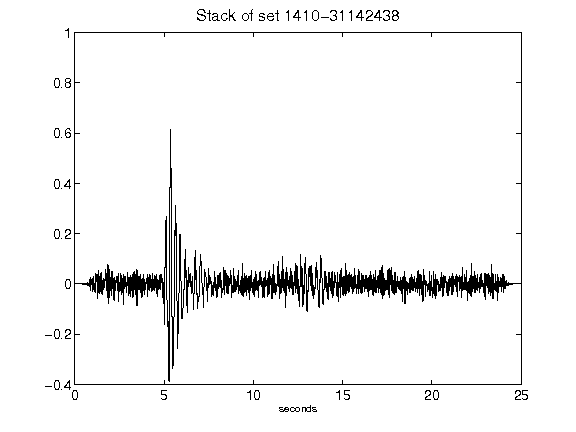](figures/1410-31142438_Stack.png)[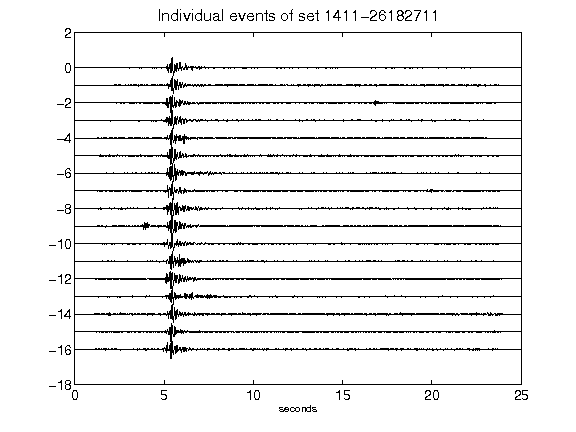](figures/1411-26182711_AllEv.png)[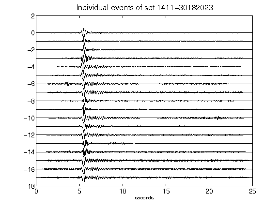](figures/1411-30182023_AllEv.png)[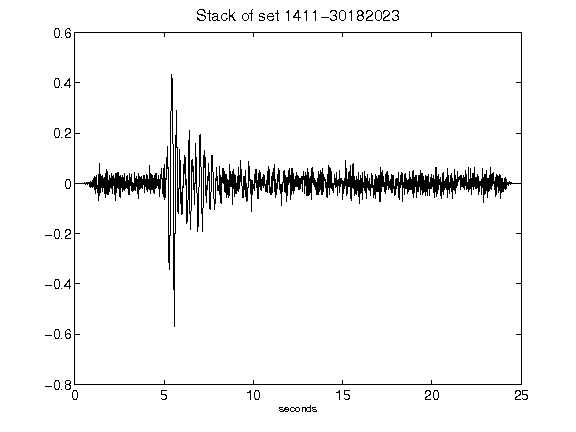](figures/1411-30182023_Stack.png)[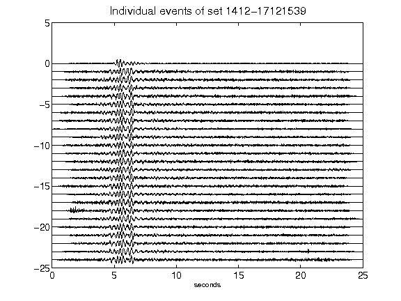](figures/1412-17121539_AllEv.png)[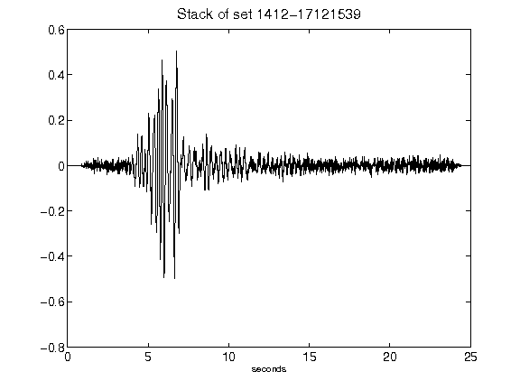](figures/1412-17121539_Stack.png)[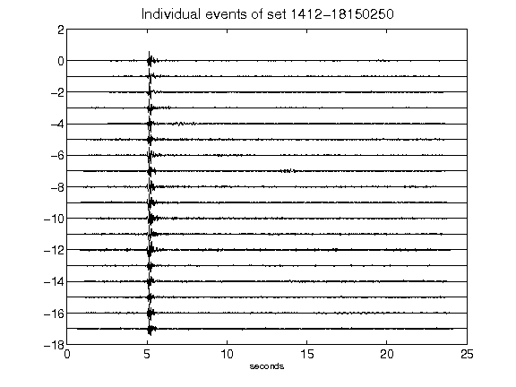](figures/1412-18150250_AllEv.png)[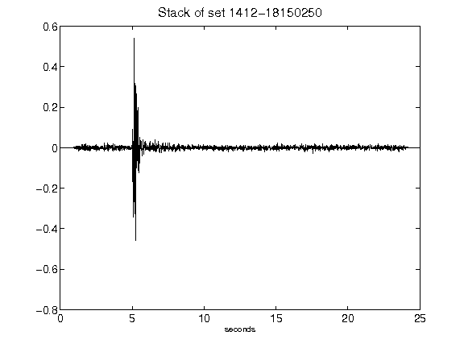](figures/1412-18150250_Stack.png)[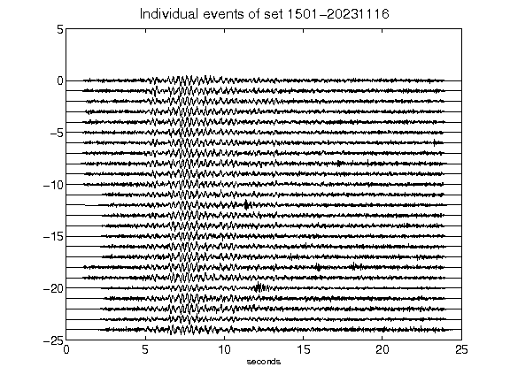](figures/1501-20231116_AllEv.png)[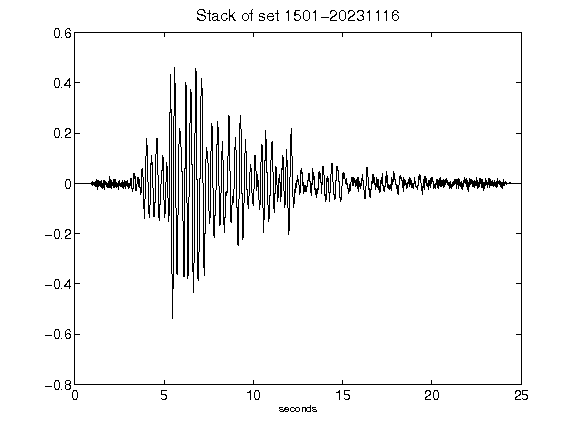](figures/1501-20231116_Stack.png)