# Repeating Earthquake Activity at STAR

## Waveforms
[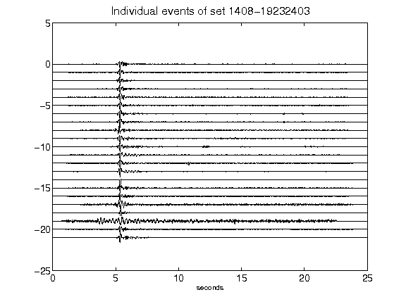](figures/1408-19232403_AllEv.png)[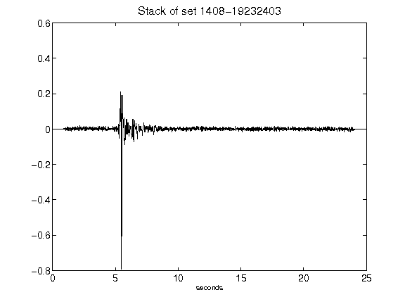](figures/1408-19232403_Stack.png)[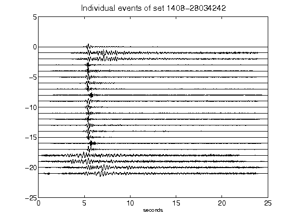](figures/1408-28034242_AllEv.png)[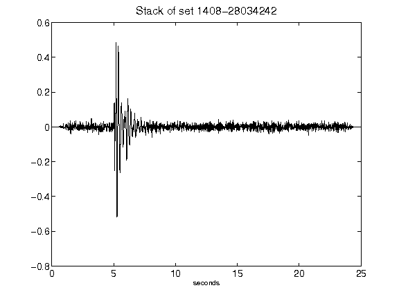](figures/1408-28034242_Stack.png)[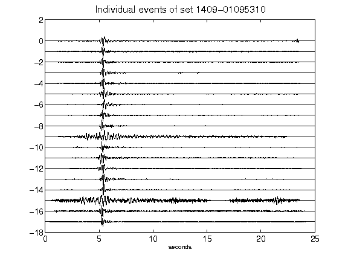](figures/1409-01095310_AllEv.png)[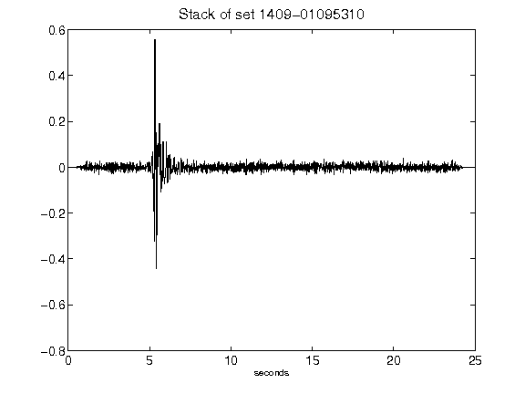](figures/1409-01095310_Stack.png)[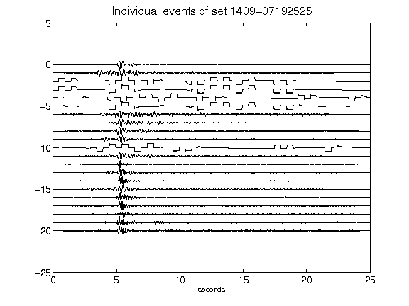](figures/1409-07192525_AllEv.png)[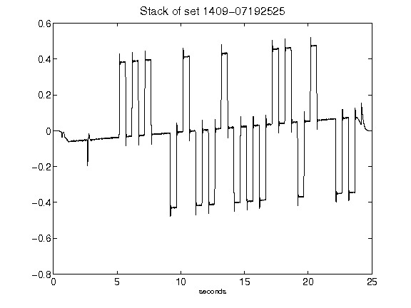](figures/1409-07192525_Stack.png)[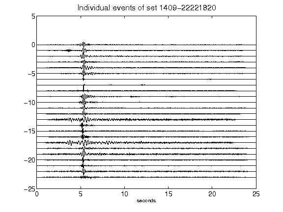](figures/1409-22221820_AllEv.png)[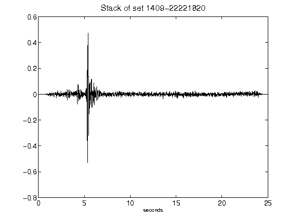](figures/1409-22221820_Stack.png)[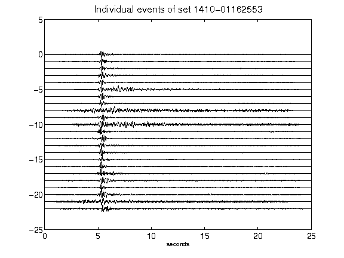](figures/1410-01162553_AllEv.png)[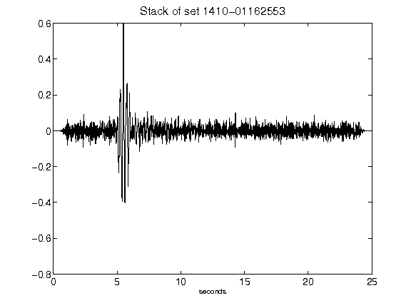](figures/1410-01162553_Stack.png)[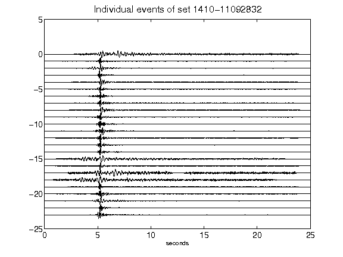](figures/1410-11092832_AllEv.png)[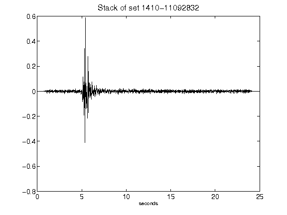](figures/1410-11092832_Stack.png)[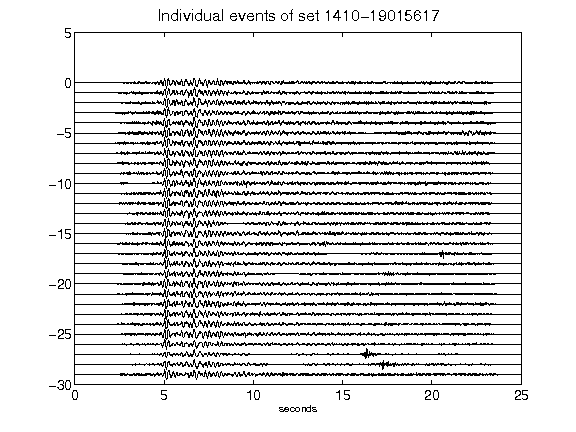](figures/1410-19015617_AllEv.png)[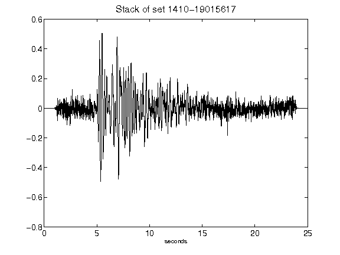](figures/1410-19015617_Stack.png)[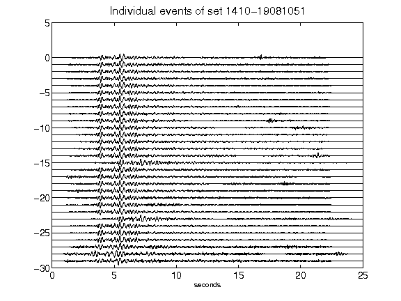](figures/1410-19081051_AllEv.png)[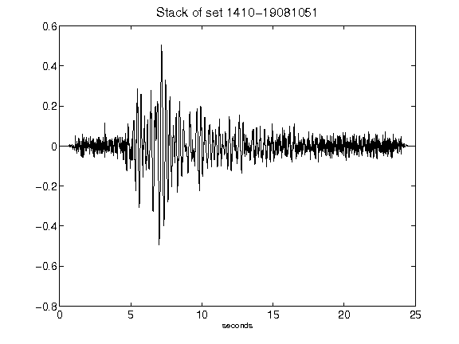](figures/1410-19081051_Stack.png)[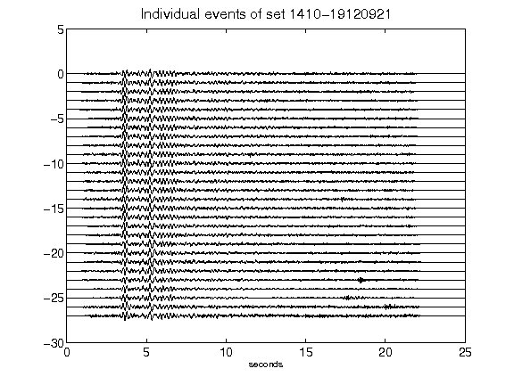](figures/1410-19120921_AllEv.png)[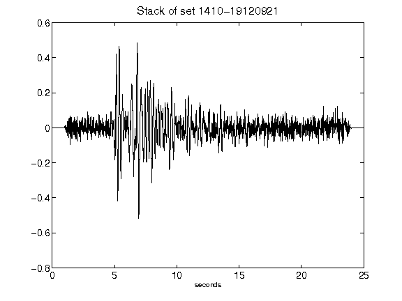](figures/1410-19120921_Stack.png)[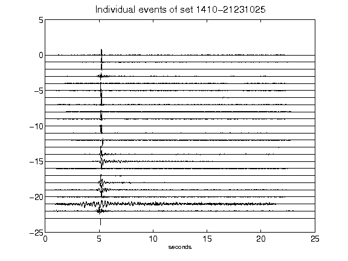](figures/1410-21231025_AllEv.png)[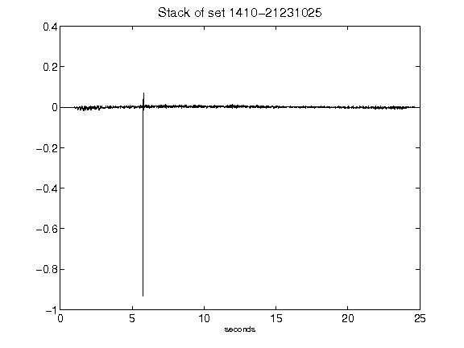](figures/1410-21231025_Stack.png)[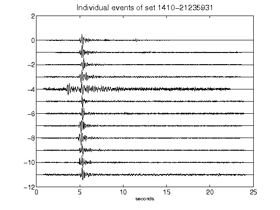](figures/1410-21235931_AllEv.png)[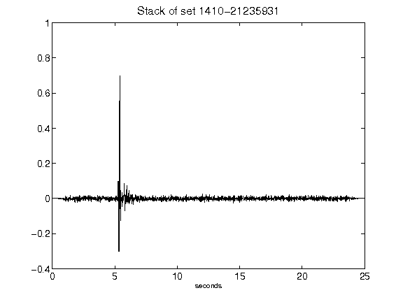](figures/1410-21235931_Stack.png)[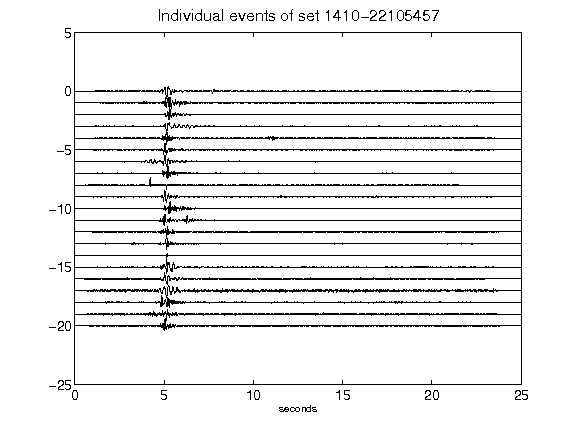](figures/1410-22105457_AllEv.png)[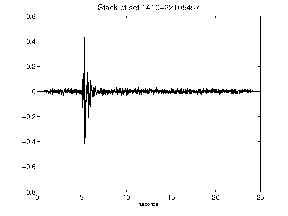](figures/1410-22105457_Stack.png)[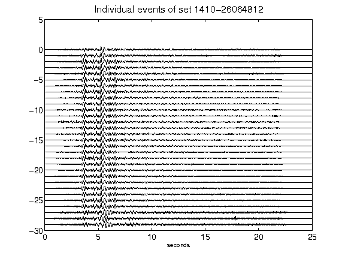](figures/1410-26064812_AllEv.png)[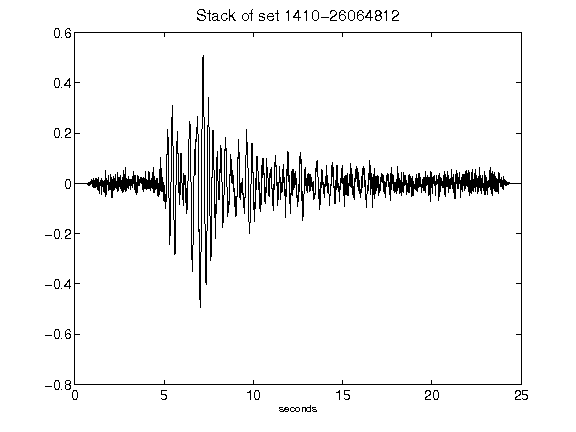](figures/1410-26064812_Stack.png)[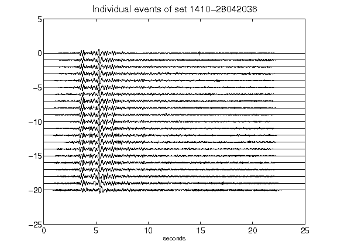](figures/1410-28042036_AllEv.png)[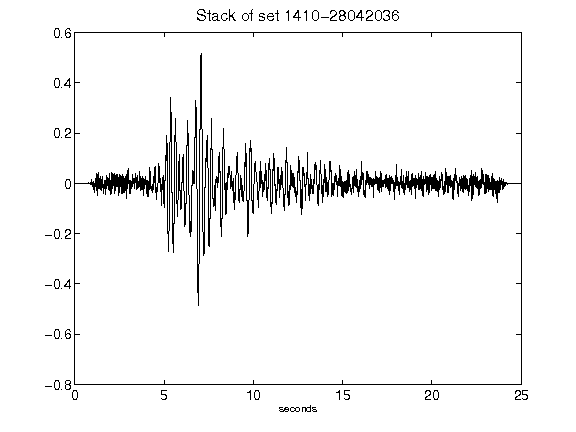](figures/1410-28042036_Stack.png)[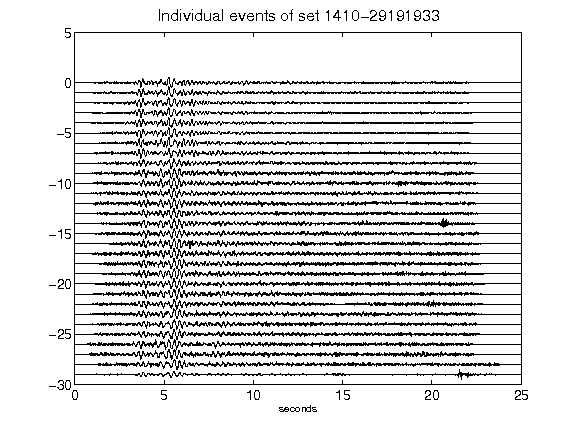](figures/1410-29191933_AllEv.png)[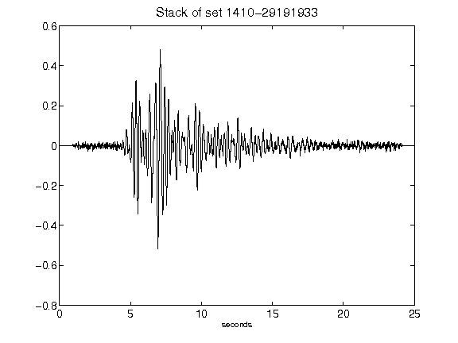](figures/1410-29191933_Stack.png)[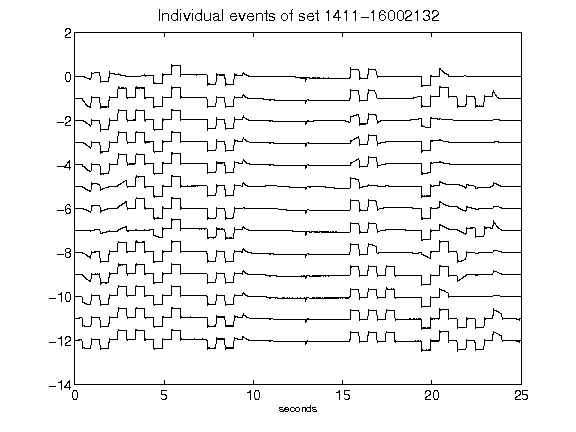](figures/1411-16002132_AllEv.png)[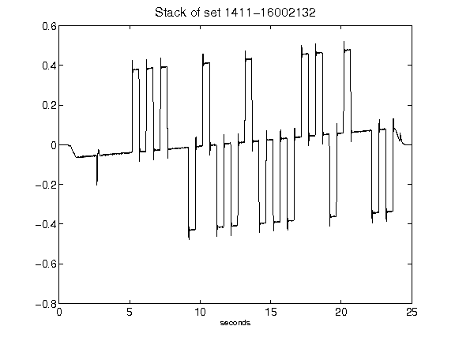](figures/1411-16002132_Stack.png)[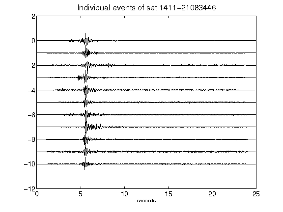](figures/1411-21083446_AllEv.png)[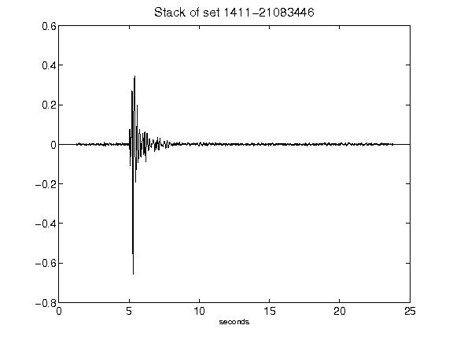](figures/1411-21083446_Stack.png)[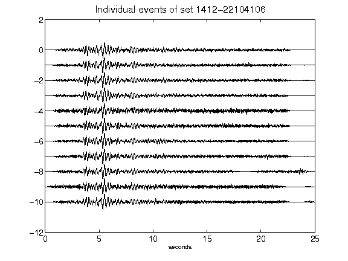](figures/1412-22104106_AllEv.png)[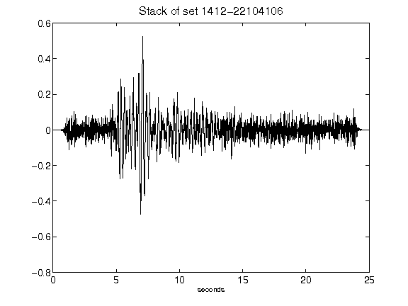](figures/1412-22104106_Stack.png)