# Repeating Earthquake Activity at STAR

## Waveforms
[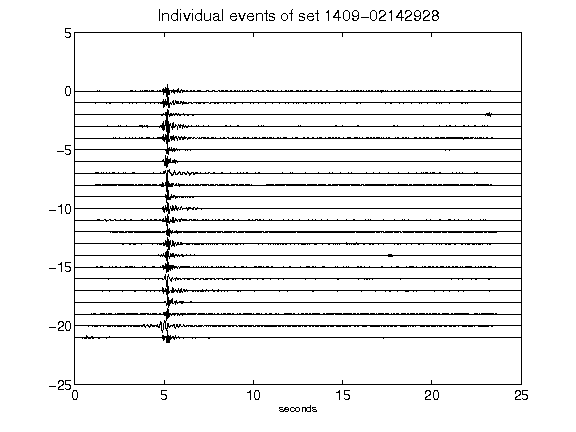](figures/1409-02142928_AllEv.png)[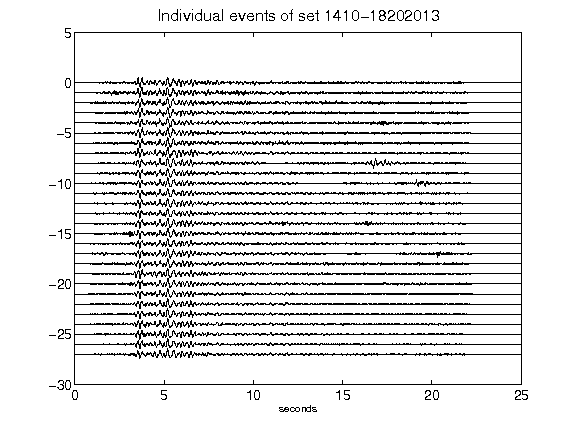](figures/1410-18202013_AllEv.png)[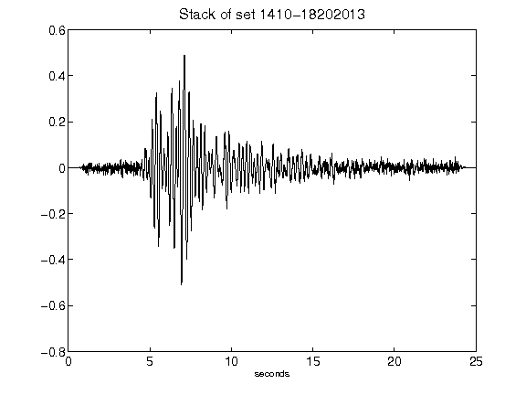](figures/1410-18202013_Stack.png)[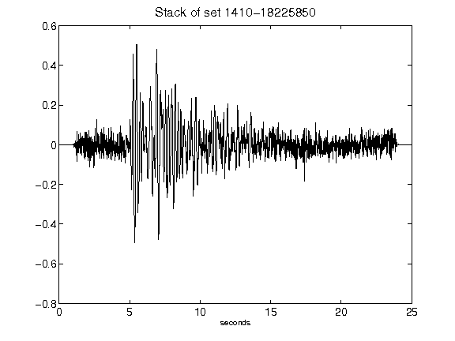](figures/1410-18225850_Stack.png)[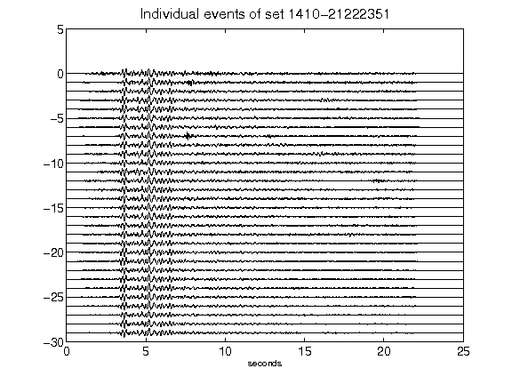](figures/1410-21222351_AllEv.png)[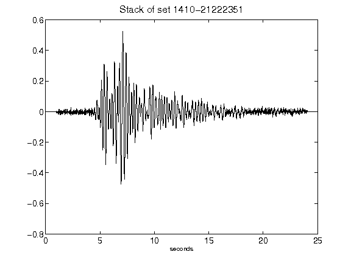](figures/1410-21222351_Stack.png)[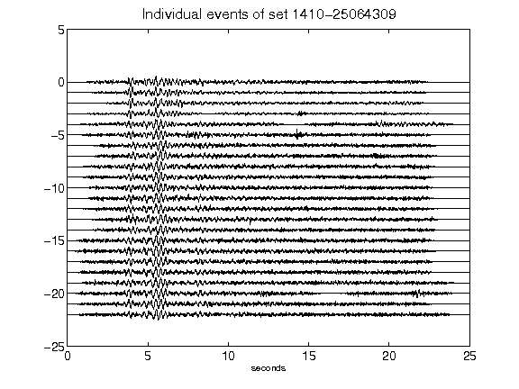](figures/1410-25064309_AllEv.png)[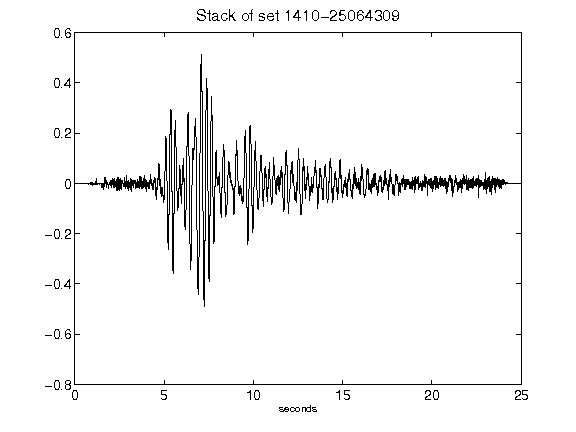](figures/1410-25064309_Stack.png)[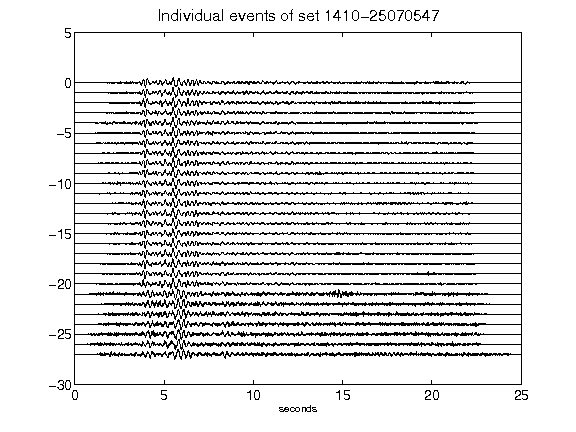](figures/1410-25070547_AllEv.png)[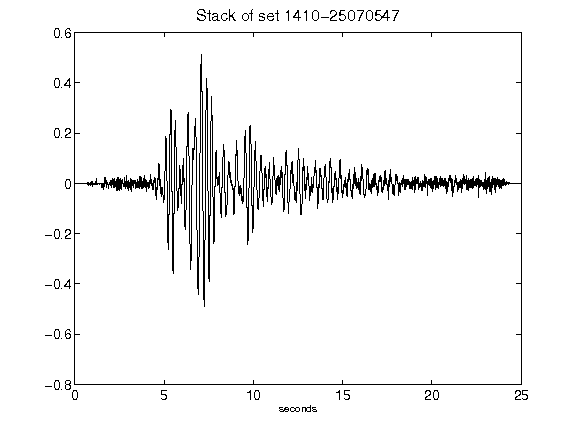](figures/1410-25070547_Stack.png)[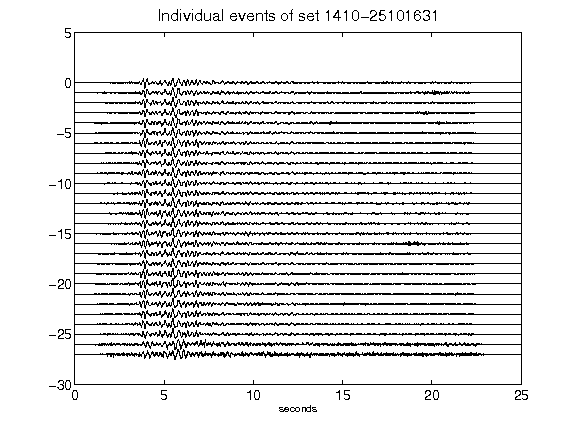](figures/1410-25101631_AllEv.png)[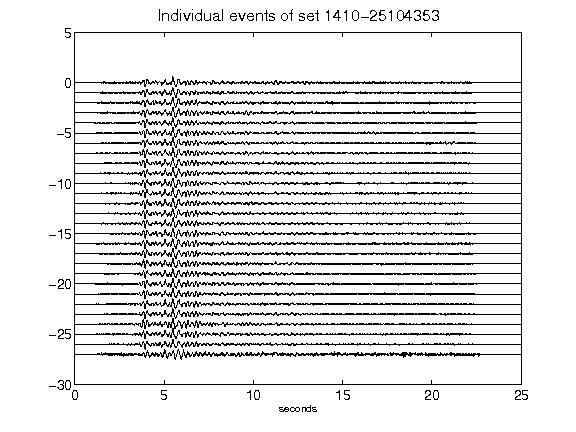](figures/1410-25104353_AllEv.png)[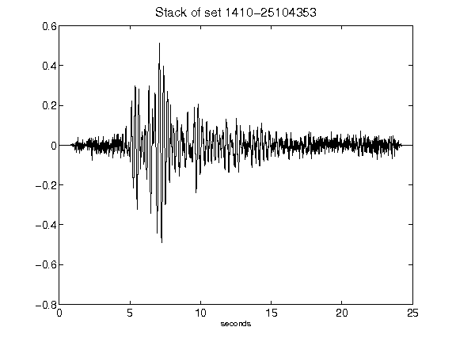](figures/1410-25104353_Stack.png)[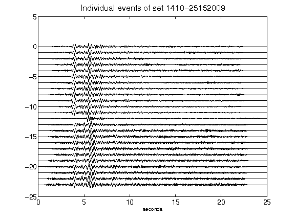](figures/1410-25152009_AllEv.png)[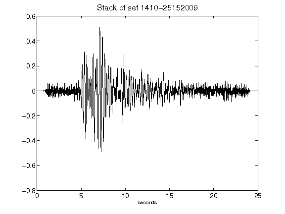](figures/1410-25152009_Stack.png)[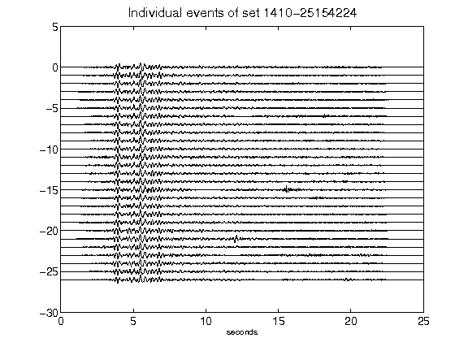](figures/1410-25154224_AllEv.png)[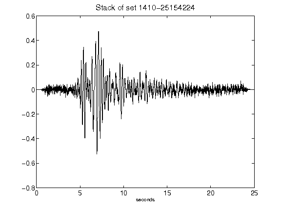](figures/1410-25154224_Stack.png)[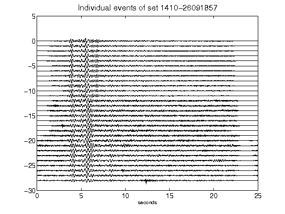](figures/1410-26091857_AllEv.png)[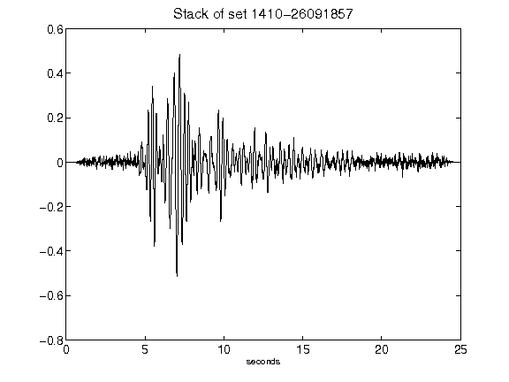](figures/1410-26091857_Stack.png)[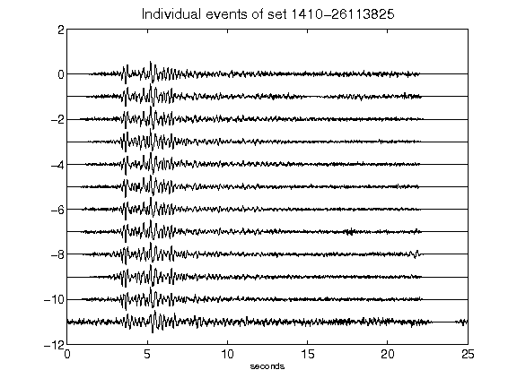](figures/1410-26113825_AllEv.png)[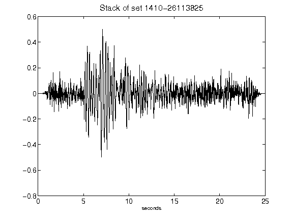](figures/1410-26113825_Stack.png)[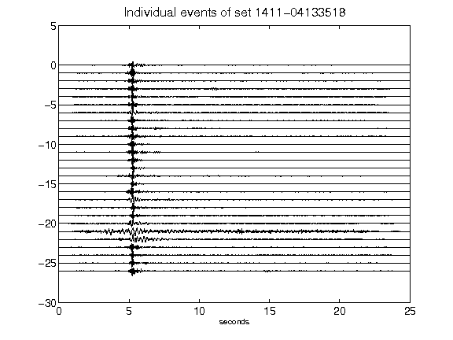](figures/1411-04133518_AllEv.png)[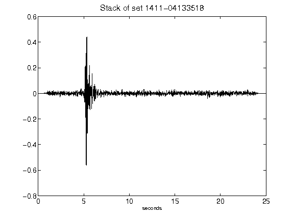](figures/1411-04133518_Stack.png)[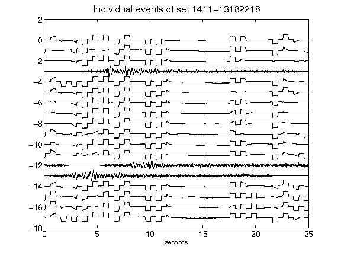](figures/1411-13182218_AllEv.png)[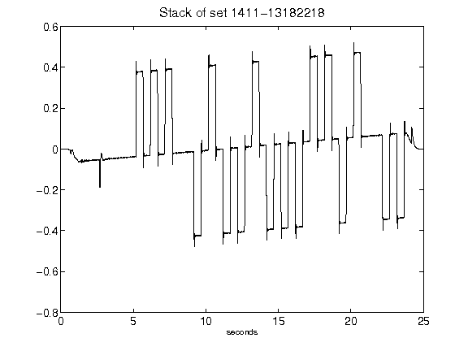](figures/1411-13182218_Stack.png)[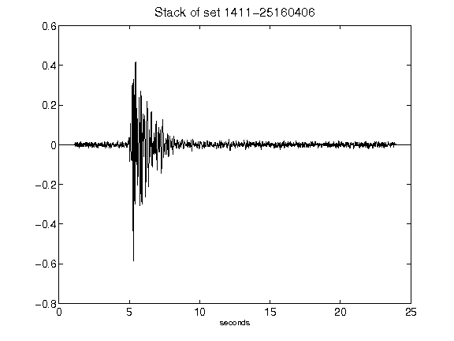](figures/1411-25160406_Stack.png)