# Repeating Earthquake Activity at STAR

## Waveforms
[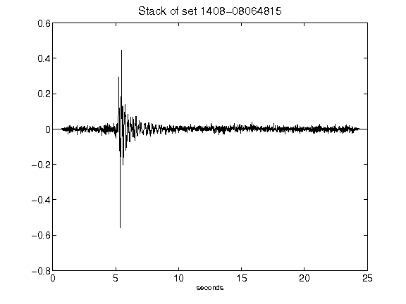](figures/1408-08064815_Stack.png)[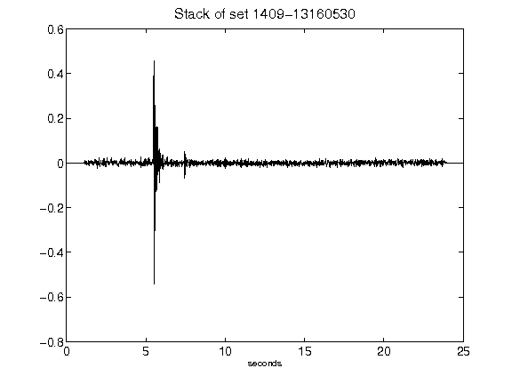](figures/1409-13160530_Stack.png)[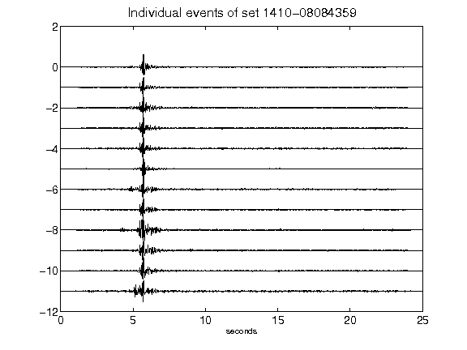](figures/1410-08084359_AllEv.png)[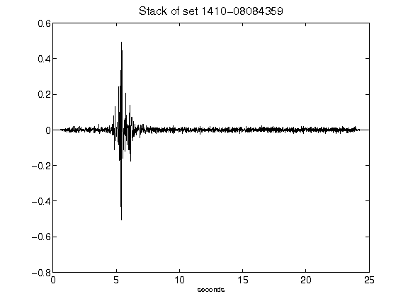](figures/1410-08084359_Stack.png)[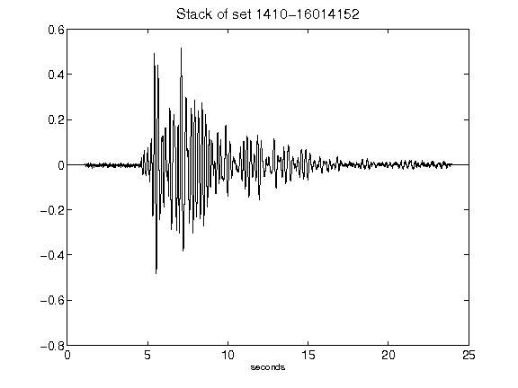](figures/1410-16014152_Stack.png)[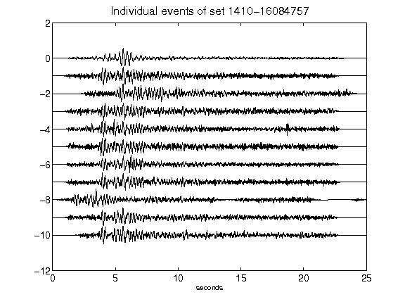](figures/1410-16084757_AllEv.png)[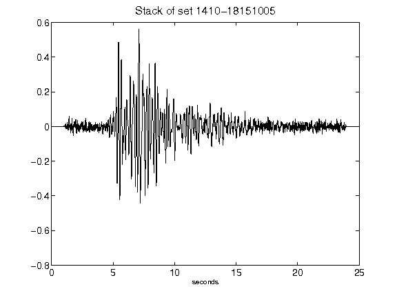](figures/1410-18151005_Stack.png)[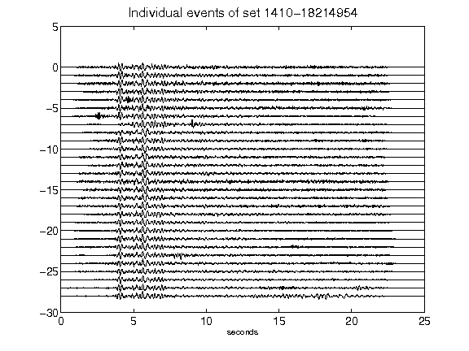](figures/1410-18214954_AllEv.png)[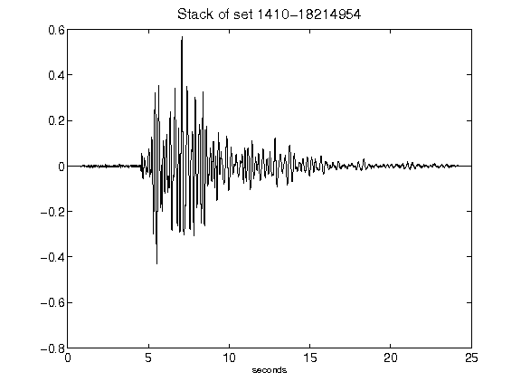](figures/1410-18214954_Stack.png)[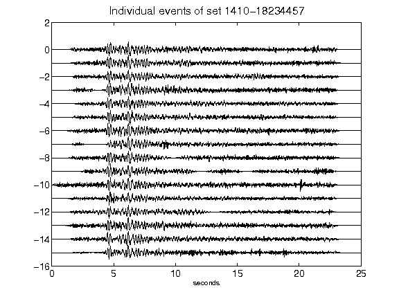](figures/1410-18234457_AllEv.png)[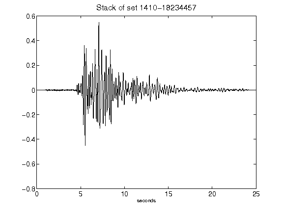](figures/1410-18234457_Stack.png)[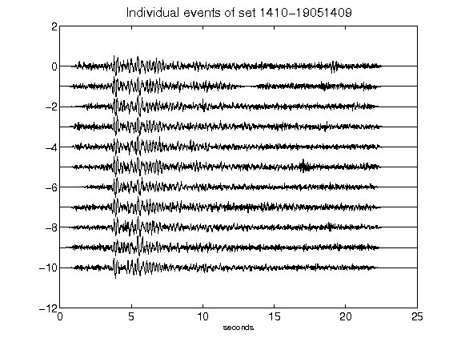](figures/1410-19051409_AllEv.png)[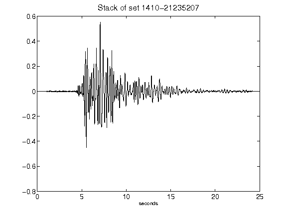](figures/1410-21235207_Stack.png)[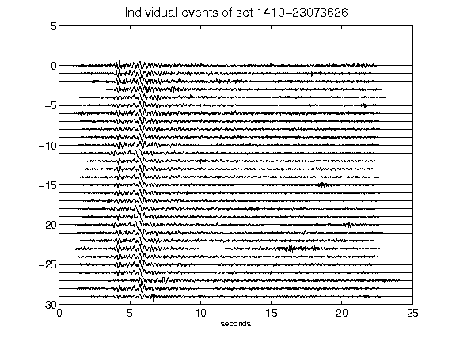](figures/1410-23073626_AllEv.png)[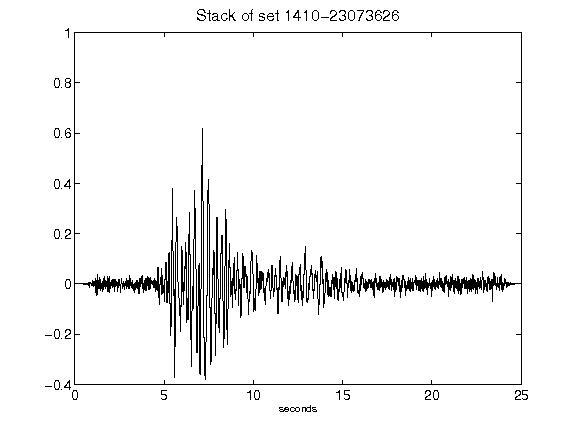](figures/1410-23073626_Stack.png)[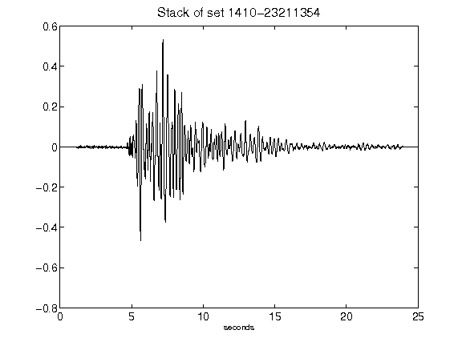](figures/1410-23211354_Stack.png)[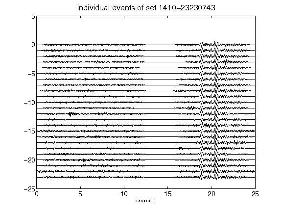](figures/1410-23230743_AllEv.png)[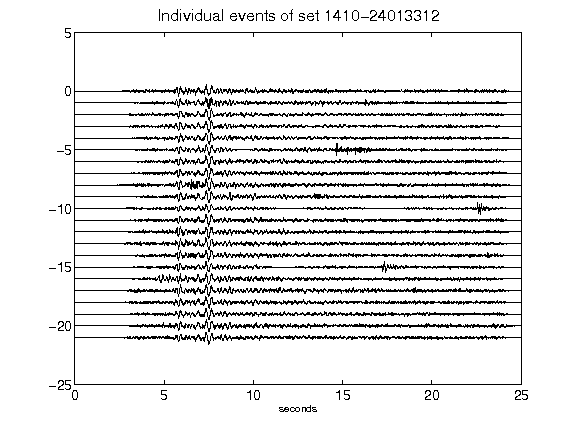](figures/1410-24013312_AllEv.png)[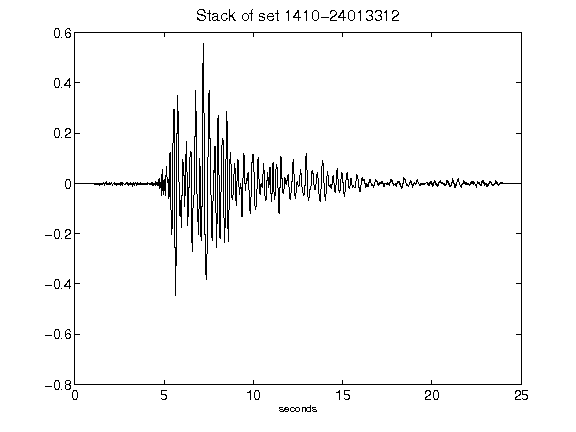](figures/1410-24013312_Stack.png)[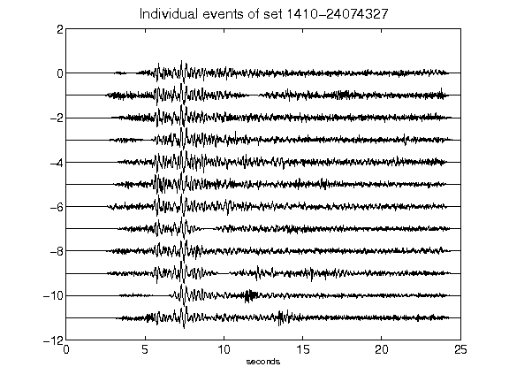](figures/1410-24074327_AllEv.png)[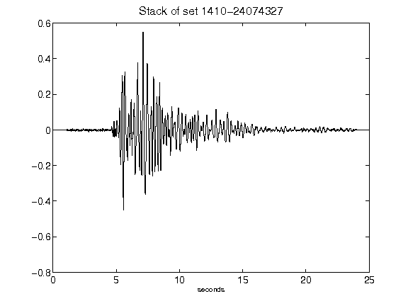](figures/1410-24074327_Stack.png)[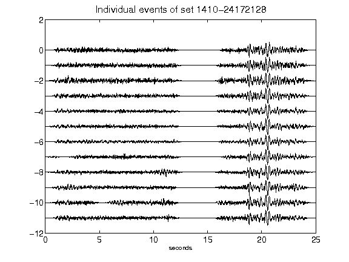](figures/1410-24172128_AllEv.png)[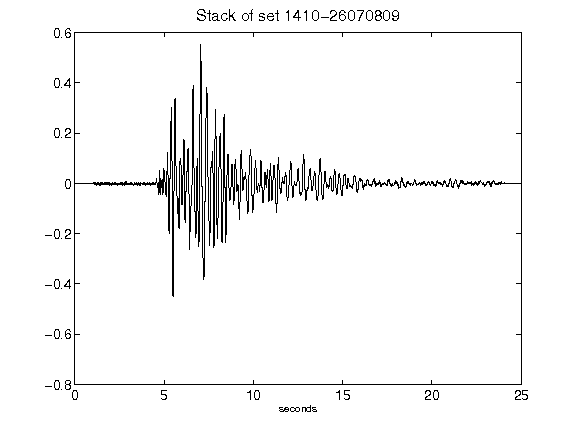](figures/1410-26070809_Stack.png)[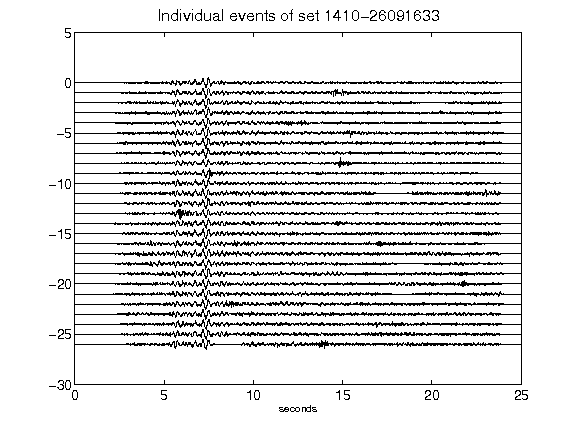](figures/1410-26091633_AllEv.png)[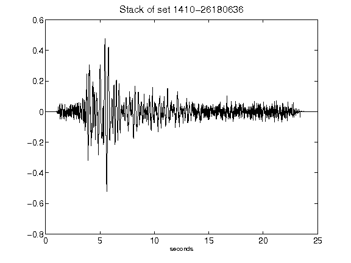](figures/1410-26180636_Stack.png)[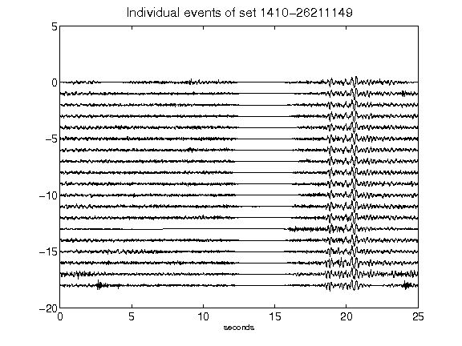](figures/1410-26211149_AllEv.png)[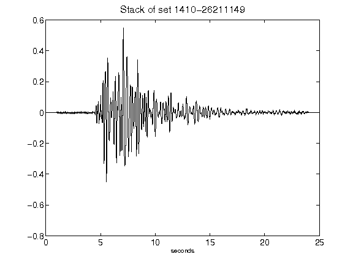](figures/1410-26211149_Stack.png)