# Repeating Earthquake Activity at STAR
  
  

## Waveforms
[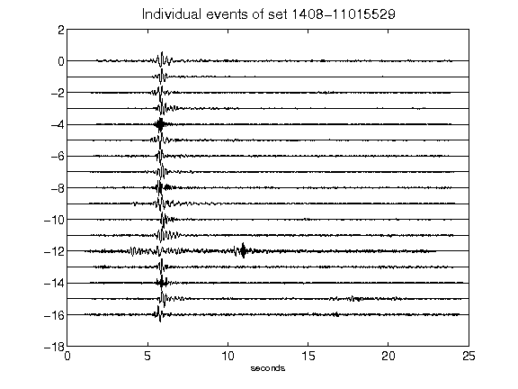](figures/1408-11015529_AllEv.png)[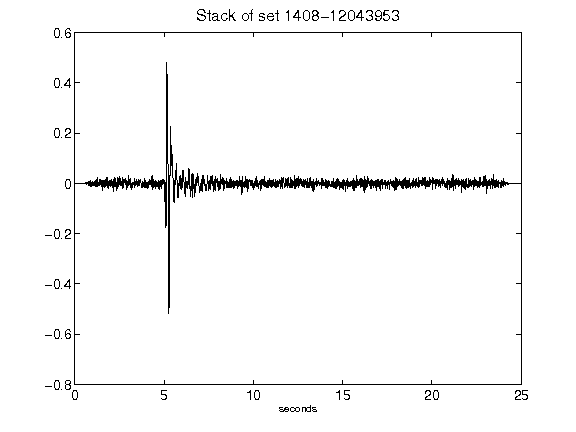](figures/1408-12043953_Stack.png)[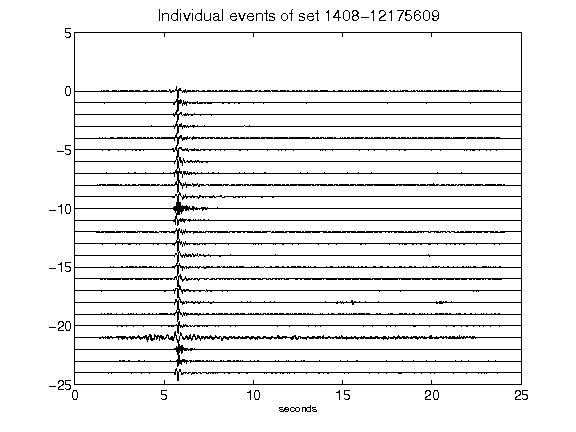](figures/1408-12175609_AllEv.png)[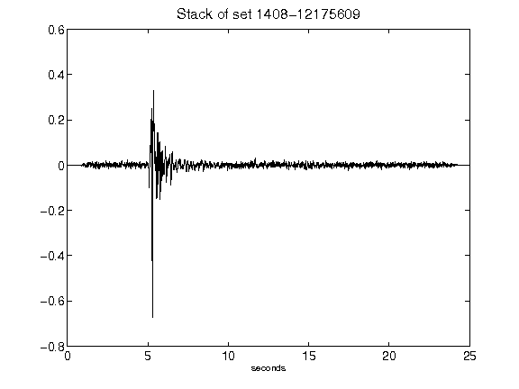](figures/1408-12175609_Stack.png)[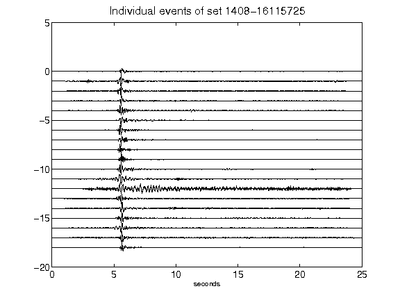](figures/1408-16115725_AllEv.png)[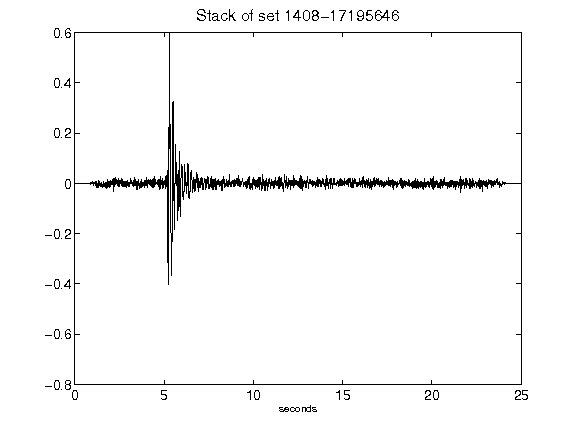](figures/1408-17195646_Stack.png)[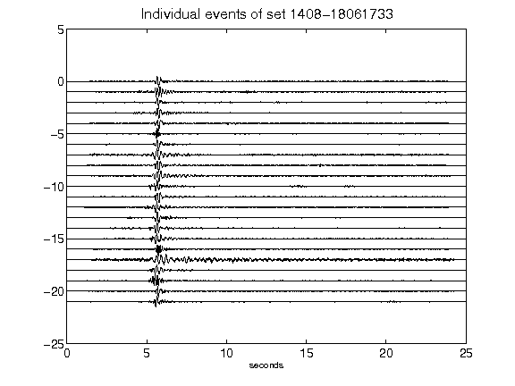](figures/1408-18061733_AllEv.png)[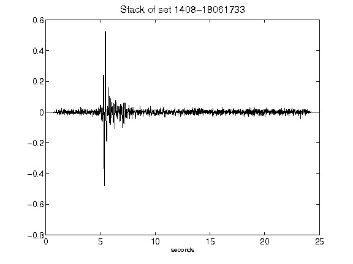](figures/1408-18061733_Stack.png)[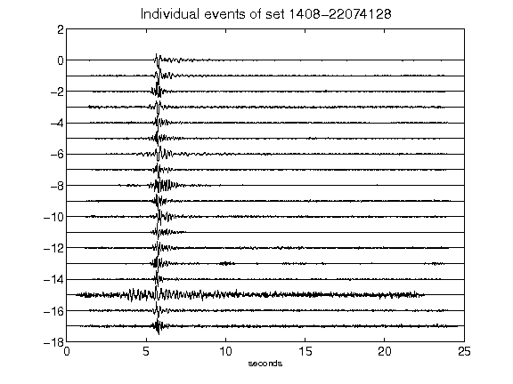](figures/1408-22074128_AllEv.png)[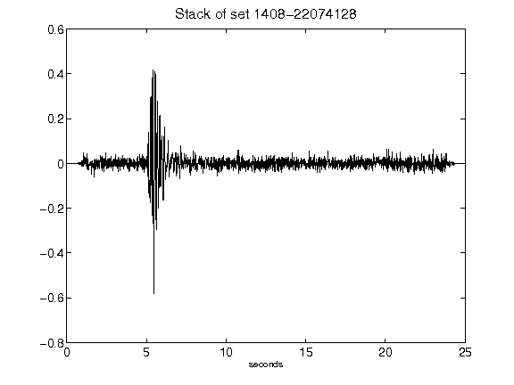](figures/1408-22074128_Stack.png)[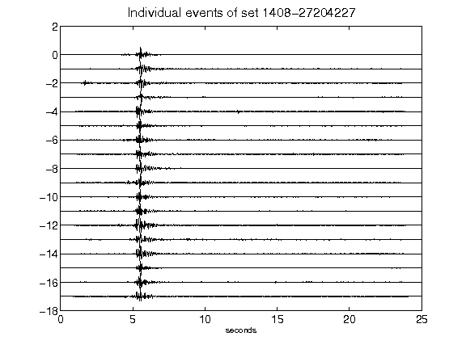](figures/1408-27204227_AllEv.png)[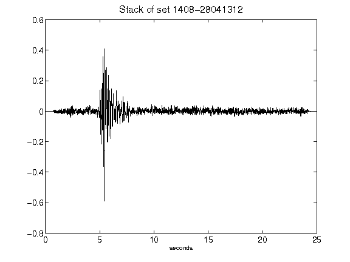](figures/1408-28041312_Stack.png)[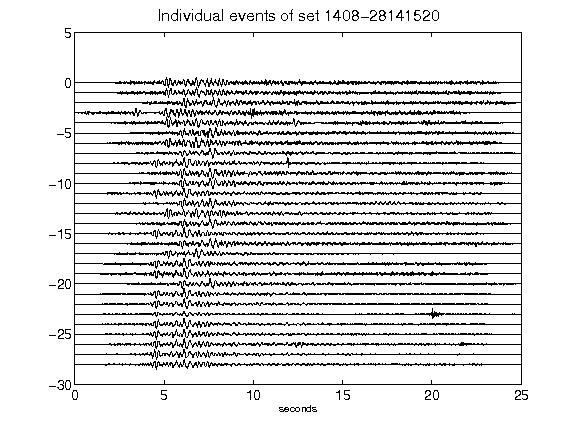](figures/1408-28141520_AllEv.png)[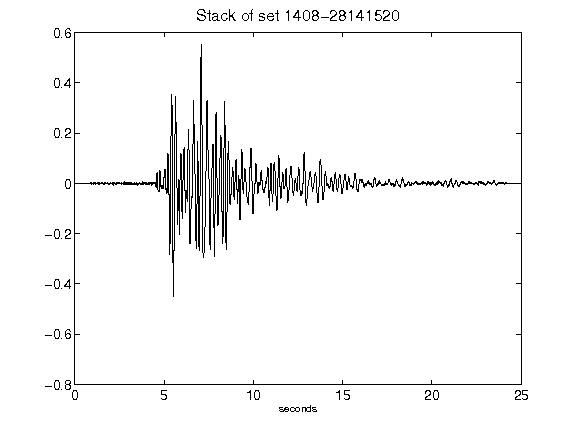](figures/1408-28141520_Stack.png)[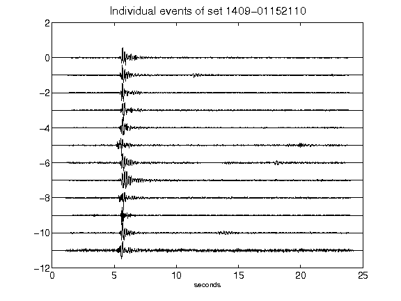](figures/1409-01152110_AllEv.png)[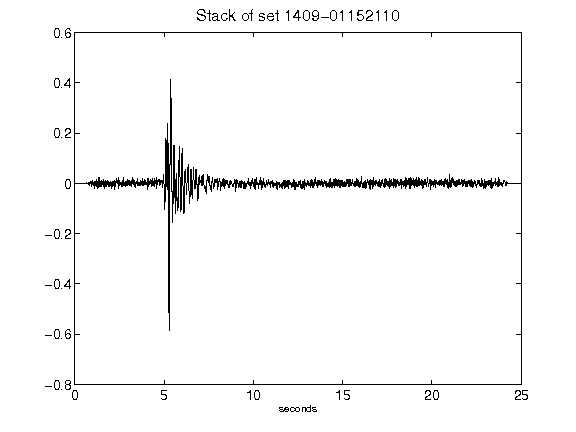](figures/1409-01152110_Stack.png)[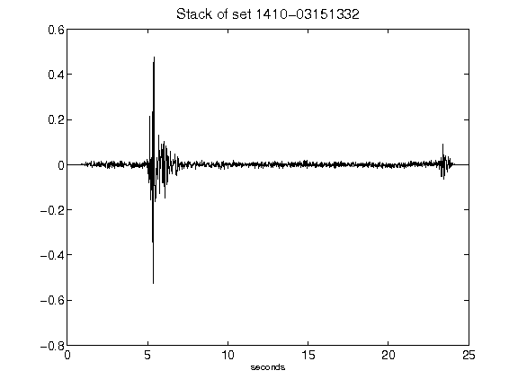](figures/1410-03151332_Stack.png)[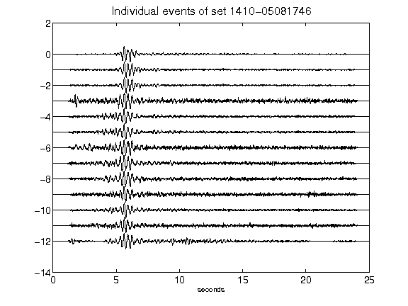](figures/1410-05081746_AllEv.png)[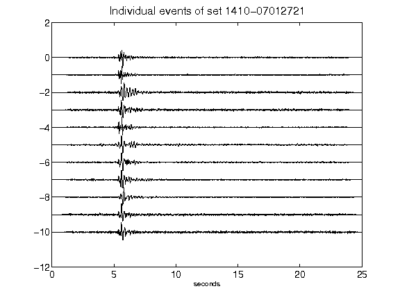](figures/1410-07012721_AllEv.png)[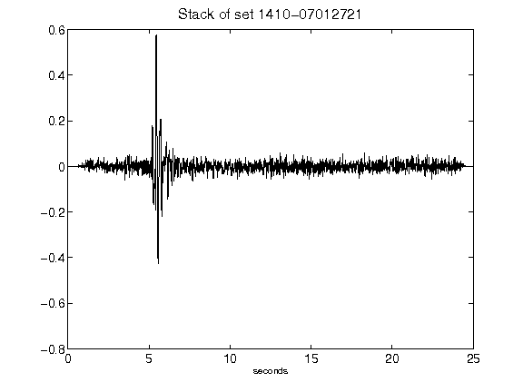](figures/1410-07012721_Stack.png)[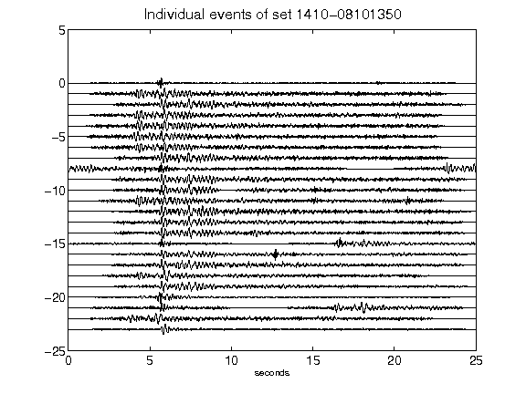](figures/1410-08101350_AllEv.png)[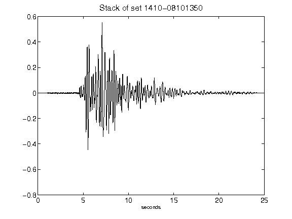](figures/1410-08101350_Stack.png)[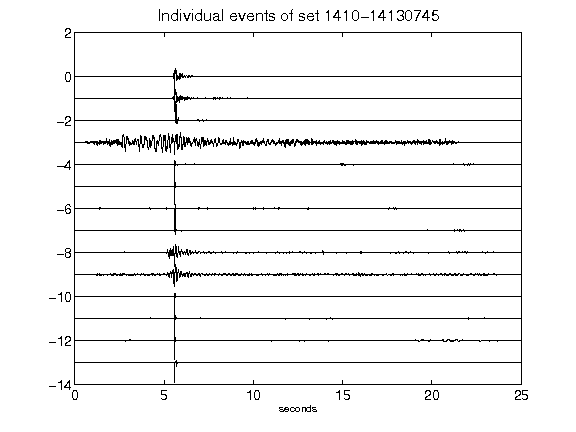](figures/1410-14130745_AllEv.png)[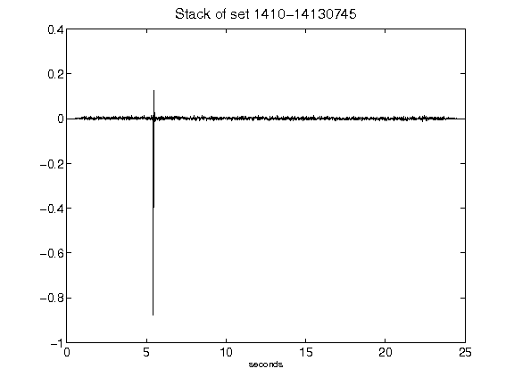](figures/1410-14130745_Stack.png)[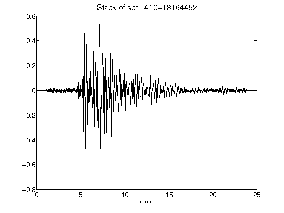](figures/1410-18164452_Stack.png)[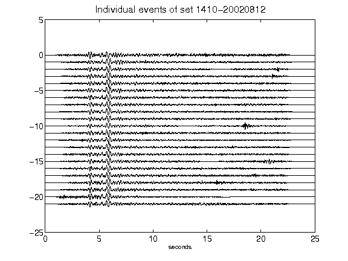](figures/1410-20020812_AllEv.png)[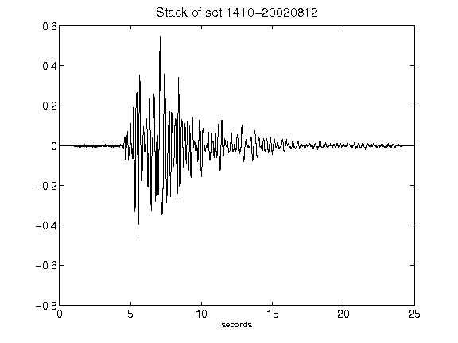](figures/1410-20020812_Stack.png)[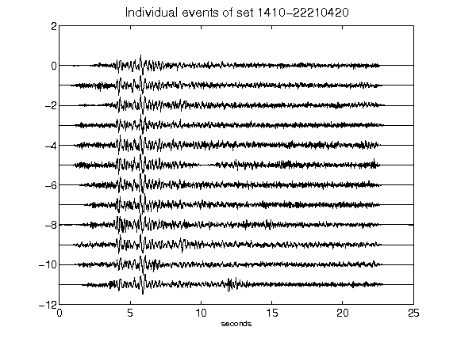](figures/1410-22210420_AllEv.png)[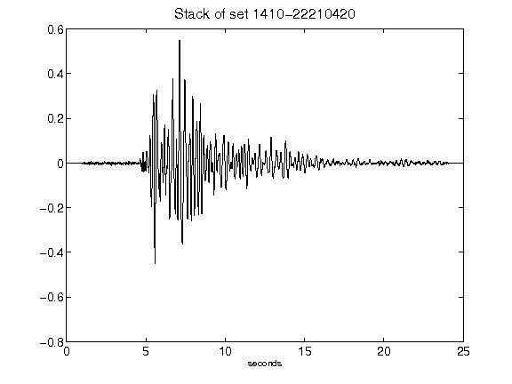](figures/1410-22210420_Stack.png)[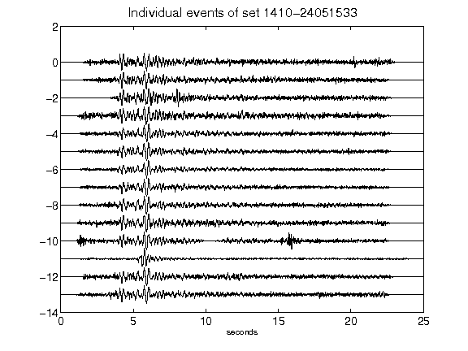](figures/1410-24051533_AllEv.png)[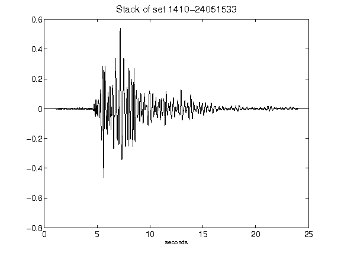](figures/1410-24051533_Stack.png)[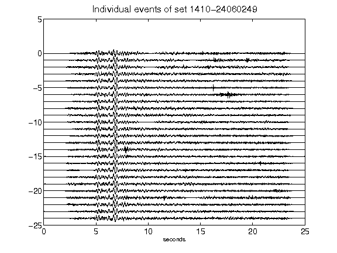](figures/1410-24060249_AllEv.png)[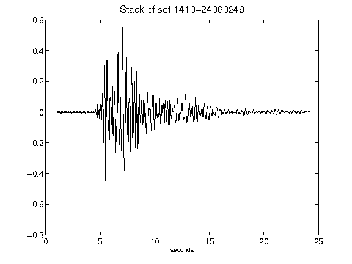](figures/1410-24060249_Stack.png)[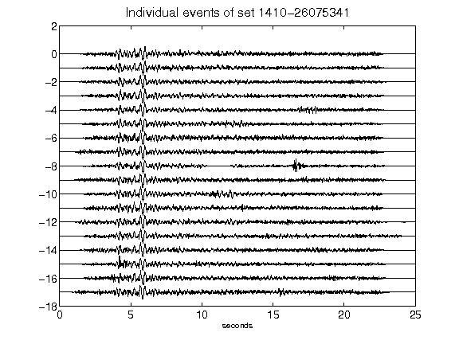](figures/1410-26075341_AllEv.png)[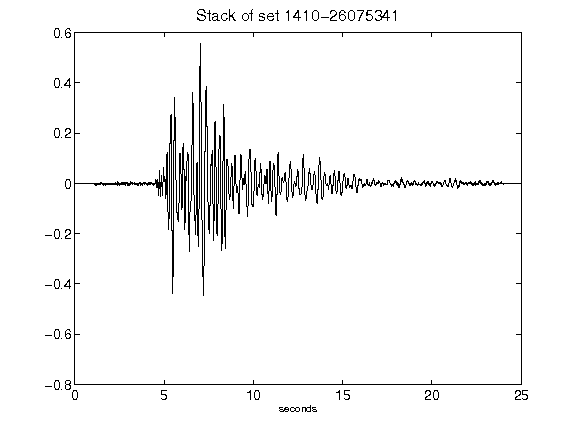](figures/1410-26075341_Stack.png)[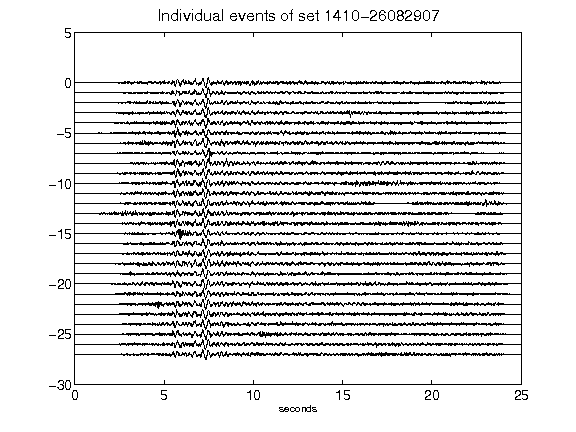](figures/1410-26082907_AllEv.png)[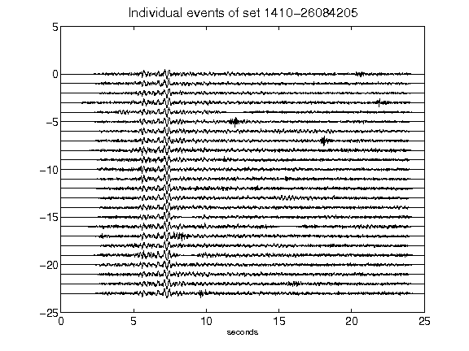](figures/1410-26084205_AllEv.png)