# Repeating Earthquake Activity at STAR

## Waveforms
[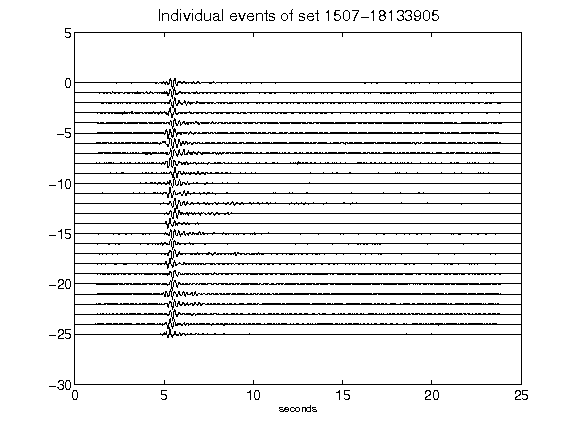](figures/1507-18133905_AllEv.png)[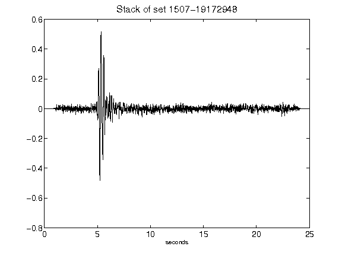](figures/1507-19172948_Stack.png)[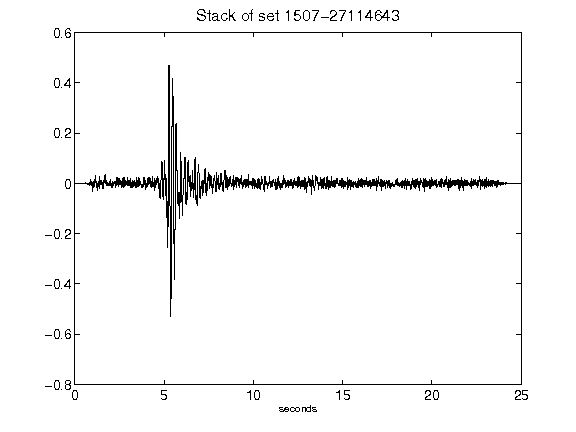](figures/1507-27114643_Stack.png)[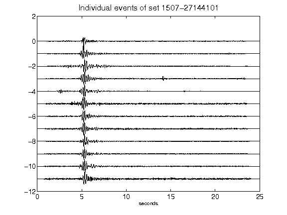](figures/1507-27144101_AllEv.png)[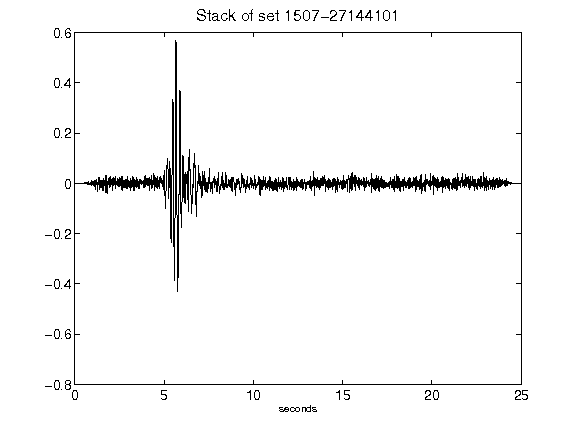](figures/1507-27144101_Stack.png)[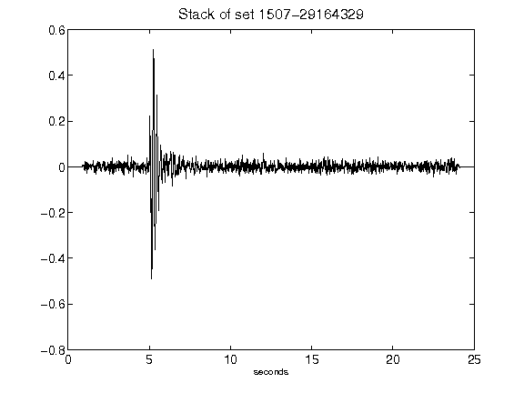](figures/1507-29164329_Stack.png)[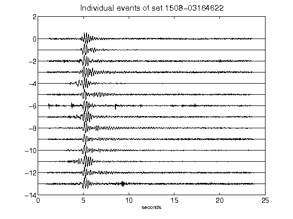](figures/1508-03164622_AllEv.png)[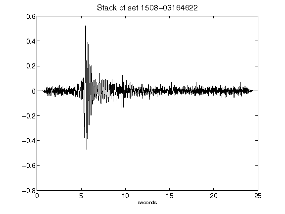](figures/1508-03164622_Stack.png)[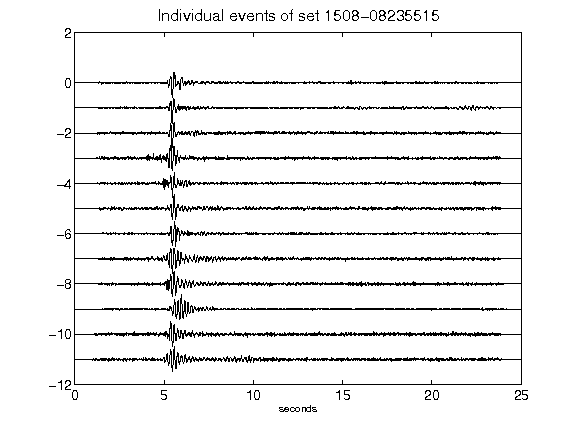](figures/1508-08235515_AllEv.png)[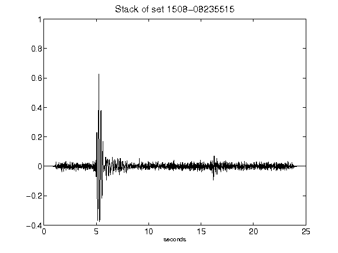](figures/1508-08235515_Stack.png)[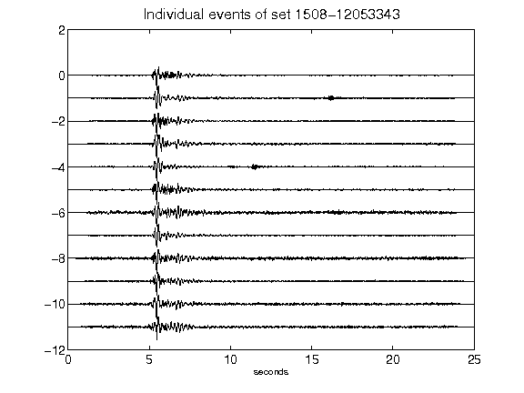](figures/1508-12053343_AllEv.png)[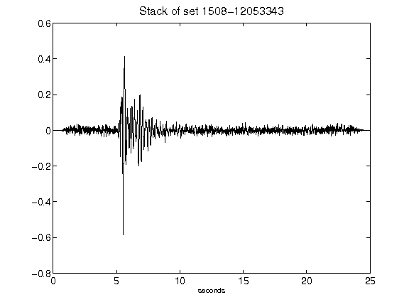](figures/1508-12053343_Stack.png)[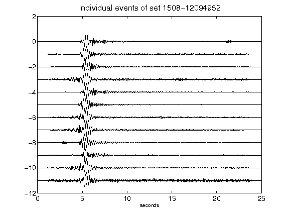](figures/1508-12094952_AllEv.png)[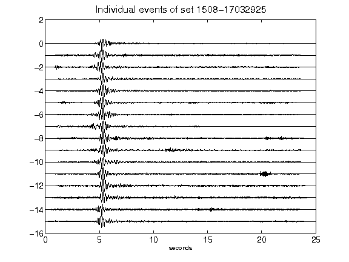](figures/1508-17032925_AllEv.png)[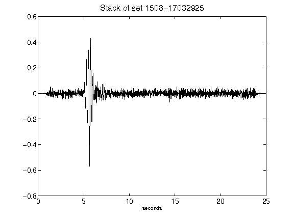](figures/1508-17032925_Stack.png)[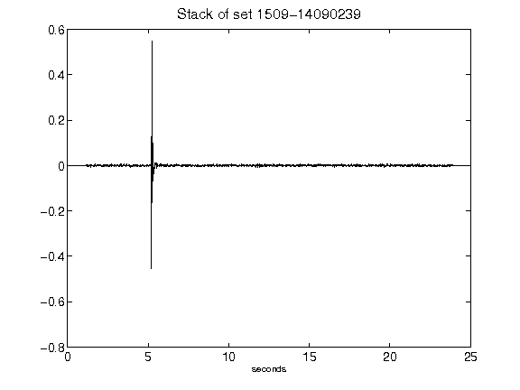](figures/1509-14090239_Stack.png)[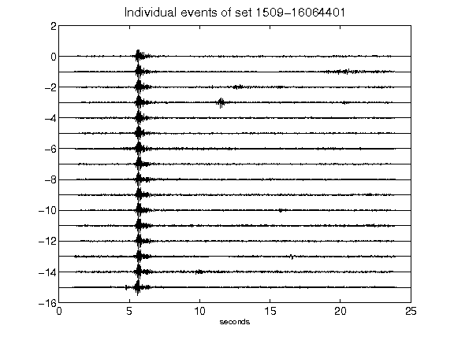](figures/1509-16064401_AllEv.png)[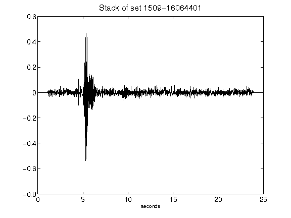](figures/1509-16064401_Stack.png)[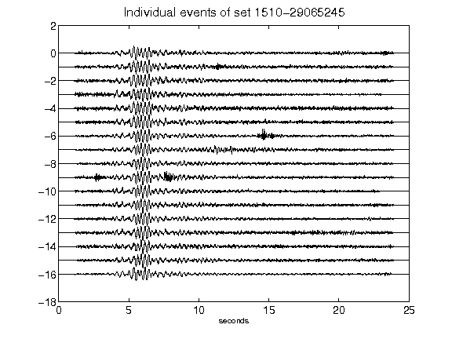](figures/1510-29065245_AllEv.png)[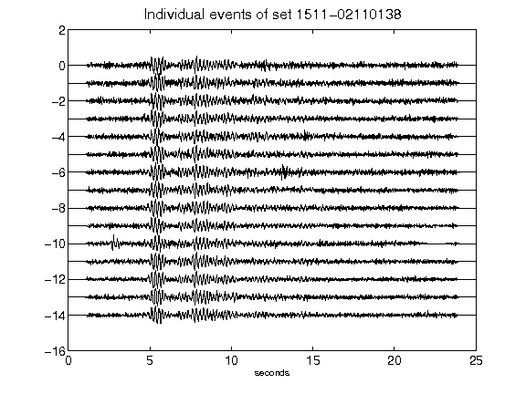](figures/1511-02110138_AllEv.png)[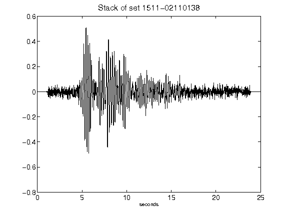](figures/1511-02110138_Stack.png)