# Repeating Earthquake Activity at STAR

## Waveforms
[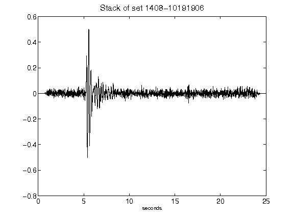](figures/1408-10191906_Stack.png)[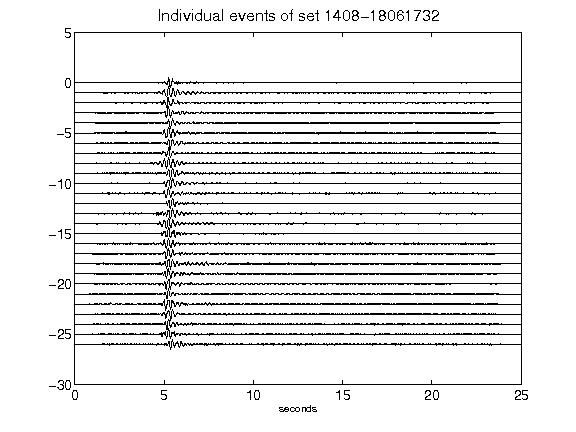](figures/1408-18061732_AllEv.png)[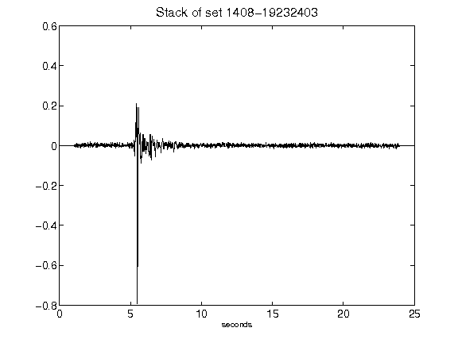](figures/1408-19232403_Stack.png)[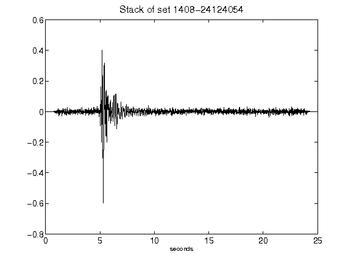](figures/1408-24124054_Stack.png)[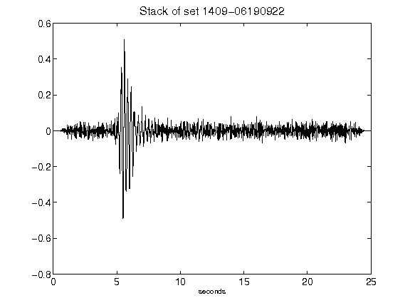](figures/1409-06190922_Stack.png)[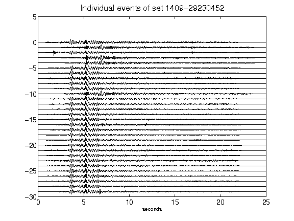](figures/1409-29230452_AllEv.png)[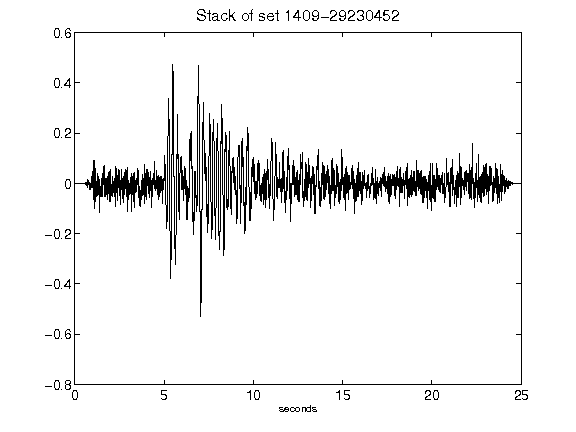](figures/1409-29230452_Stack.png)[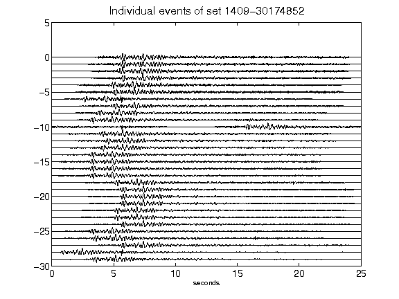](figures/1409-30174852_AllEv.png)[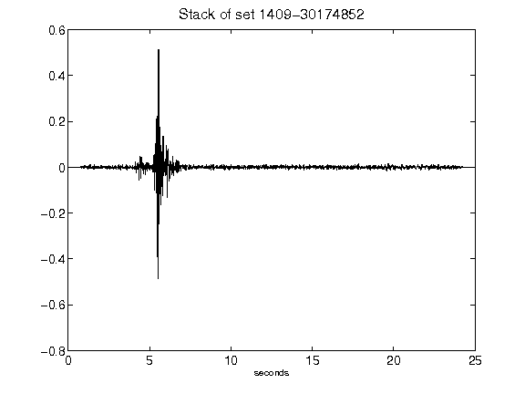](figures/1409-30174852_Stack.png)[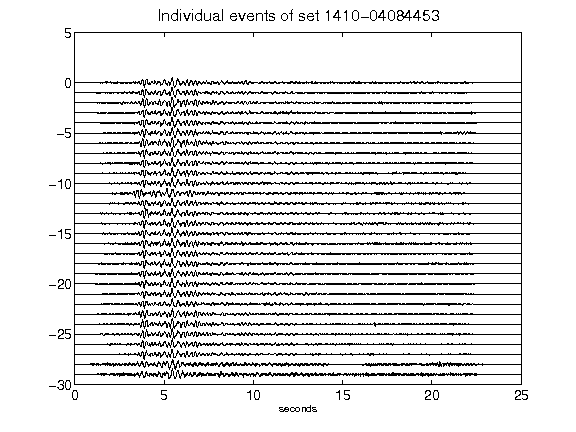](figures/1410-04084453_AllEv.png)[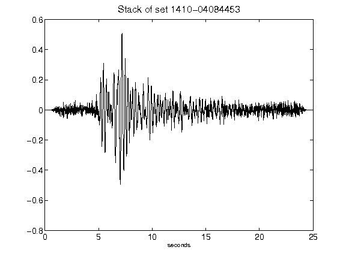](figures/1410-04084453_Stack.png)[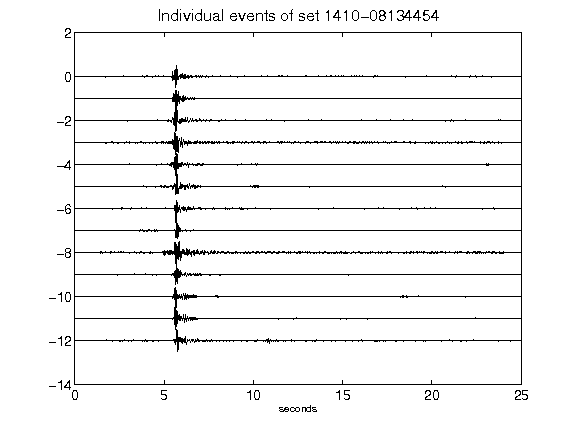](figures/1410-08134454_AllEv.png)[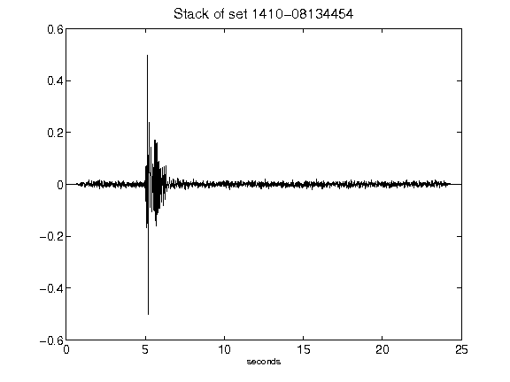](figures/1410-08134454_Stack.png)[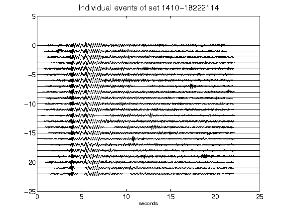](figures/1410-18222114_AllEv.png)[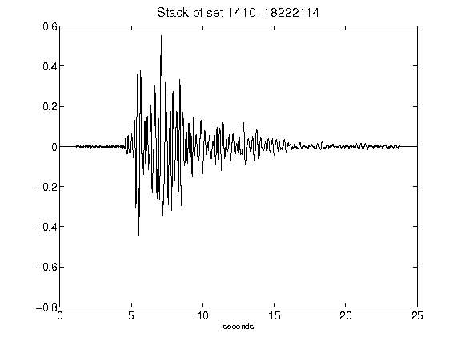](figures/1410-18222114_Stack.png)[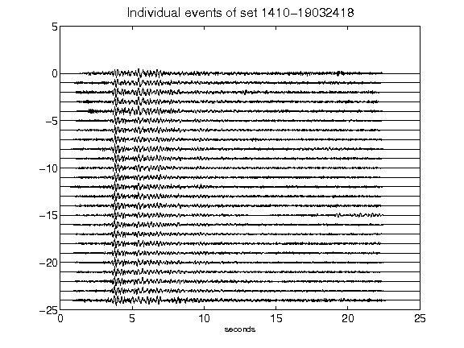](figures/1410-19032418_AllEv.png)[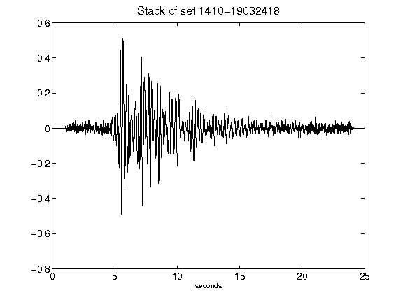](figures/1410-19032418_Stack.png)[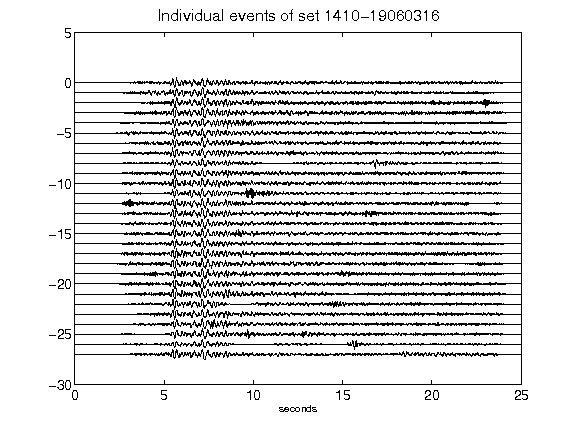](figures/1410-19060316_AllEv.png)[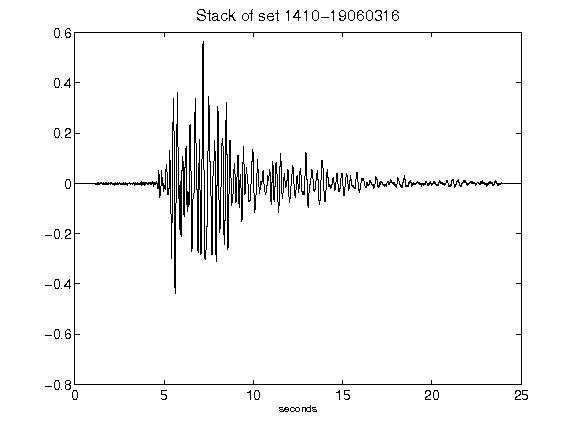](figures/1410-19060316_Stack.png)[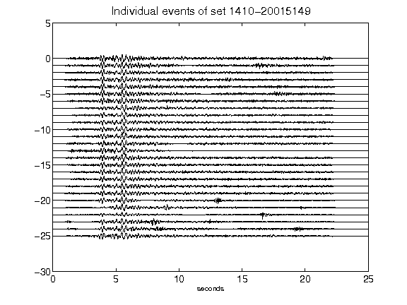](figures/1410-20015149_AllEv.png)[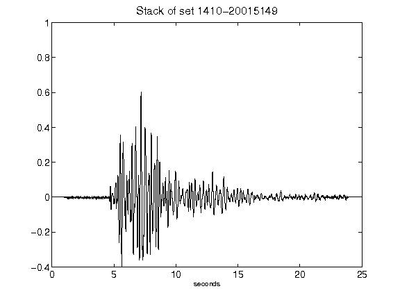](figures/1410-20015149_Stack.png)[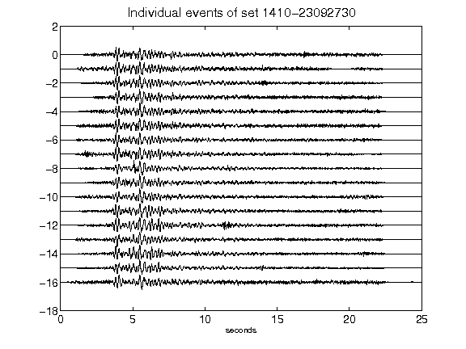](figures/1410-23092730_AllEv.png)[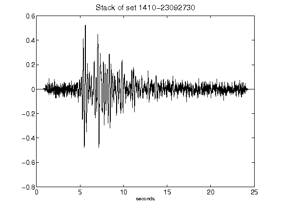](figures/1410-23092730_Stack.png)[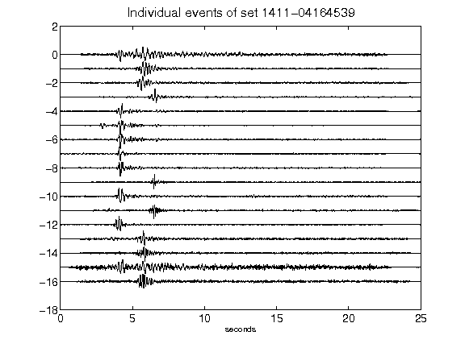](figures/1411-04164539_AllEv.png)[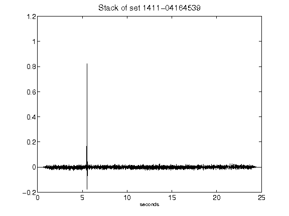](figures/1411-04164539_Stack.png)[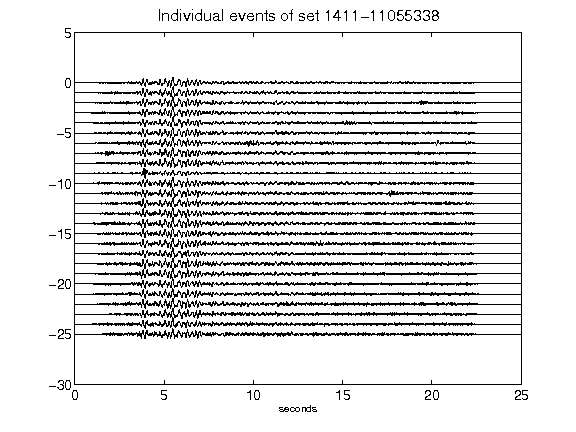](figures/1411-11055338_AllEv.png)[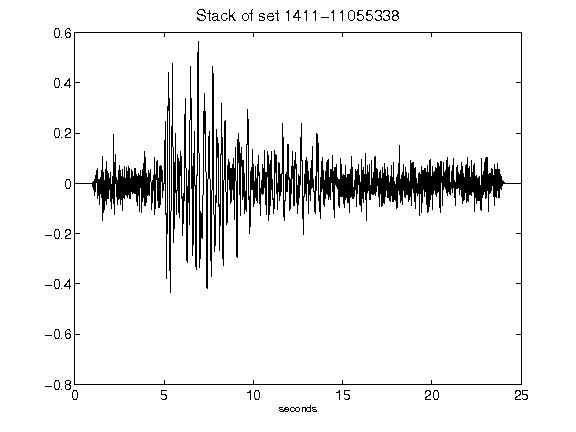](figures/1411-11055338_Stack.png)[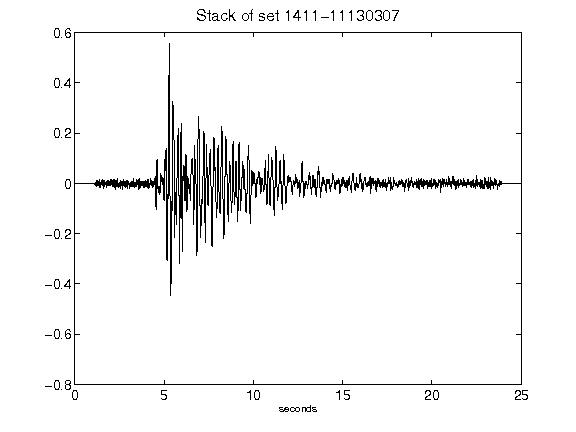](figures/1411-11130307_Stack.png)[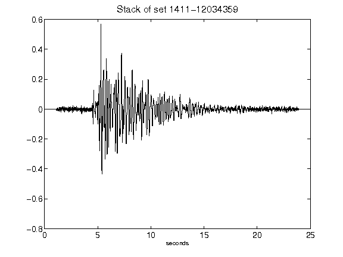](figures/1411-12034359_Stack.png)