# Repeating Earthquake Activity at STAR

## Waveforms
[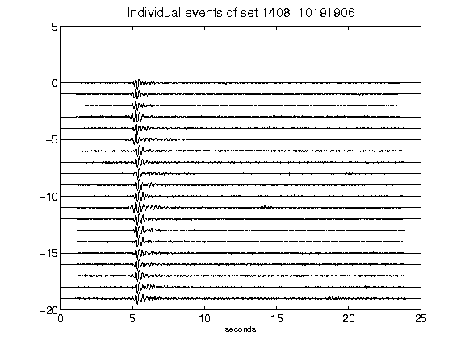](figures/1408-10191906_AllEv.png)[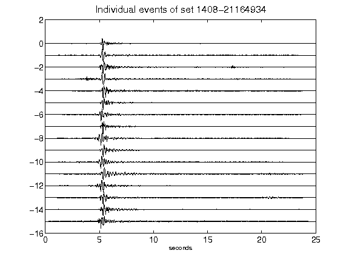](figures/1408-21164934_AllEv.png)[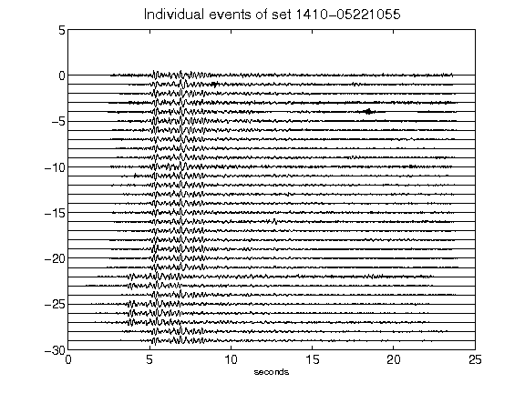](figures/1410-05221055_AllEv.png)[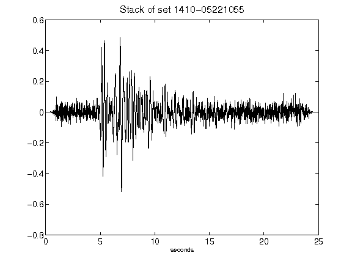](figures/1410-05221055_Stack.png)[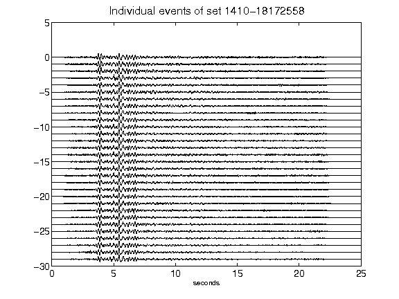](figures/1410-18172558_AllEv.png)[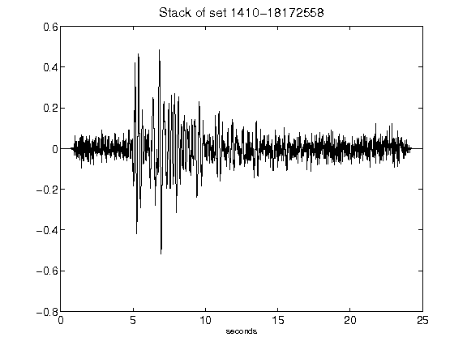](figures/1410-18172558_Stack.png)[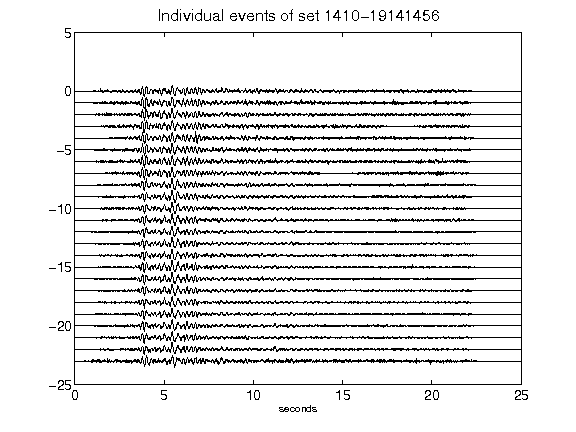](figures/1410-19141456_AllEv.png)[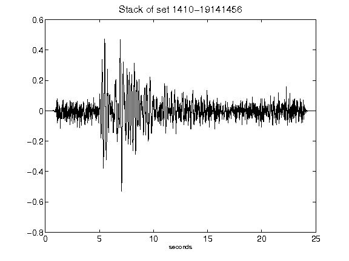](figures/1410-19141456_Stack.png)[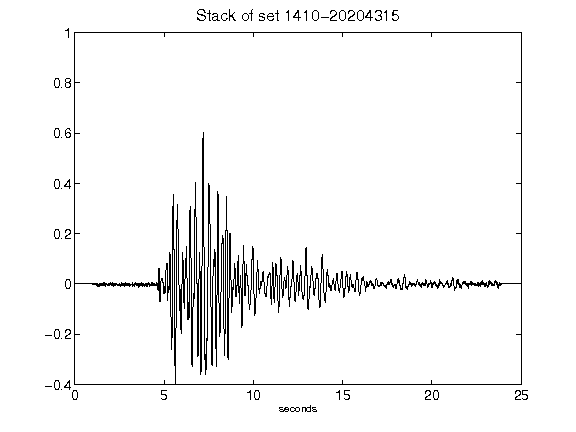](figures/1410-20204315_Stack.png)[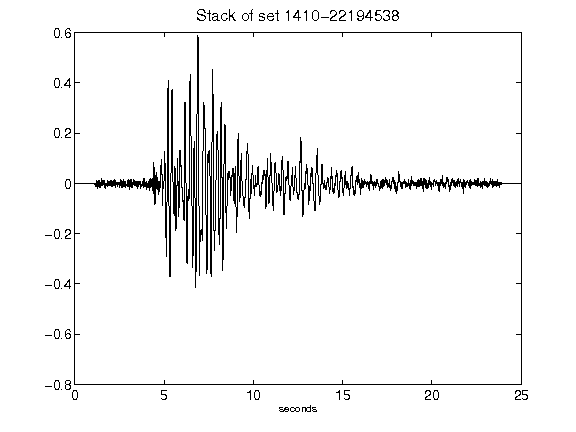](figures/1410-22194538_Stack.png)[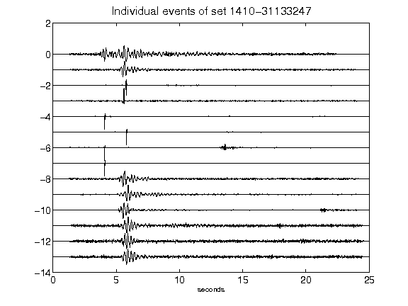](figures/1410-31133247_AllEv.png)[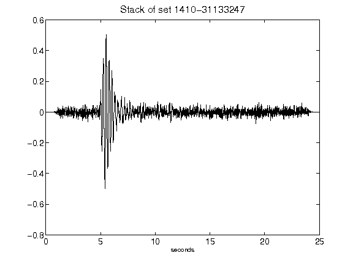](figures/1410-31133247_Stack.png)[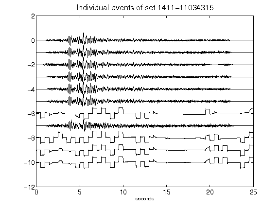](figures/1411-11034315_AllEv.png)[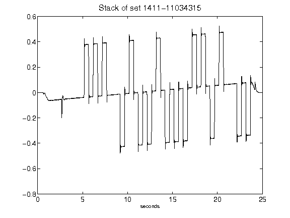](figures/1411-11034315_Stack.png)[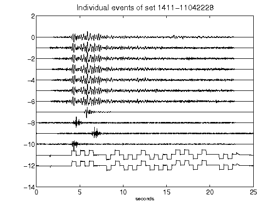](figures/1411-11042228_AllEv.png)[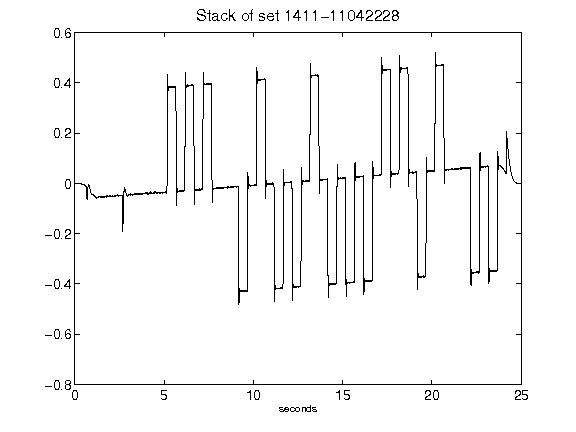](figures/1411-11042228_Stack.png)[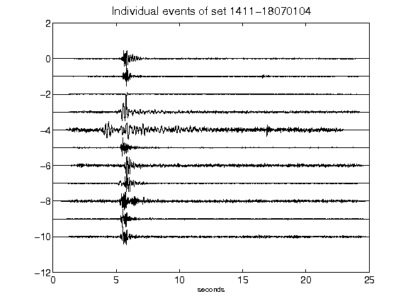](figures/1411-18070104_AllEv.png)[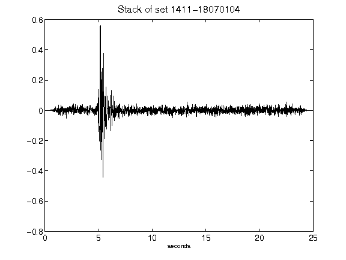](figures/1411-18070104_Stack.png)[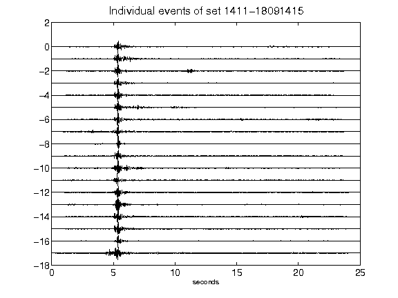](figures/1411-18091415_AllEv.png)[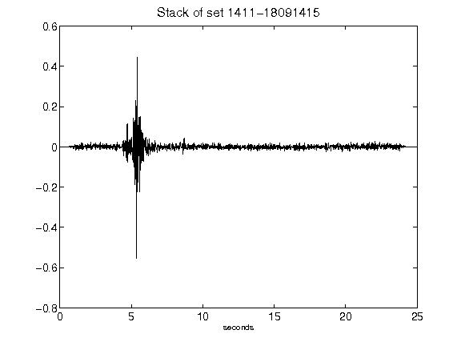](figures/1411-18091415_Stack.png)