# Repeating Earthquake Activity at STAR

## Waveforms
[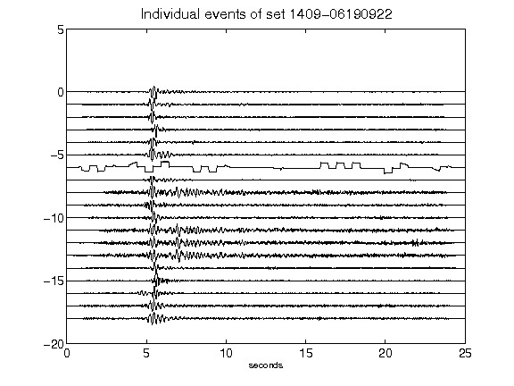](figures/1409-06190922_AllEv.png)[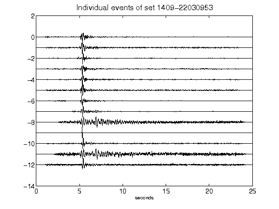](figures/1409-22030953_AllEv.png)[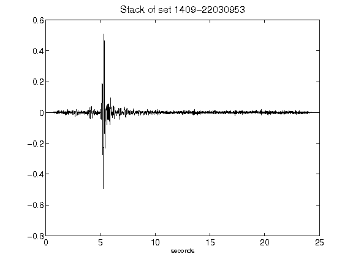](figures/1409-22030953_Stack.png)[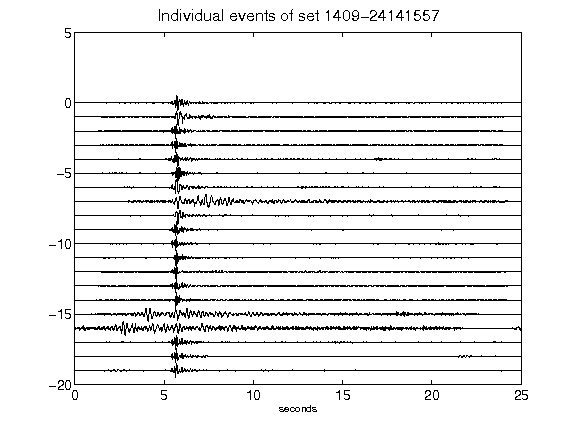](figures/1409-24141557_AllEv.png)[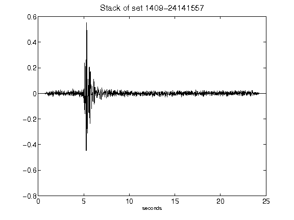](figures/1409-24141557_Stack.png)[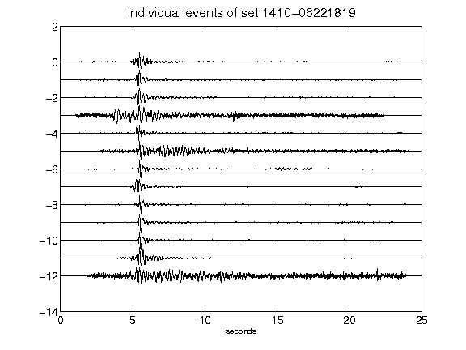](figures/1410-06221819_AllEv.png)[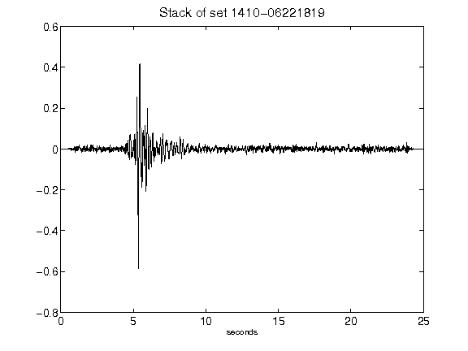](figures/1410-06221819_Stack.png)[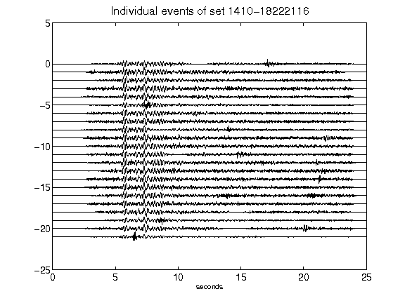](figures/1410-18222116_AllEv.png)[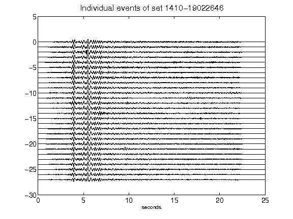](figures/1410-19022646_AllEv.png)[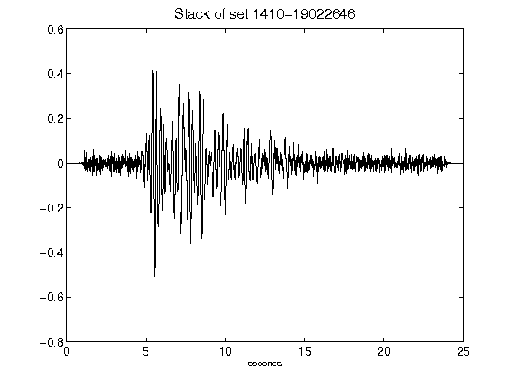](figures/1410-19022646_Stack.png)[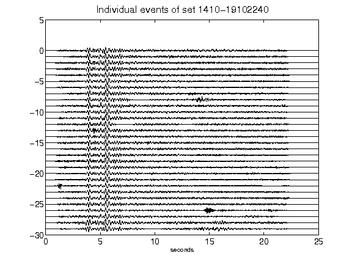](figures/1410-19102240_AllEv.png)[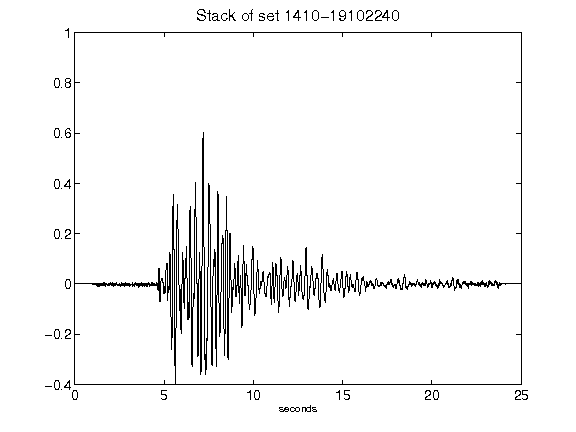](figures/1410-19102240_Stack.png)[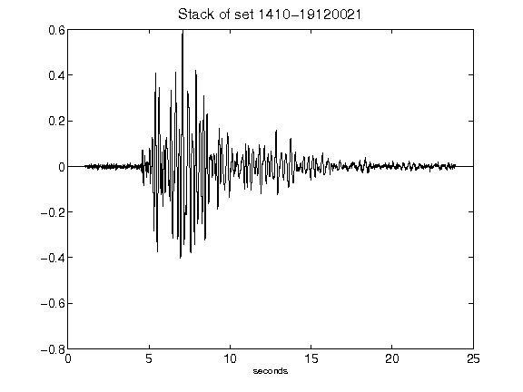](figures/1410-19120021_Stack.png)[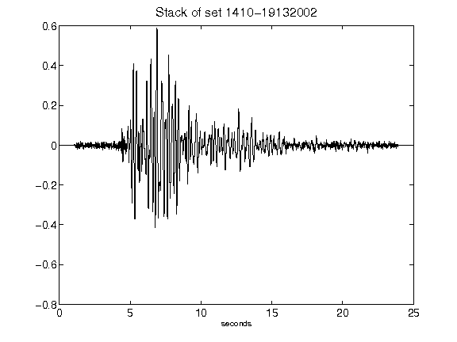](figures/1410-19132002_Stack.png)[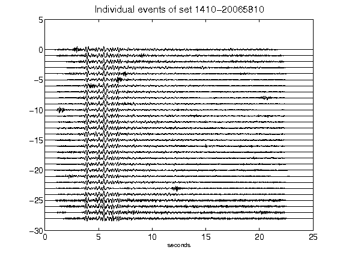](figures/1410-20065810_AllEv.png)[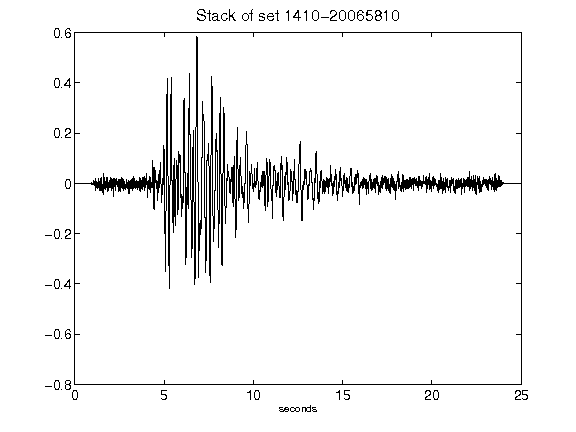](figures/1410-20065810_Stack.png)[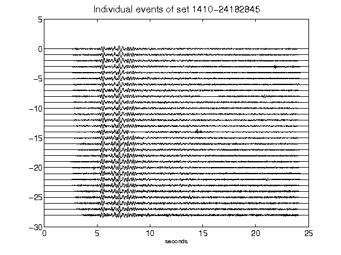](figures/1410-24182845_AllEv.png)[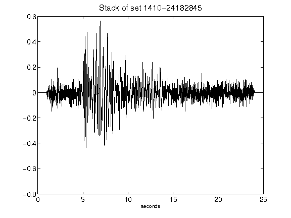](figures/1410-24182845_Stack.png)[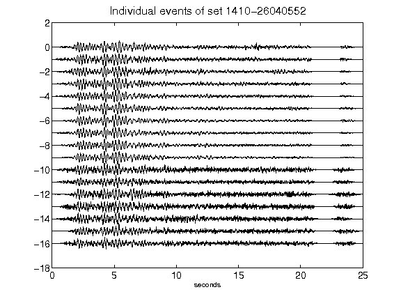](figures/1410-26040552_AllEv.png)[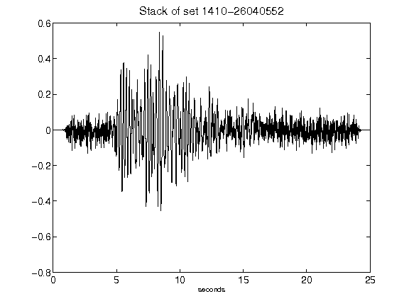](figures/1410-26040552_Stack.png)[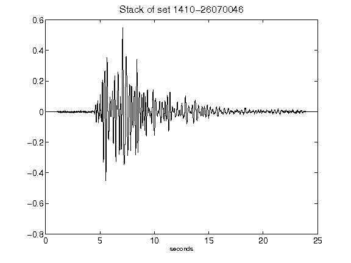](figures/1410-26070046_Stack.png)[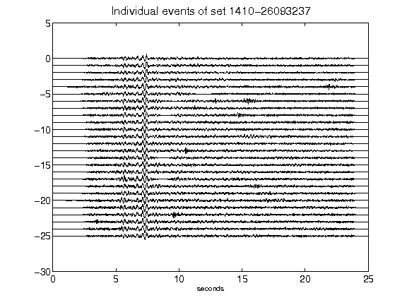](figures/1410-26093237_AllEv.png)[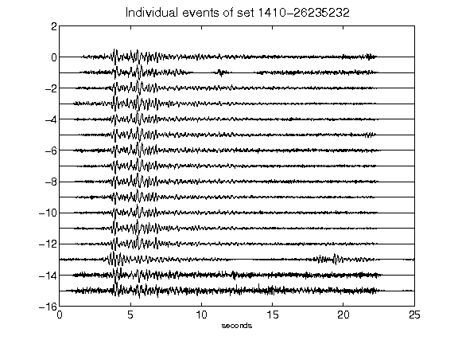](figures/1410-26235232_AllEv.png)[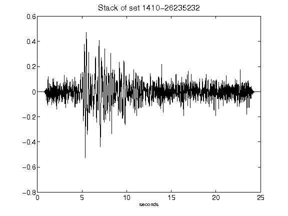](figures/1410-26235232_Stack.png)[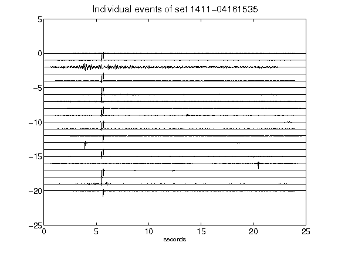](figures/1411-04161535_AllEv.png)[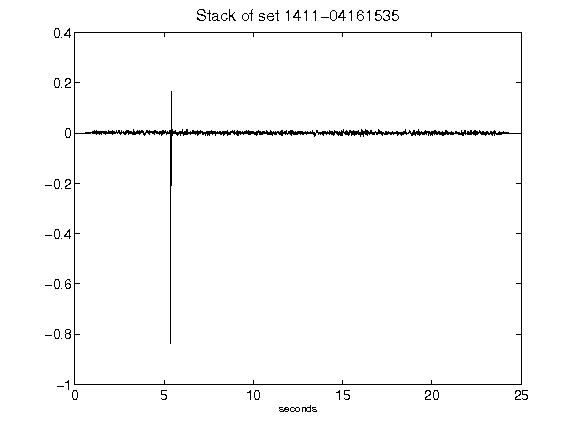](figures/1411-04161535_Stack.png)[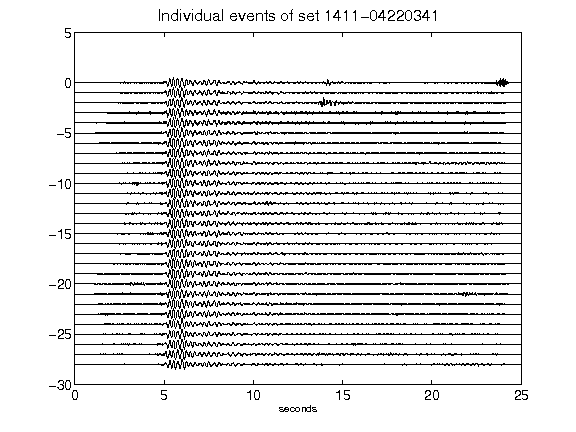](figures/1411-04220341_AllEv.png)[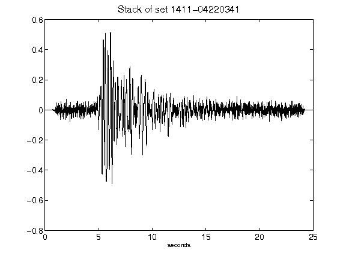](figures/1411-04220341_Stack.png)[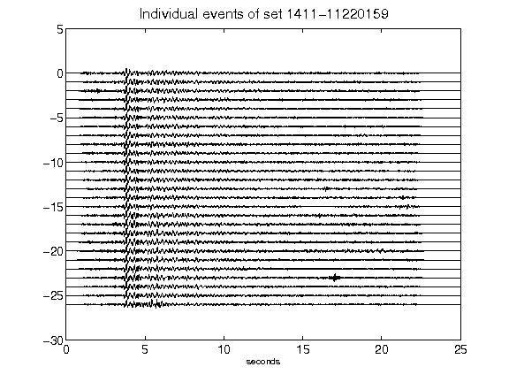](figures/1411-11220159_AllEv.png)[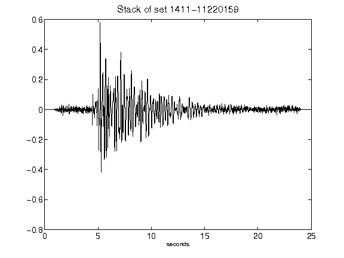](figures/1411-11220159_Stack.png)[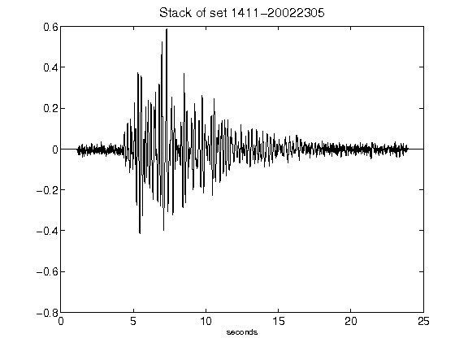](figures/1411-20022305_Stack.png)