# Repeating Earthquake Activity at STAR

## Waveforms
[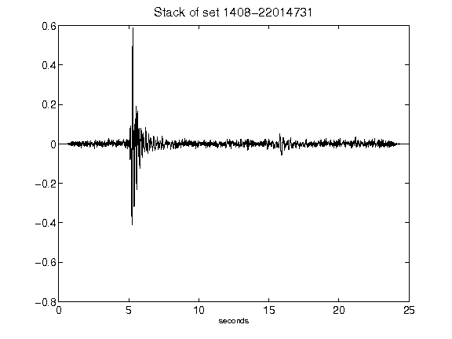](figures/1408-22014731_Stack.png)[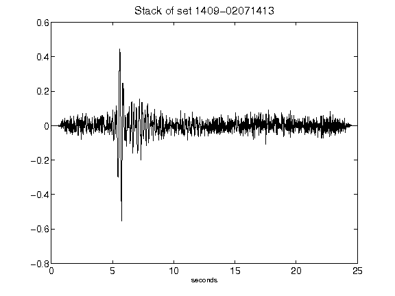](figures/1409-02071413_Stack.png)[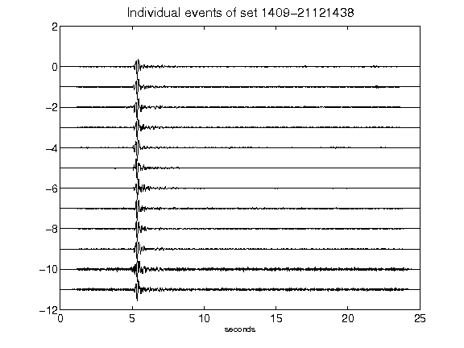](figures/1409-21121438_AllEv.png)[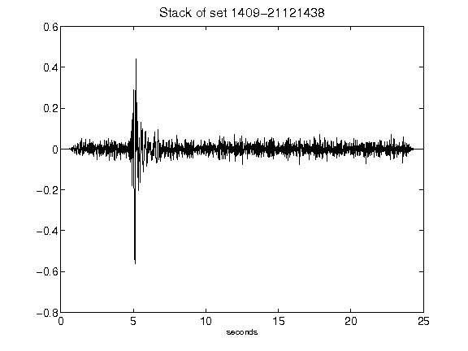](figures/1409-21121438_Stack.png)[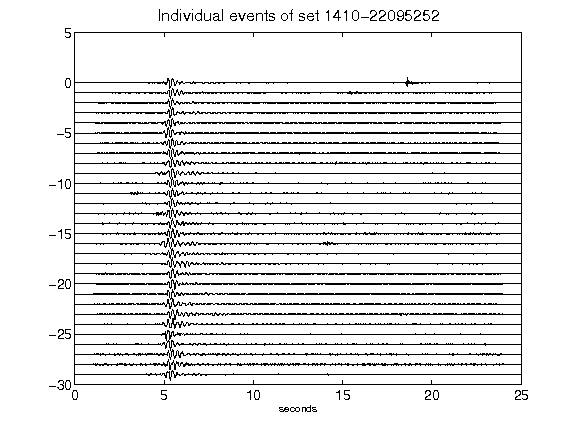](figures/1410-22095252_AllEv.png)[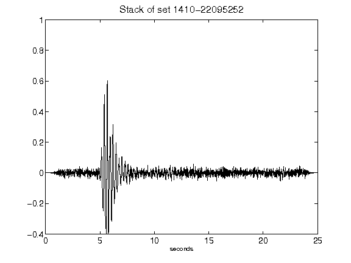](figures/1410-22095252_Stack.png)[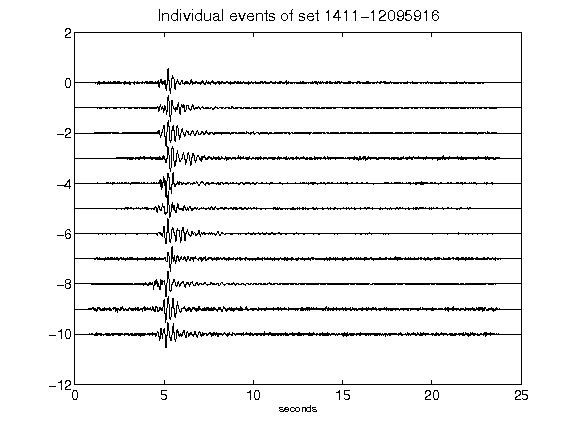](figures/1411-12095916_AllEv.png)[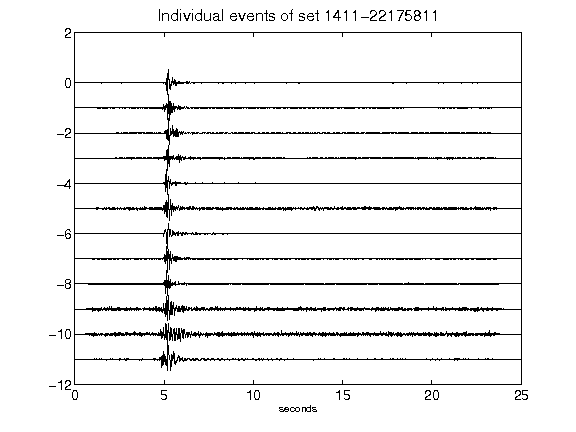](figures/1411-22175811_AllEv.png)[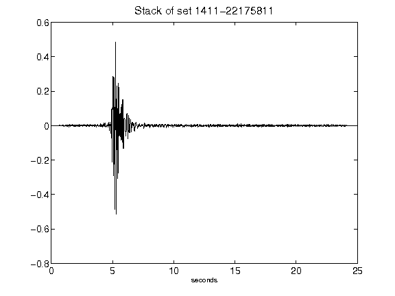](figures/1411-22175811_Stack.png)[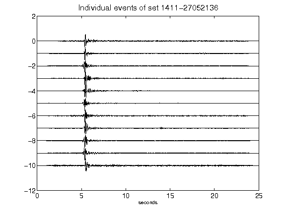](figures/1411-27052136_AllEv.png)[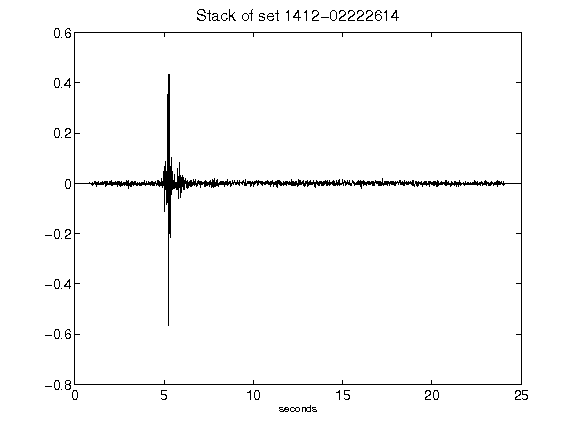](figures/1412-02222614_Stack.png)[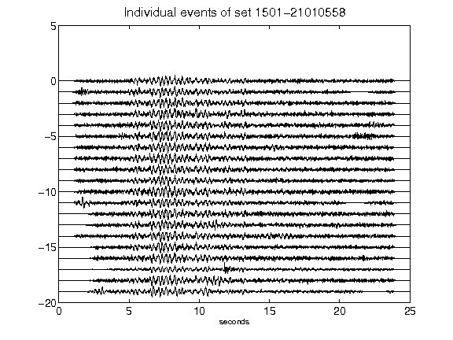](figures/1501-21010558_AllEv.png)[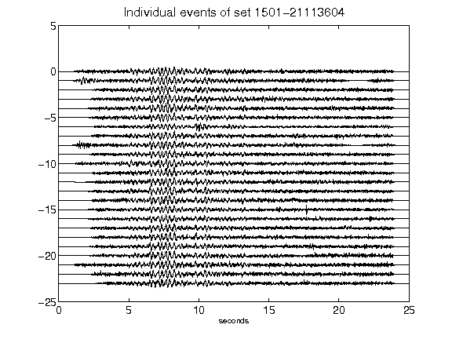](figures/1501-21113604_AllEv.png)[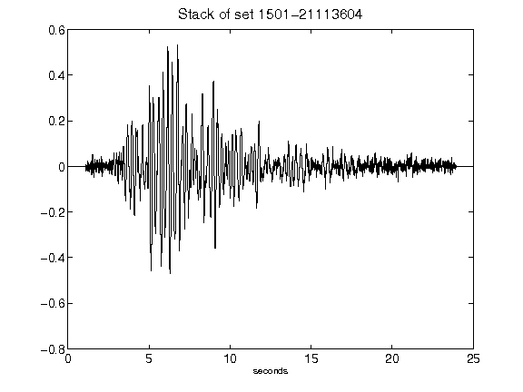](figures/1501-21113604_Stack.png)[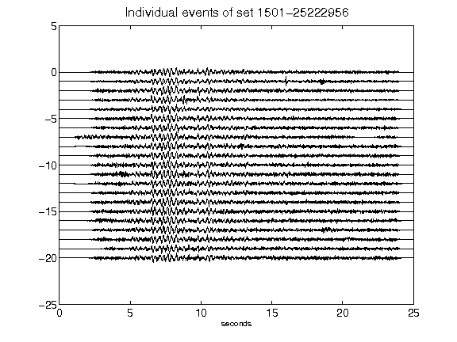](figures/1501-25222956_AllEv.png)[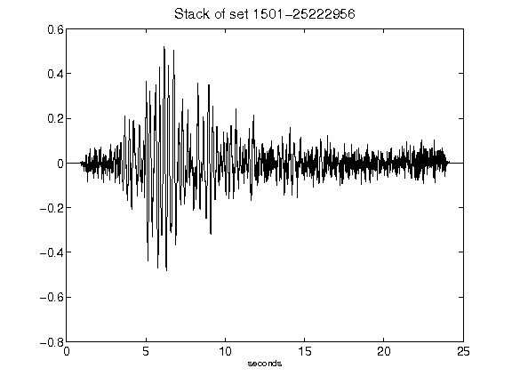](figures/1501-25222956_Stack.png)