# Repeating Earthquake Activity at STAR

## Waveforms
[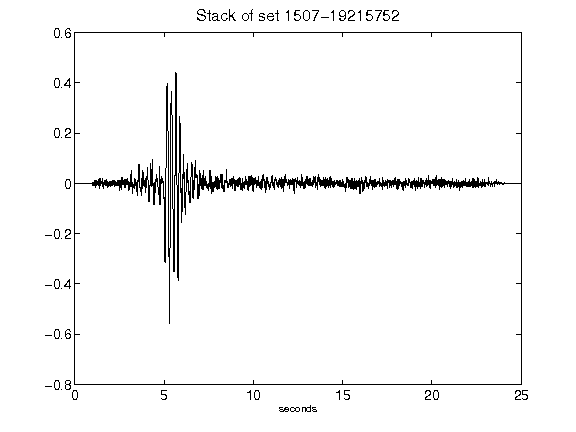](figures/1507-19215752_Stack.png)[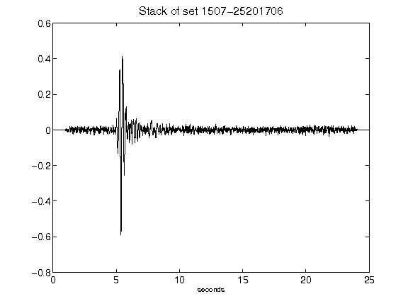](figures/1507-25201706_Stack.png)[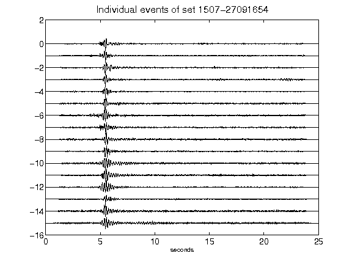](figures/1507-27091654_AllEv.png)[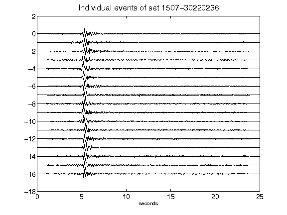](figures/1507-30220236_AllEv.png)[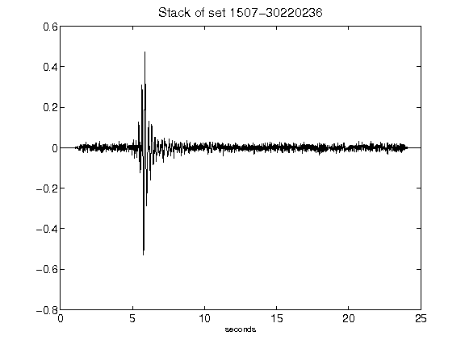](figures/1507-30220236_Stack.png)[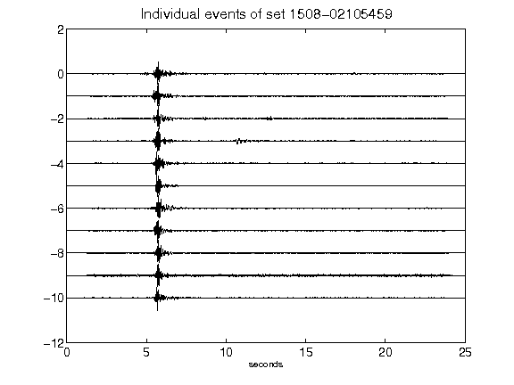](figures/1508-02105459_AllEv.png)[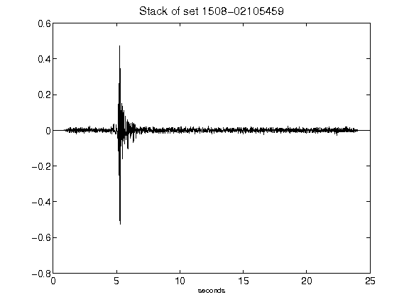](figures/1508-02105459_Stack.png)[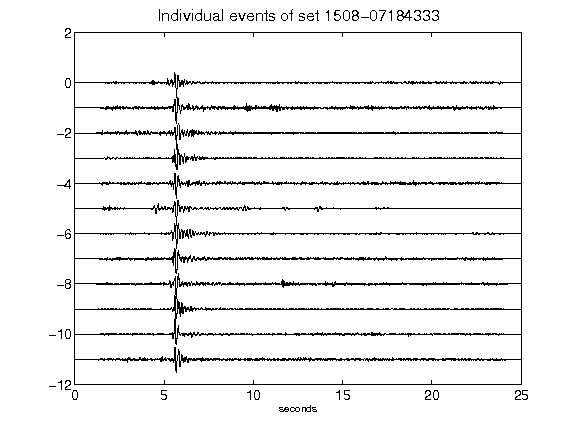](figures/1508-07184333_AllEv.png)[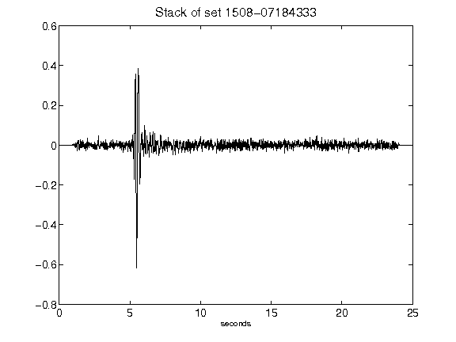](figures/1508-07184333_Stack.png)[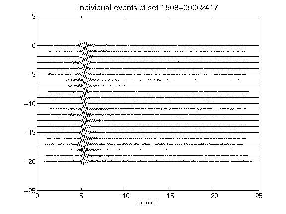](figures/1508-09062417_AllEv.png)[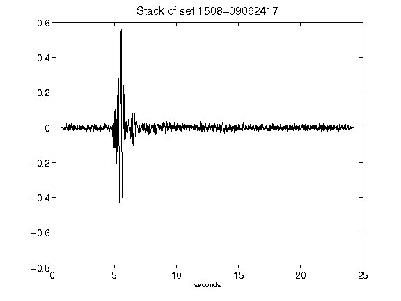](figures/1508-09062417_Stack.png)[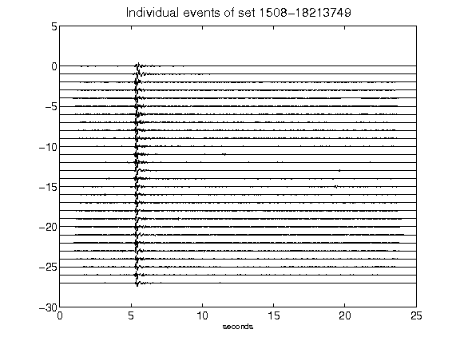](figures/1508-18213749_AllEv.png)[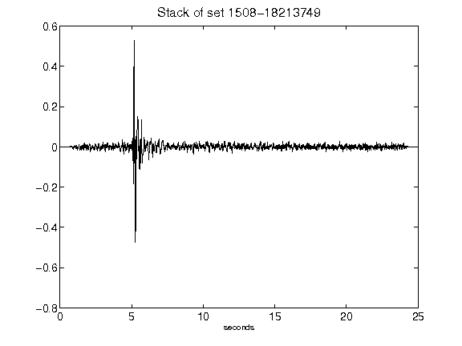](figures/1508-18213749_Stack.png)[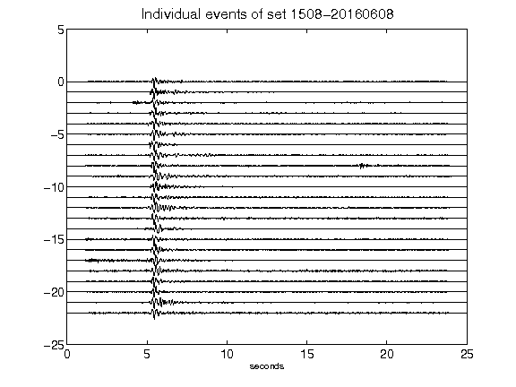](figures/1508-20160608_AllEv.png)[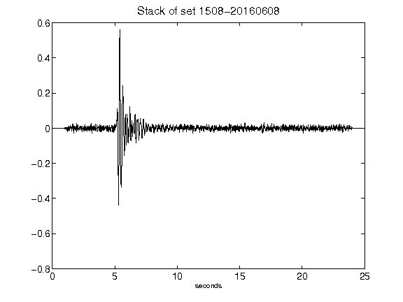](figures/1508-20160608_Stack.png)[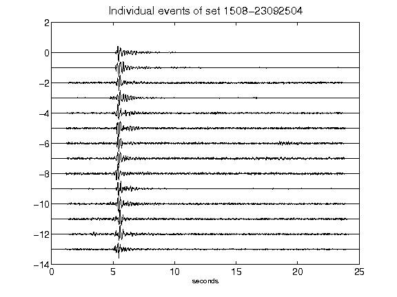](figures/1508-23092504_AllEv.png)[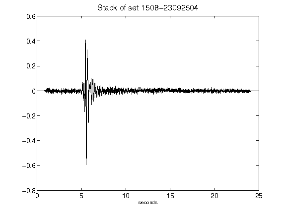](figures/1508-23092504_Stack.png)[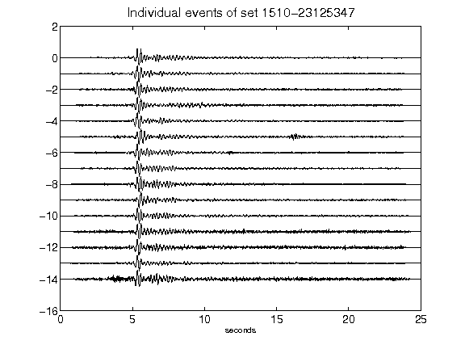](figures/1510-23125347_AllEv.png)[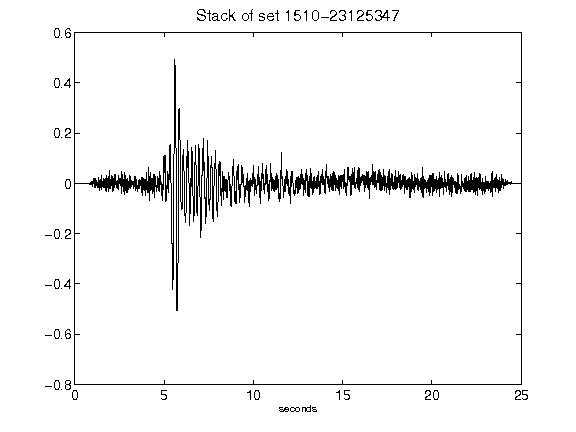](figures/1510-23125347_Stack.png)