# Repeating Earthquake Activity at STAR

## Waveforms
[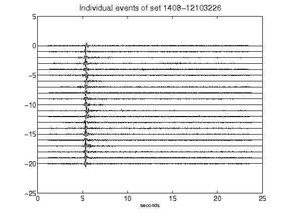](figures/1408-12103226_AllEv.png)[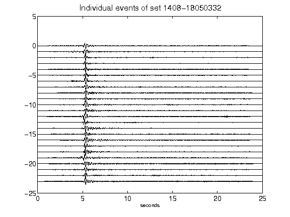](figures/1408-18050332_AllEv.png)[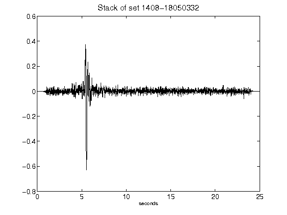](figures/1408-18050332_Stack.png)[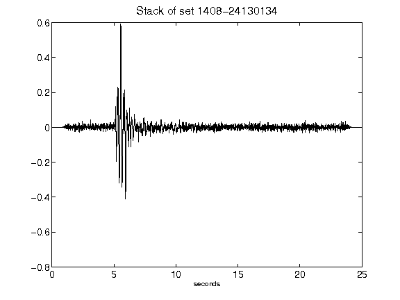](figures/1408-24130134_Stack.png)[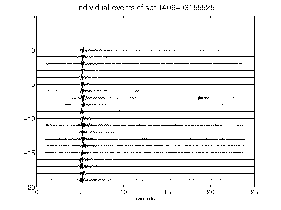](figures/1409-03155525_AllEv.png)[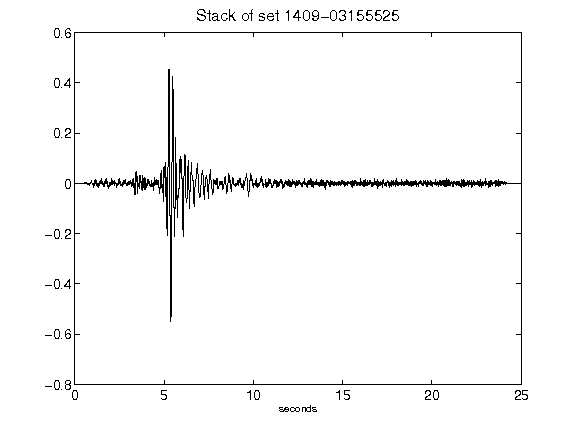](figures/1409-03155525_Stack.png)[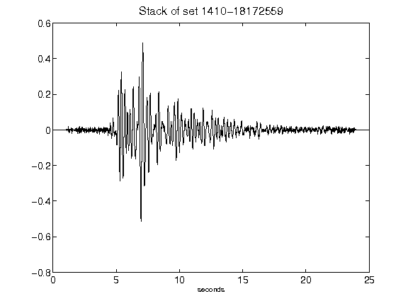](figures/1410-18172559_Stack.png)[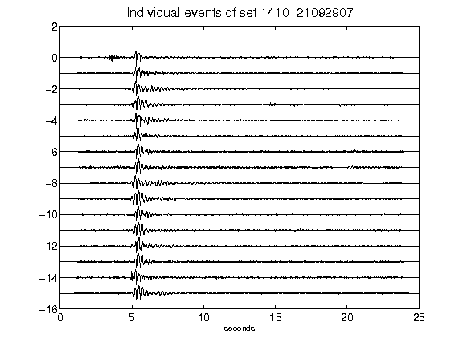](figures/1410-21092907_AllEv.png)[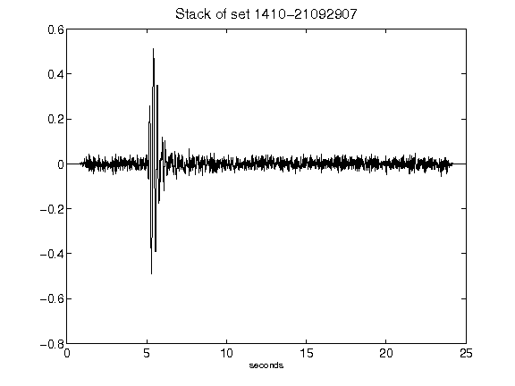](figures/1410-21092907_Stack.png)[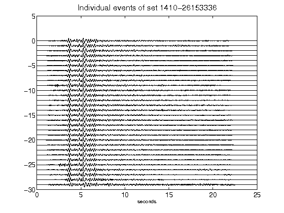](figures/1410-26153336_AllEv.png)[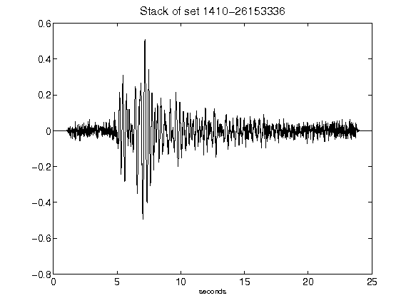](figures/1410-26153336_Stack.png)[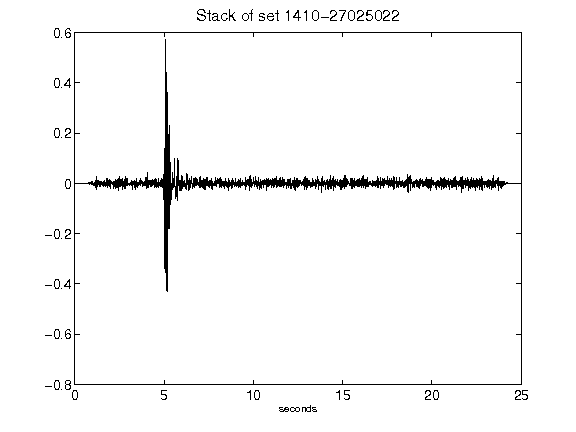](figures/1410-27025022_Stack.png)[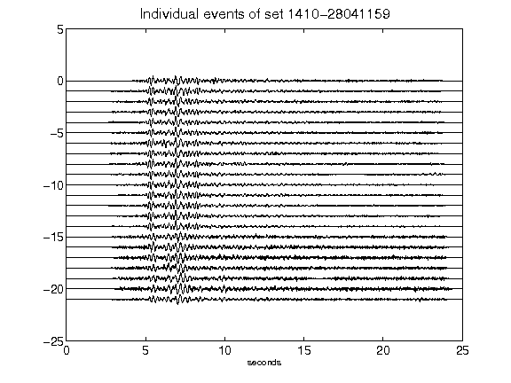](figures/1410-28041159_AllEv.png)[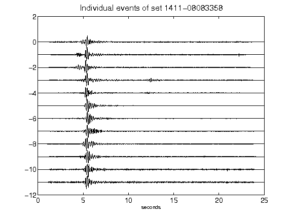](figures/1411-08083358_AllEv.png)[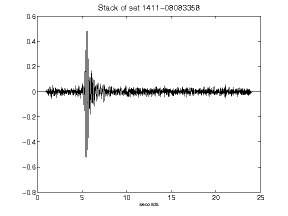](figures/1411-08083358_Stack.png)[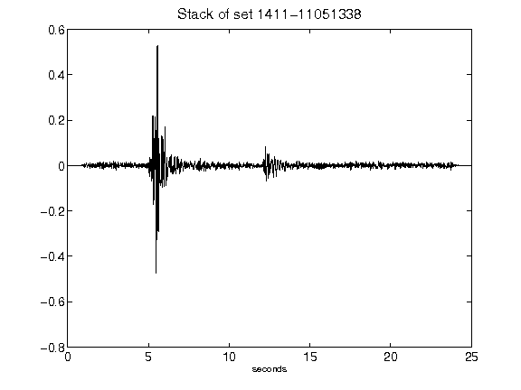](figures/1411-11051338_Stack.png)[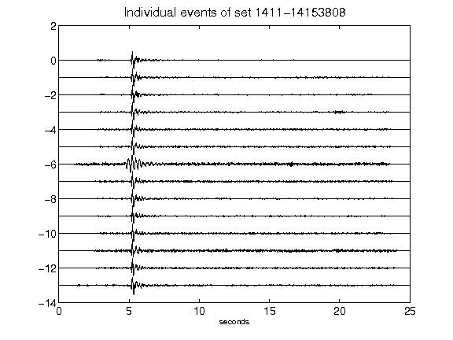](figures/1411-14153808_AllEv.png)[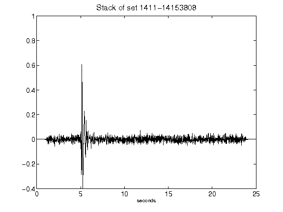](figures/1411-14153808_Stack.png)[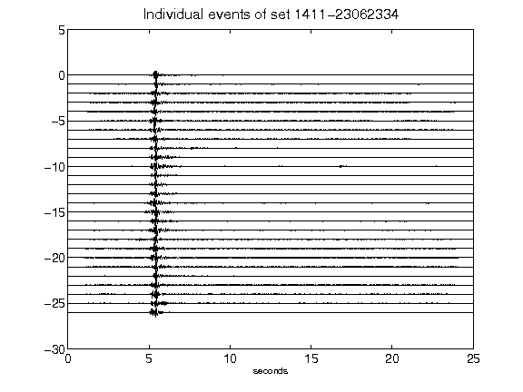](figures/1411-23062334_AllEv.png)[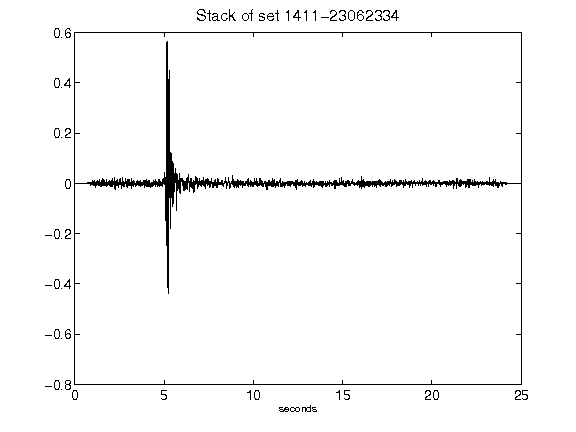](figures/1411-23062334_Stack.png)[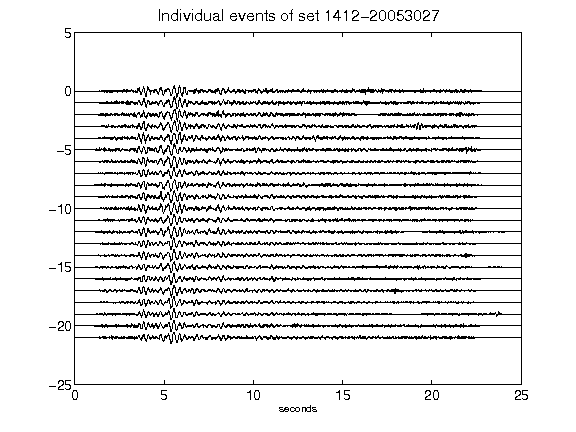](figures/1412-20053027_AllEv.png)[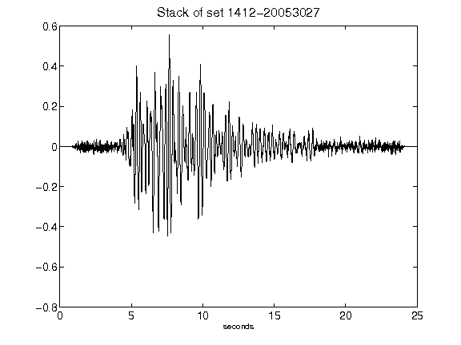](figures/1412-20053027_Stack.png)[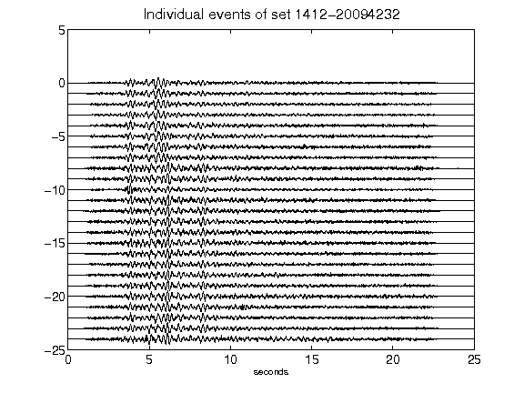](figures/1412-20094232_AllEv.png)[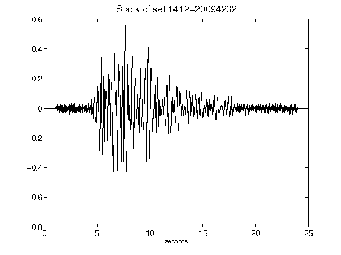](figures/1412-20094232_Stack.png)[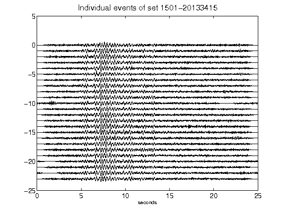](figures/1501-20133415_AllEv.png)[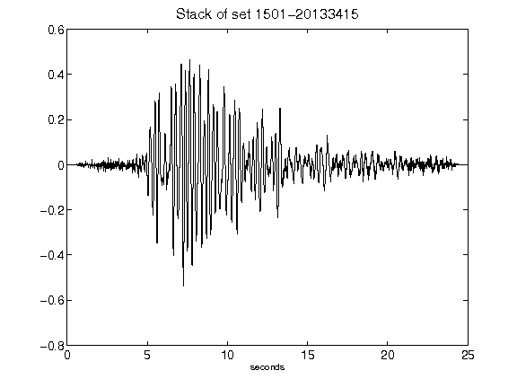](figures/1501-20133415_Stack.png)