# Repeating Earthquake Activity at STAR

## Waveforms
[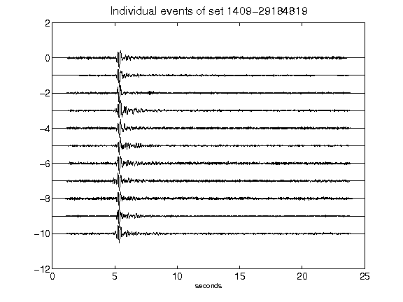](figures/1409-29184819_AllEv.png)[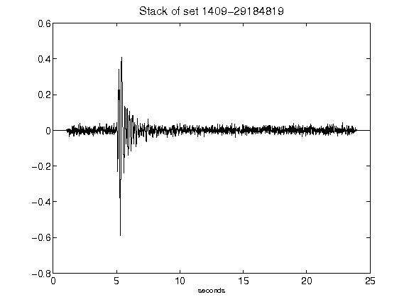](figures/1409-29184819_Stack.png)[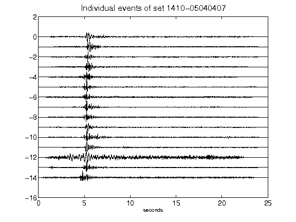](figures/1410-05040407_AllEv.png)[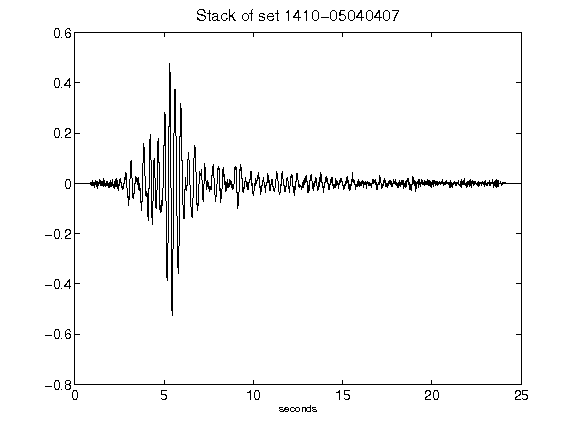](figures/1410-05040407_Stack.png)[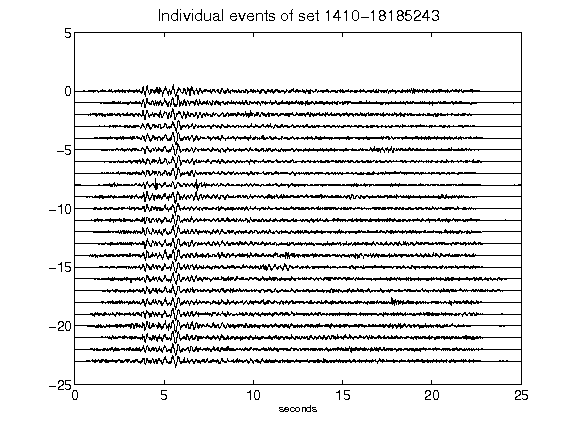](figures/1410-18185243_AllEv.png)[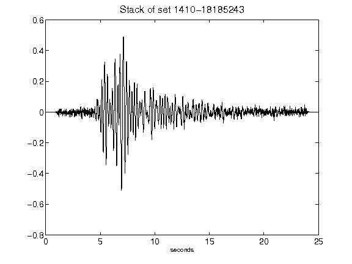](figures/1410-18185243_Stack.png)[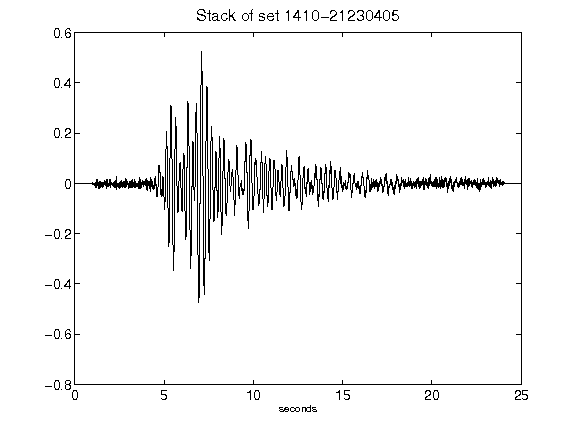](figures/1410-21230405_Stack.png)[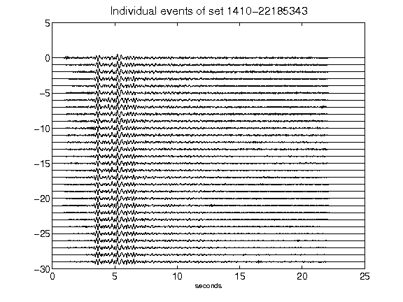](figures/1410-22185343_AllEv.png)[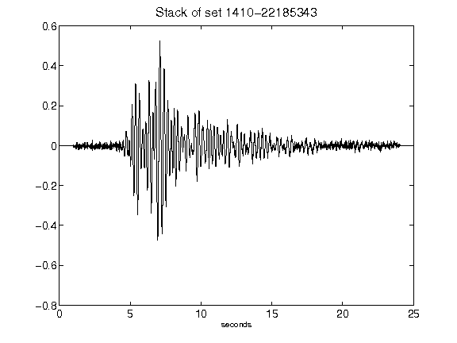](figures/1410-22185343_Stack.png)[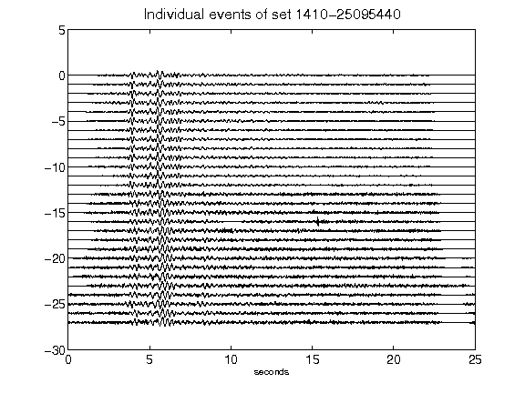](figures/1410-25095440_AllEv.png)[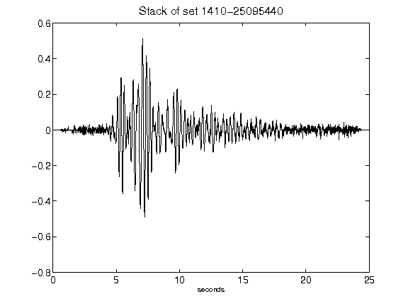](figures/1410-25095440_Stack.png)[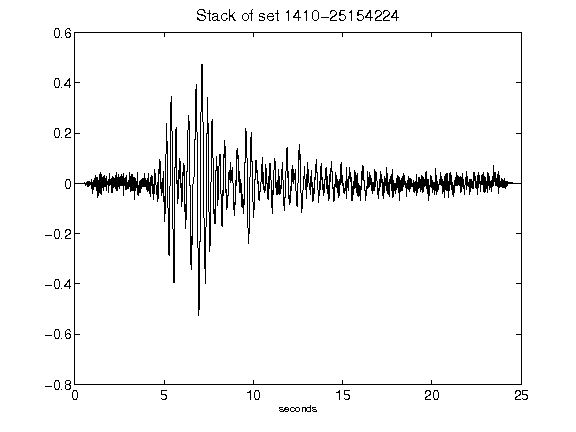](figures/1410-25154224_Stack.png)[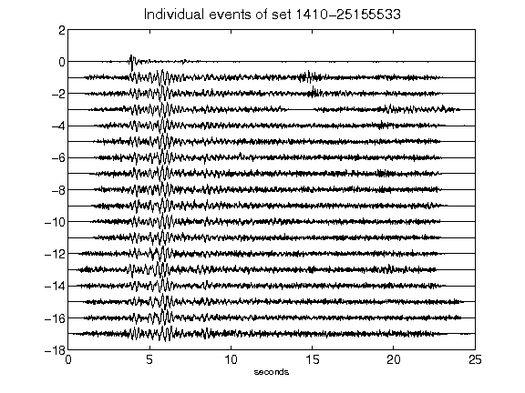](figures/1410-25155533_AllEv.png)[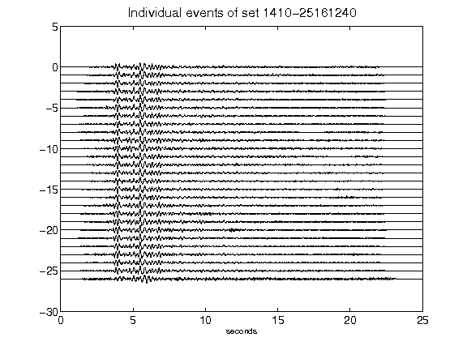](figures/1410-25161240_AllEv.png)[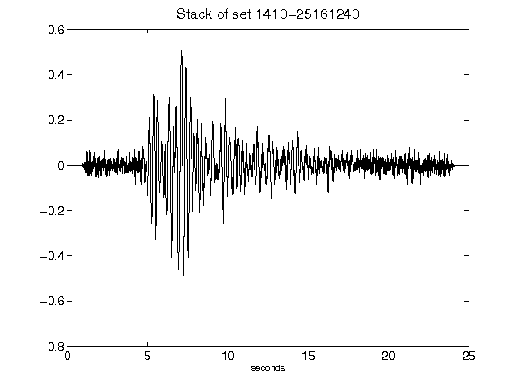](figures/1410-25161240_Stack.png)[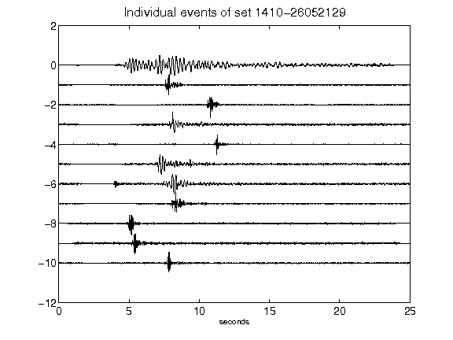](figures/1410-26052129_AllEv.png)[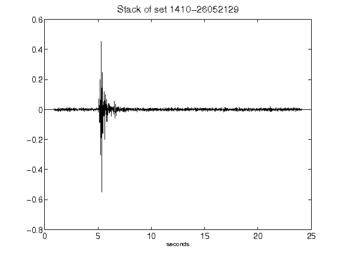](figures/1410-26052129_Stack.png)[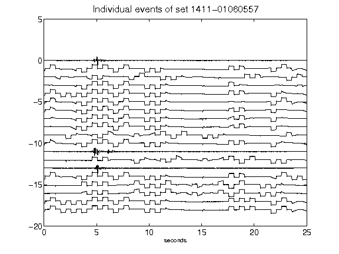](figures/1411-01060557_AllEv.png)[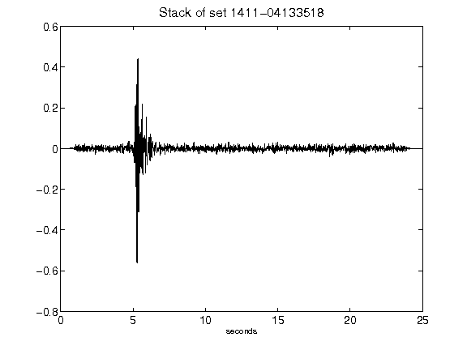](figures/1411-04133518_Stack.png)[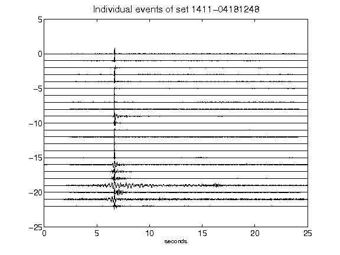](figures/1411-04181248_AllEv.png)