# Repeating Earthquake Activity at STAR

## Waveforms
[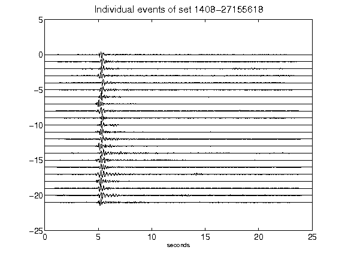](figures/1408-27155618_AllEv.png)[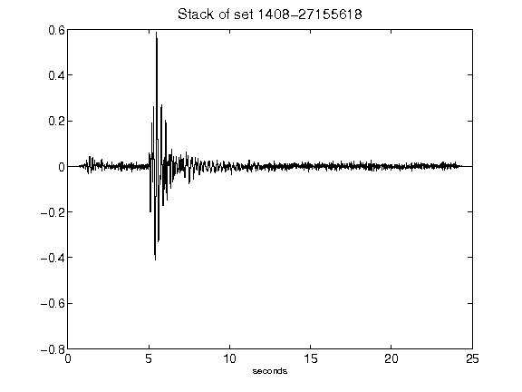](figures/1408-27155618_Stack.png)[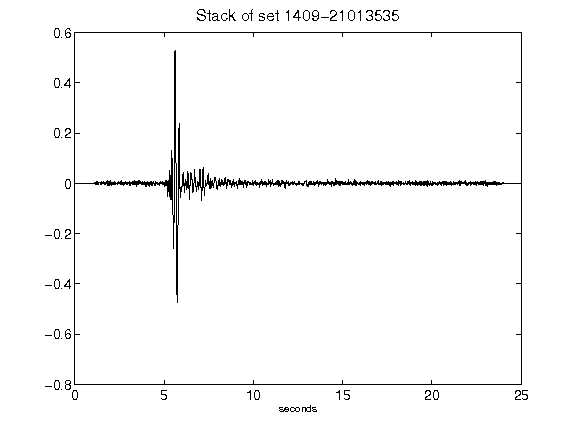](figures/1409-21013535_Stack.png)[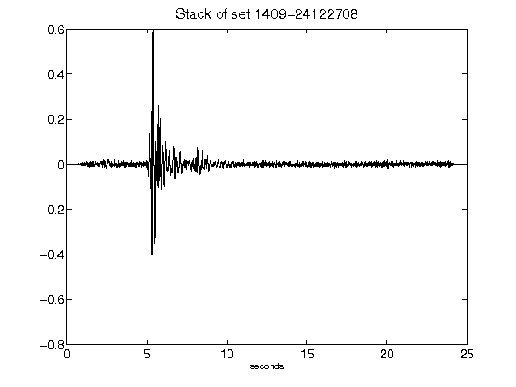](figures/1409-24122708_Stack.png)[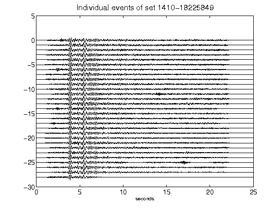](figures/1410-18225849_AllEv.png)[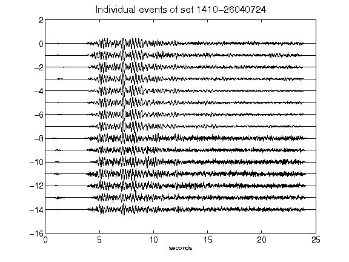](figures/1410-26040724_AllEv.png)[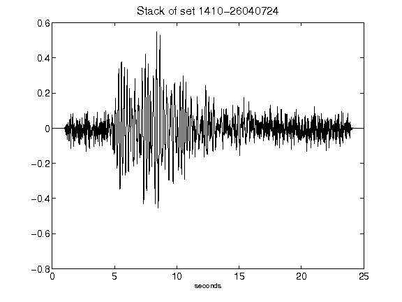](figures/1410-26040724_Stack.png)[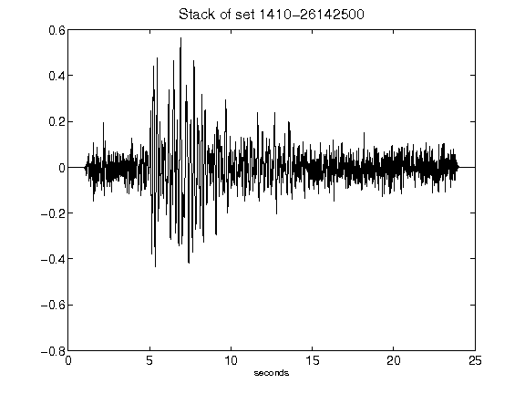](figures/1410-26142500_Stack.png)[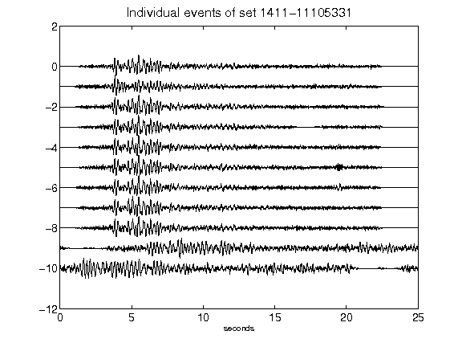](figures/1411-11105331_AllEv.png)[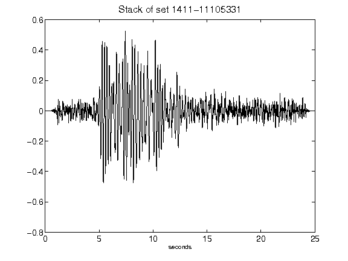](figures/1411-11105331_Stack.png)[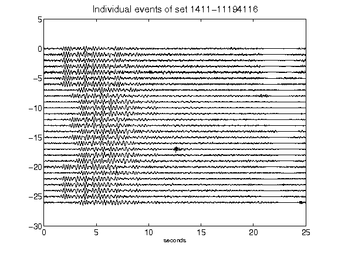](figures/1411-11194116_AllEv.png)[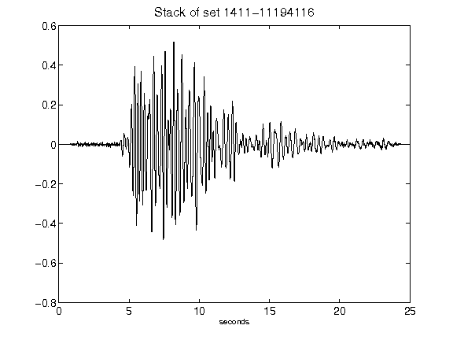](figures/1411-11194116_Stack.png)