# Repeating Earthquake Activity at STAR

## Waveforms
[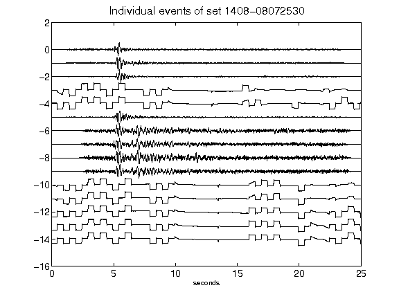](figures/1408-08072530_AllEv.png)[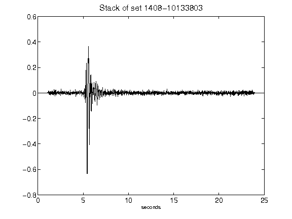](figures/1408-10133803_Stack.png)[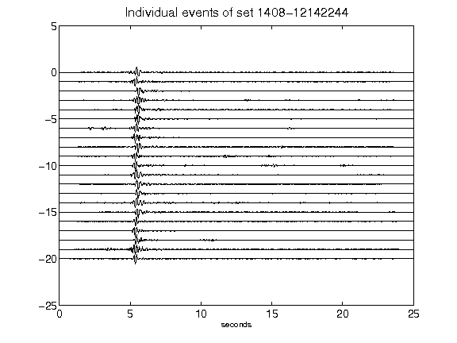](figures/1408-12142244_AllEv.png)[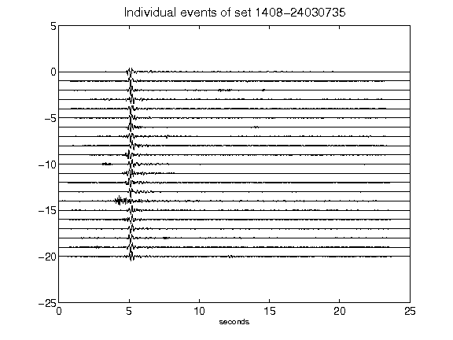](figures/1408-24030735_AllEv.png)[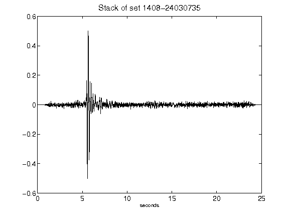](figures/1408-24030735_Stack.png)[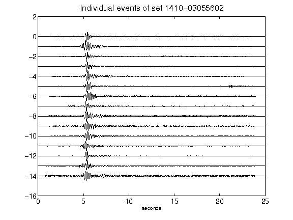](figures/1410-03055602_AllEv.png)[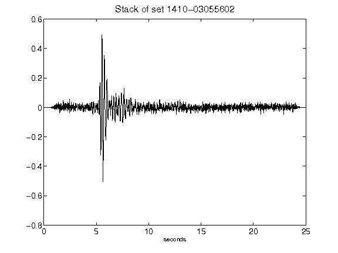](figures/1410-03055602_Stack.png)[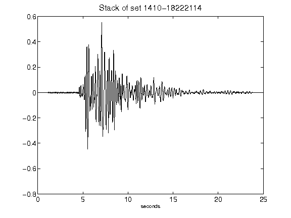](figures/1410-18222114_Stack.png)[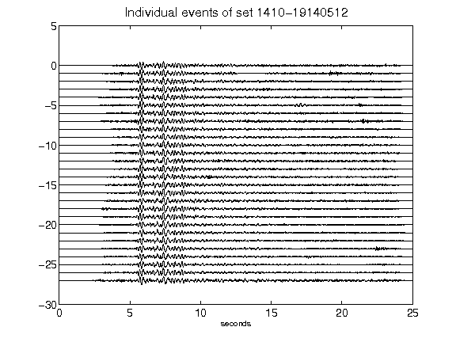](figures/1410-19140512_AllEv.png)[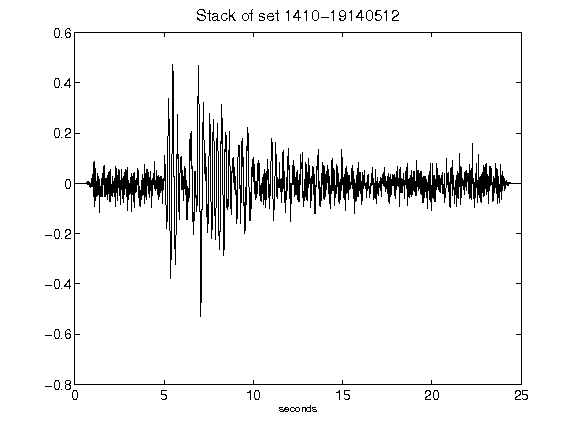](figures/1410-19140512_Stack.png)[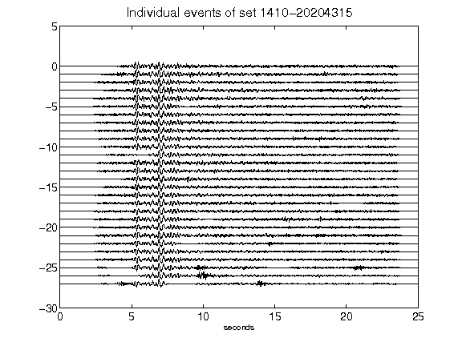](figures/1410-20204315_AllEv.png)[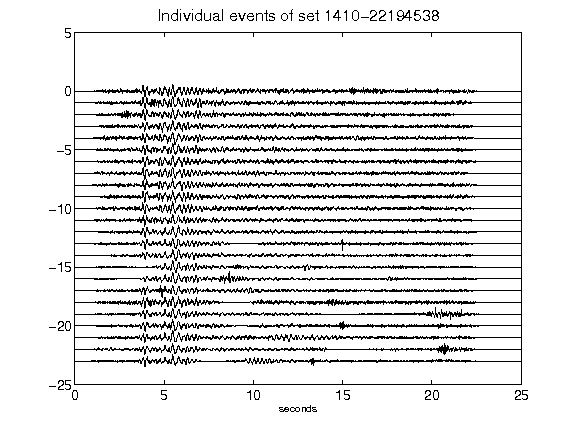](figures/1410-22194538_AllEv.png)[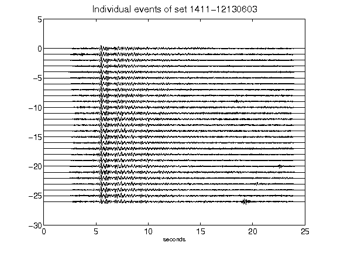](figures/1411-12130603_AllEv.png)