# Repeating Earthquake Activity at STAR

## Waveforms
[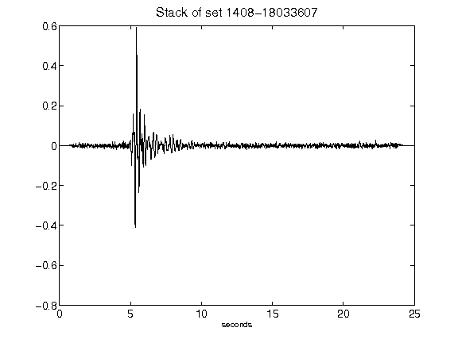](figures/1408-18033607_Stack.png)[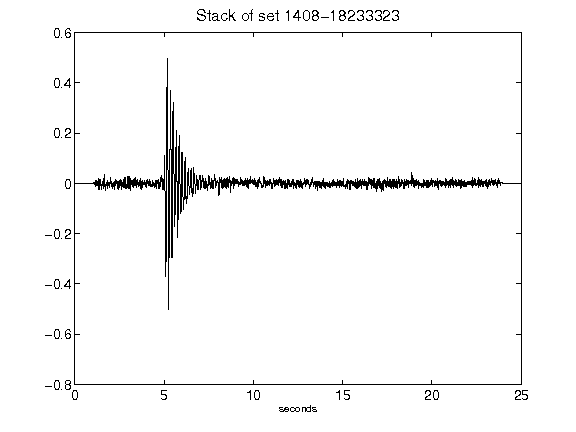](figures/1408-18233323_Stack.png)[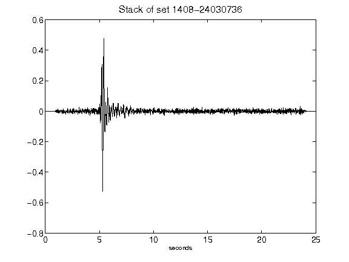](figures/1408-24030736_Stack.png)[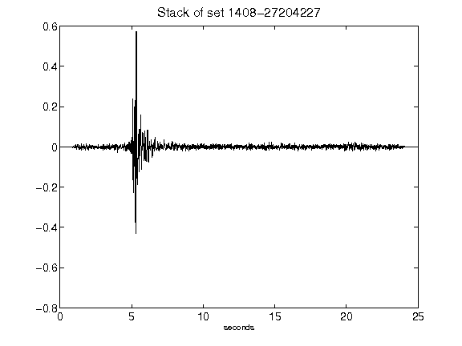](figures/1408-27204227_Stack.png)[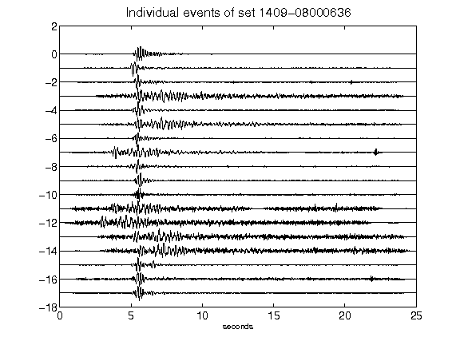](figures/1409-08000636_AllEv.png)[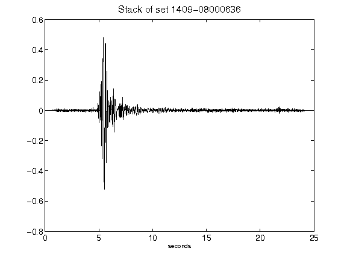](figures/1409-08000636_Stack.png)[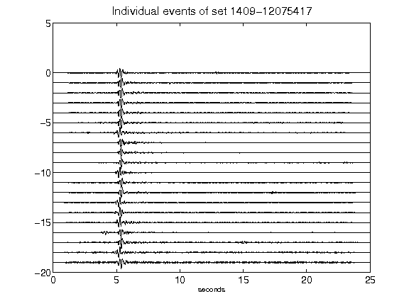](figures/1409-12075417_AllEv.png)[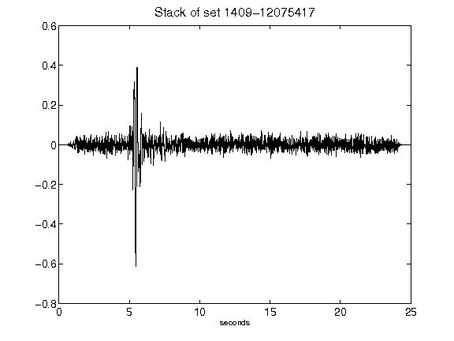](figures/1409-12075417_Stack.png)[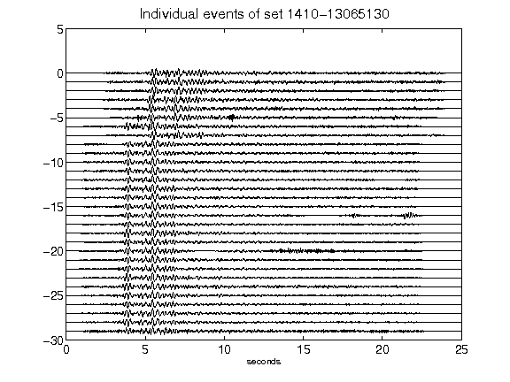](figures/1410-13065130_AllEv.png)[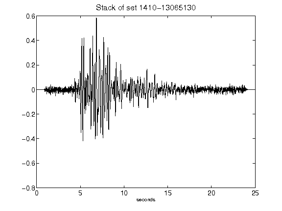](figures/1410-13065130_Stack.png)[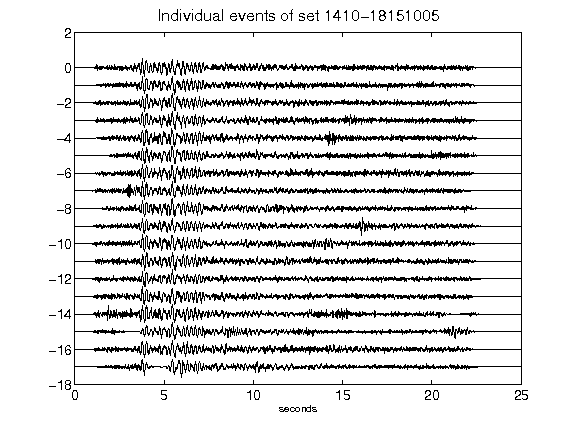](figures/1410-18151005_AllEv.png)[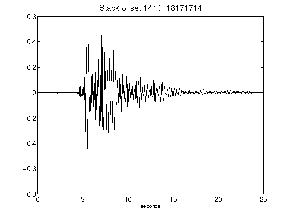](figures/1410-18171714_Stack.png)[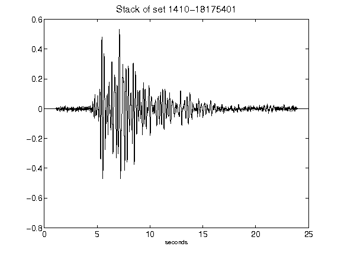](figures/1410-18175401_Stack.png)[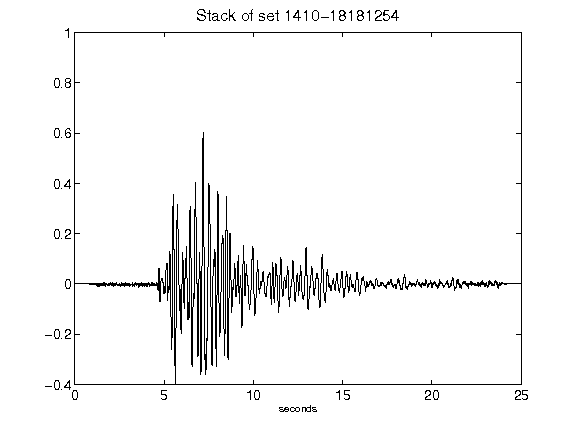](figures/1410-18181254_Stack.png)[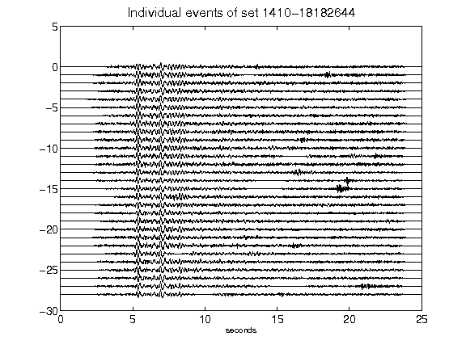](figures/1410-18182644_AllEv.png)[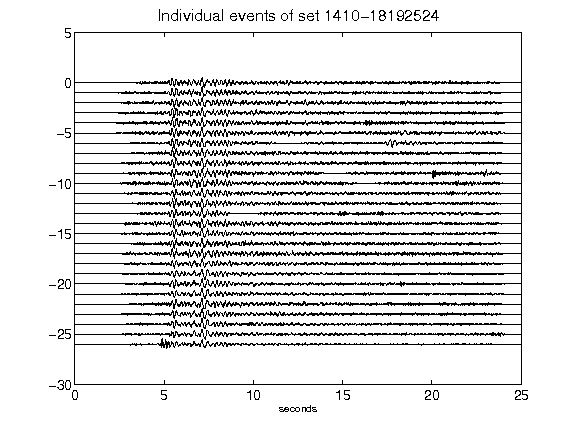](figures/1410-18192524_AllEv.png)[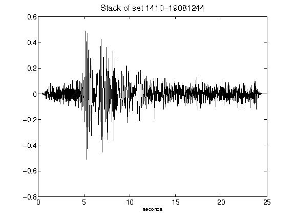](figures/1410-19081244_Stack.png)[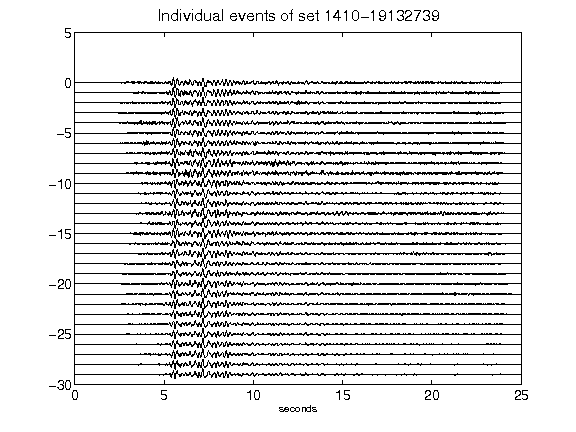](figures/1410-19132739_AllEv.png)[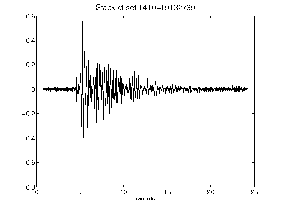](figures/1410-19132739_Stack.png)[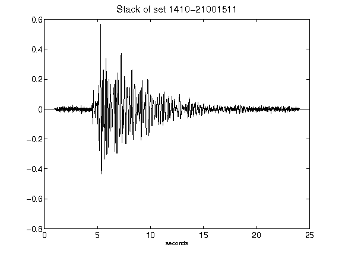](figures/1410-21001511_Stack.png)[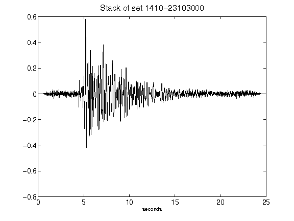](figures/1410-23103000_Stack.png)[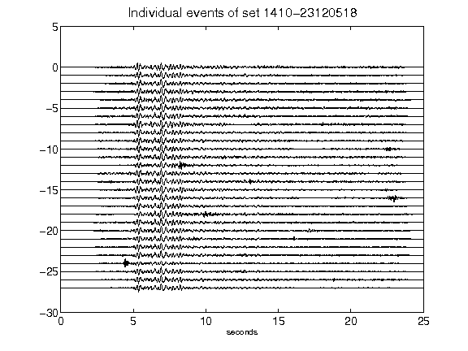](figures/1410-23120518_AllEv.png)[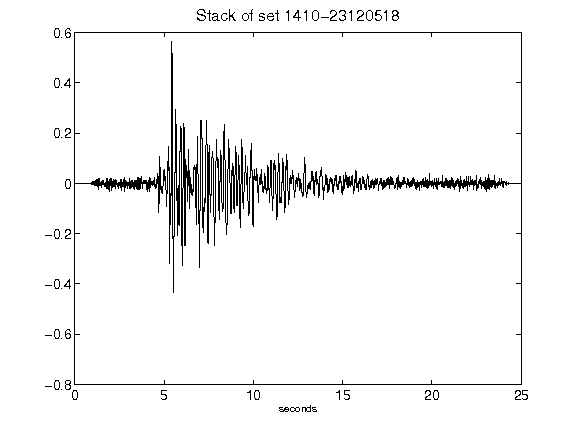](figures/1410-23120518_Stack.png)