# Repeating Earthquake Activity at STAR

## Waveforms
[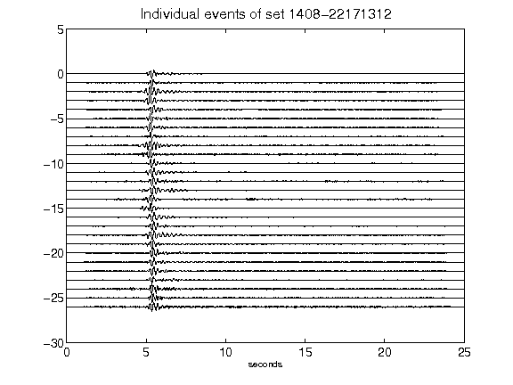](figures/1408-22171312_AllEv.png)[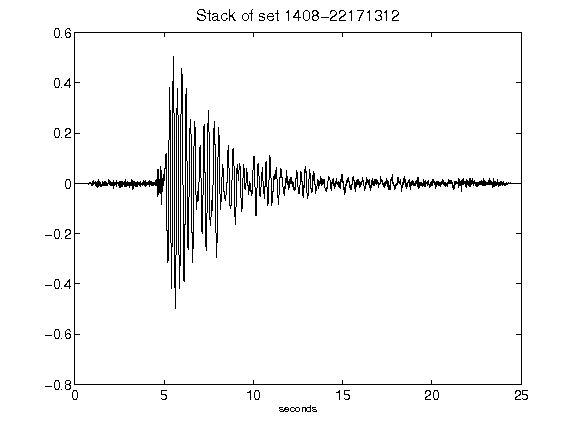](figures/1408-22171312_Stack.png)[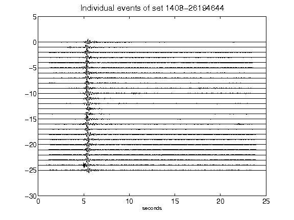](figures/1408-26194644_AllEv.png)[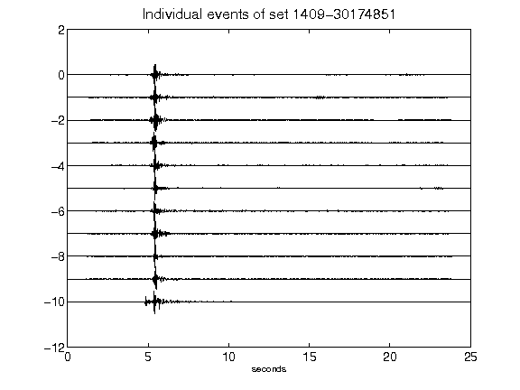](figures/1409-30174851_AllEv.png)[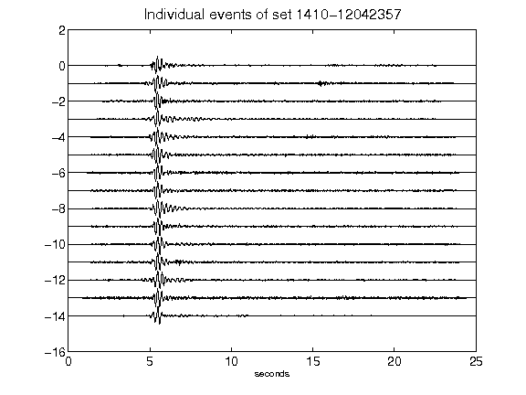](figures/1410-12042357_AllEv.png)[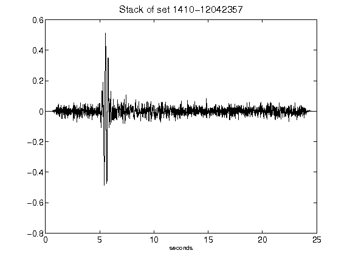](figures/1410-12042357_Stack.png)[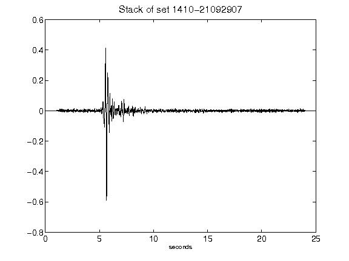](figures/1410-21092907_Stack.png)[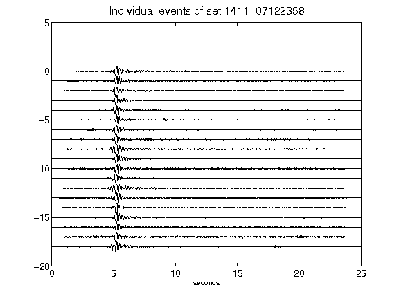](figures/1411-07122358_AllEv.png)[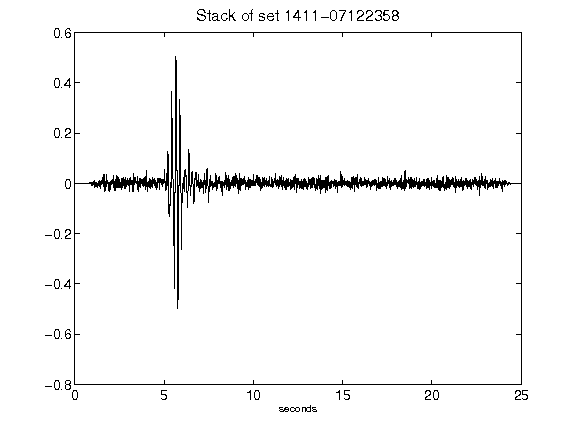](figures/1411-07122358_Stack.png)[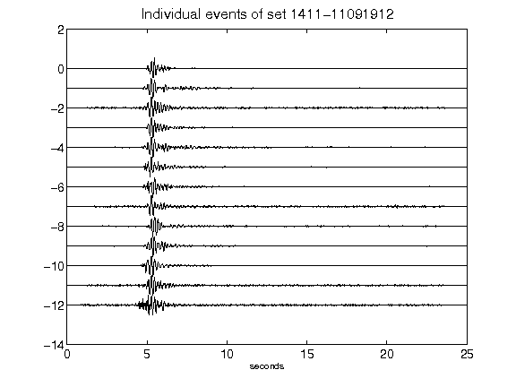](figures/1411-11091912_AllEv.png)[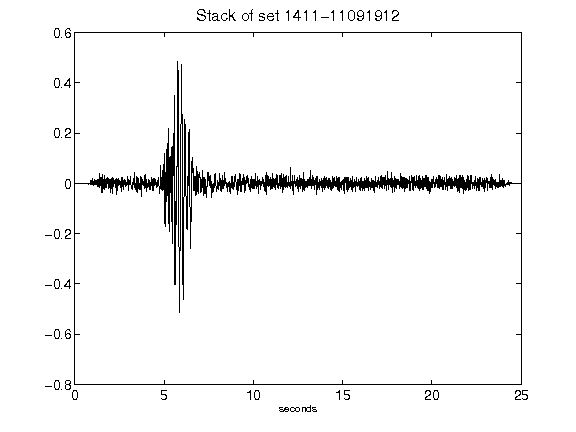](figures/1411-11091912_Stack.png)[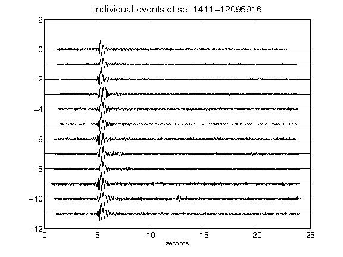](figures/1411-12095916_AllEv.png)[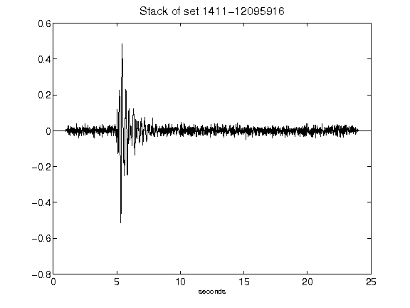](figures/1411-12095916_Stack.png)[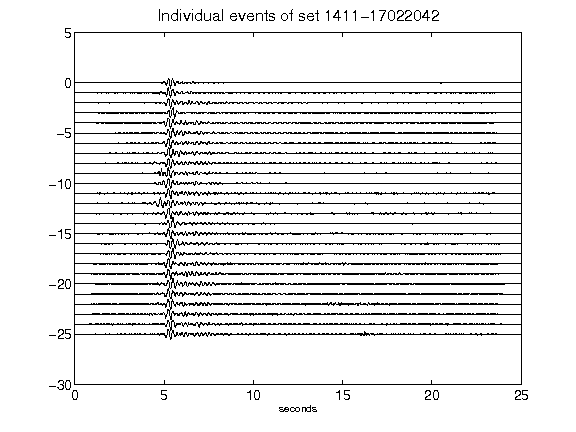](figures/1411-17022042_AllEv.png)[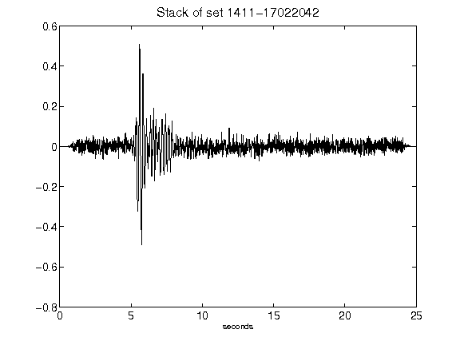](figures/1411-17022042_Stack.png)[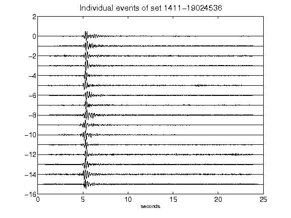](figures/1411-19024536_AllEv.png)[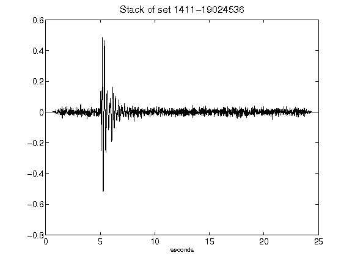](figures/1411-19024536_Stack.png)[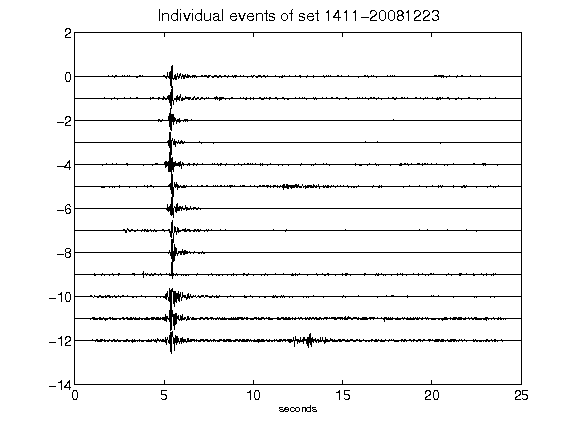](figures/1411-20081223_AllEv.png)[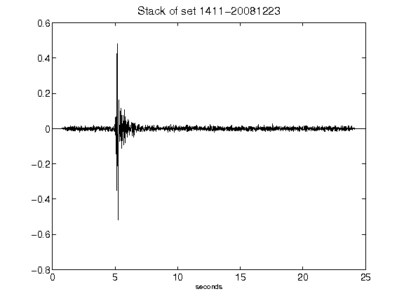](figures/1411-20081223_Stack.png)[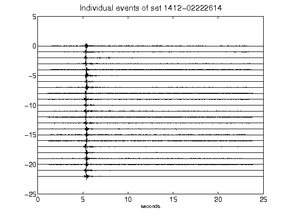](figures/1412-02222614_AllEv.png)[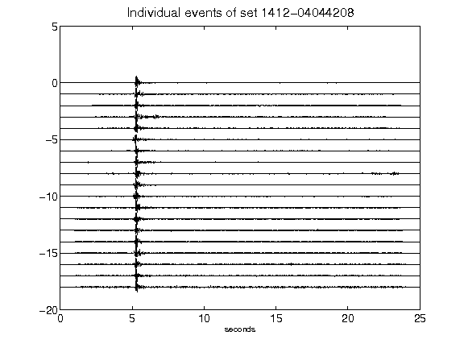](figures/1412-04044208_AllEv.png)[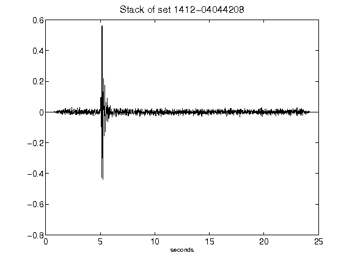](figures/1412-04044208_Stack.png)[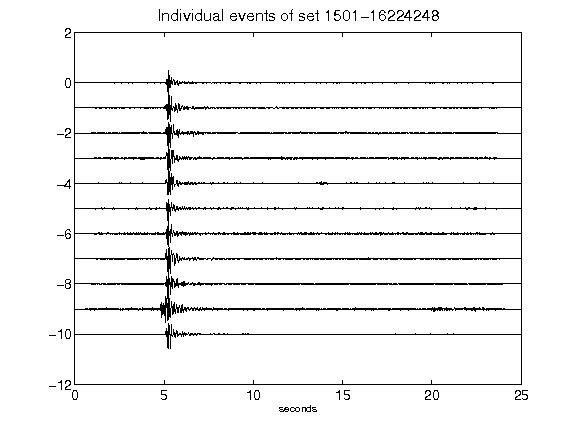](figures/1501-16224248_AllEv.png)[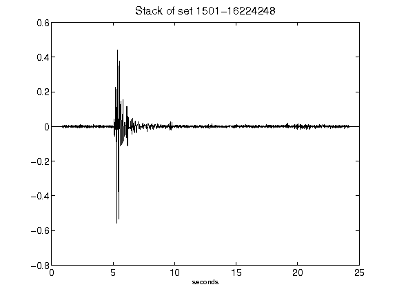](figures/1501-16224248_Stack.png)[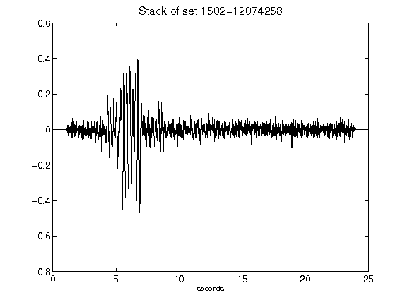](figures/1502-12074258_Stack.png)