# Repeating Earthquake Activity at STAR

## Waveforms
[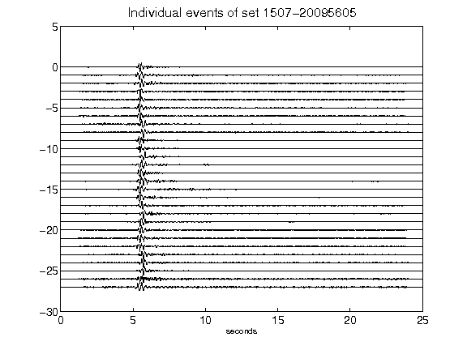](figures/1507-20095605_AllEv.png)[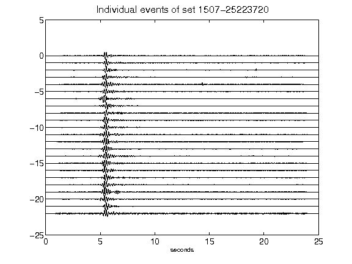](figures/1507-25223720_AllEv.png)[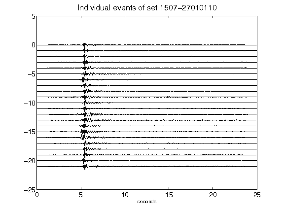](figures/1507-27010110_AllEv.png)[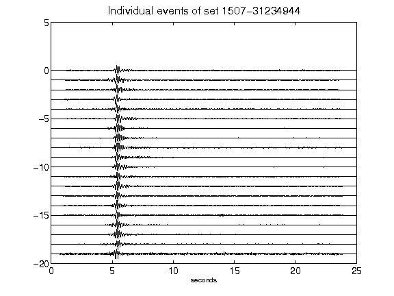](figures/1507-31234944_AllEv.png)[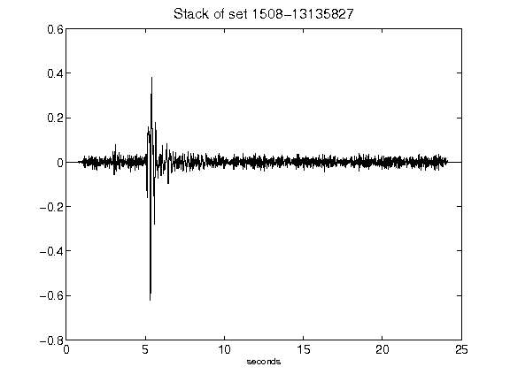](figures/1508-13135827_Stack.png)[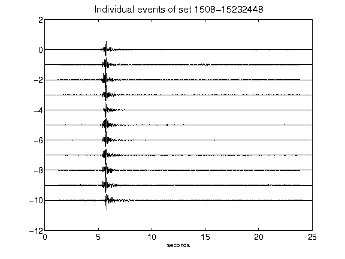](figures/1508-15232448_AllEv.png)[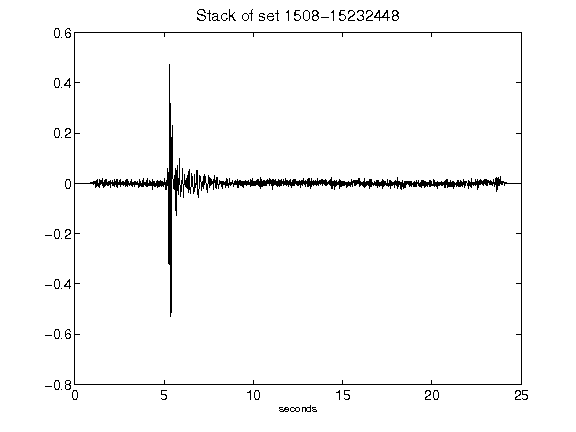](figures/1508-15232448_Stack.png)[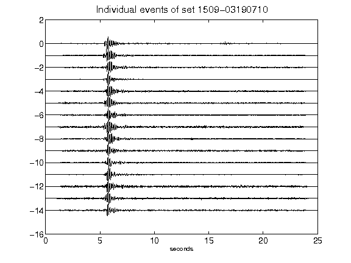](figures/1509-03190710_AllEv.png)[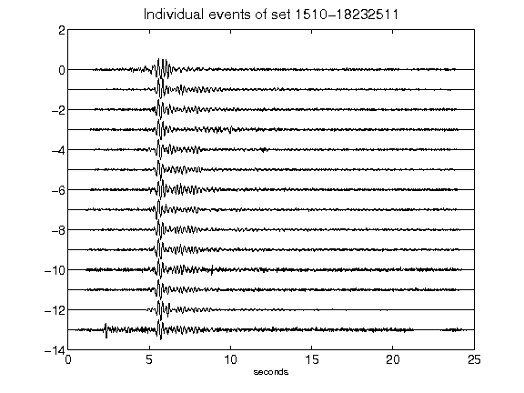](figures/1510-18232511_AllEv.png)[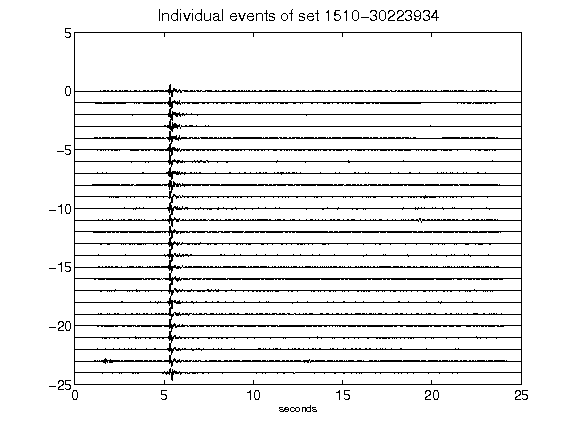](figures/1510-30223934_AllEv.png)[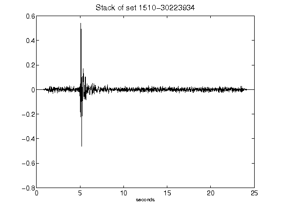](figures/1510-30223934_Stack.png)[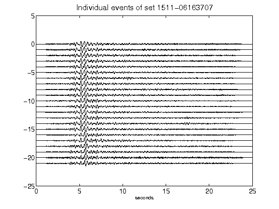](figures/1511-06163707_AllEv.png)