# Repeating Earthquake Activity at STAR

## Waveforms
[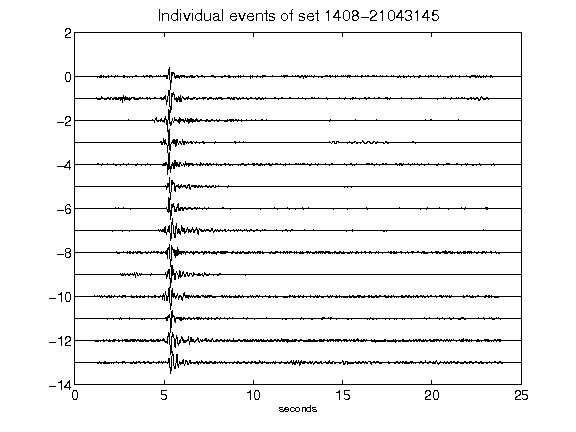](figures/1408-21043145_AllEv.png)[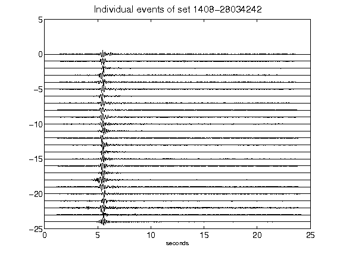](figures/1408-28034242_AllEv.png)[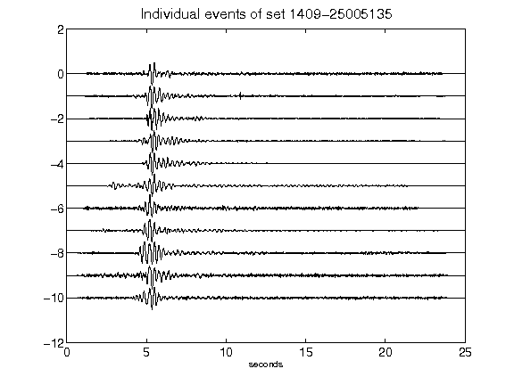](figures/1409-25005135_AllEv.png)[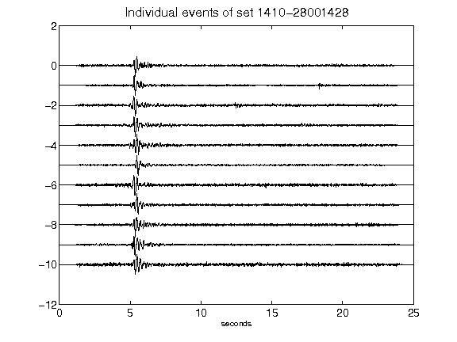](figures/1410-28001428_AllEv.png)[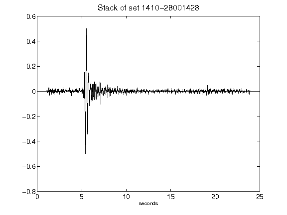](figures/1410-28001428_Stack.png)[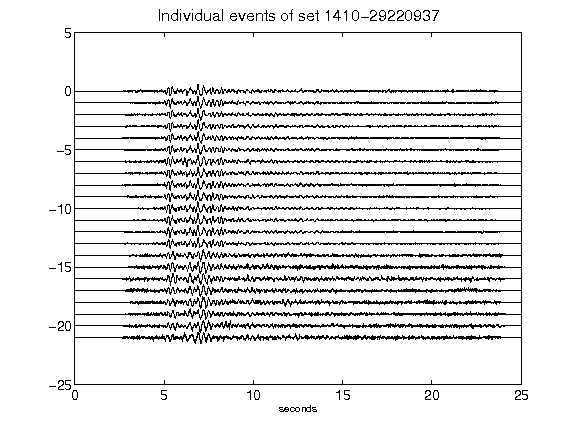](figures/1410-29220937_AllEv.png)[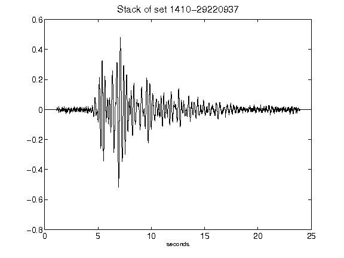](figures/1410-29220937_Stack.png)[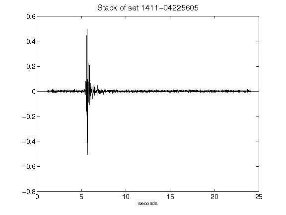](figures/1411-04225605_Stack.png)[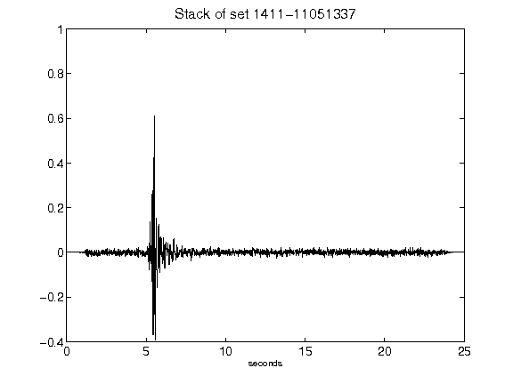](figures/1411-11051337_Stack.png)[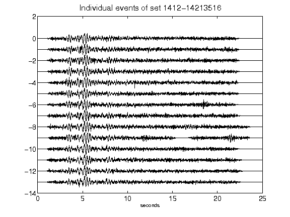](figures/1412-14213516_AllEv.png)[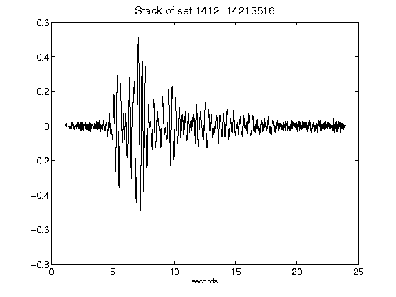](figures/1412-14213516_Stack.png)